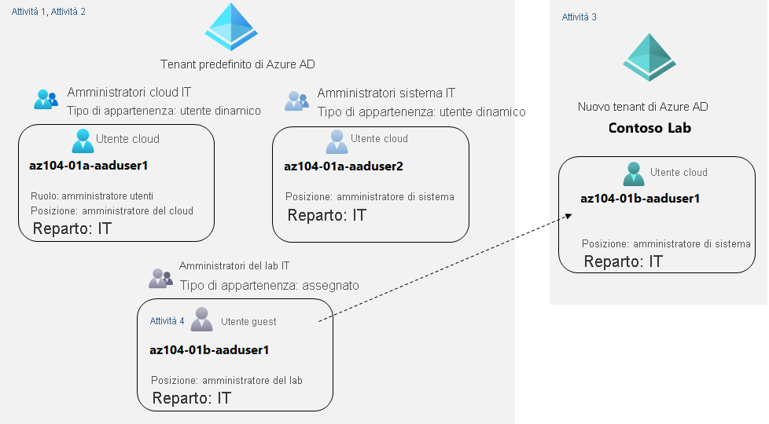

---
lab:
  title: 01 - Gestire le identità di Azure Active Directory
  module: Administer Identity
---

# Lab 01 - Gestire le identità di Azure Active Directory

# Manuale del lab per studenti

## Scenario del lab

In order to allow Contoso users to authenticate by using Azure AD, you have been tasked with provisioning users and group accounts. Membership of the groups should be updated automatically based on the user job titles. You also need to create a test Azure AD tenant with a test user account and grant that account limited permissions to resources in the Contoso Azure subscription.

Per visualizzare l'anteprima di questo lab in formato di guida interattiva, **[fare clic qui](https://mslabs.cloudguides.com/en-us/guides/AZ-104%20Exam%20Guide%20-%20Microsoft%20Azure%20Administrator%20Exercise%201)** .

## Obiettivi

In questo lab si eseguiranno le attività seguenti:

+ Attività 1: Creare e configurare gli utenti di Azure AD
+ Attività 2: Creare gruppi di Azure AD con appartenenza dinamica e assegnata
+ Attività 3: Creare un tenant di Azure Active Directory (AD) (facoltativo - problema dell'ambiente lab)
+ Attività 4: Gestire gli utenti guest di Azure AD (facoltativo - problema dell'ambiente lab)

## Tempo stimato: 30 minuti

## Diagramma dell'architettura

## Istruzioni

### Esercizio 1

#### Attività 1: Creare e configurare gli utenti di Azure AD

In questa attività verranno creati e configurati gli utenti di Azure AD.

>**Nota**: se in precedenza è stata usata la licenza di valutazione per Azure AD Premium in questo tenant di Azure AD, sarà necessario un nuovo tenant di Azure in cui eseguire l'attività 2 dopo l'attività 3.

1. Accedere al [portale di Azure](https://portal.azure.com).

1. Nel portale di Azure cercare e selezionare **Azure Active Directory**.

1. Nel pannello Azure Active Directory scorrere verso il basso fino alla sezione **Gestisci,** fare clic su **Impostazioni utente** ed esaminare le opzioni di configurazione disponibili.

1. Nel pannello Azure Active Directory, nella sezione **Gestisci**, fare clic su **Utenti** e quindi sul proprio account utente per visualizzarne le impostazioni di **Profilo**. 

1. Fare clic su **Modifica** e quindi, nella sezione **Impostazioni**, impostare **Località di utilizzo** su **Stati Uniti** fare clic su **Salva** per applicare la modifica.

    >**Nota**: questa operazione è necessaria per assegnare una licenza di Azure AD Premium P2 all'account utente più avanti in questo lab.

1. Tornare nel pannello **Utenti - Tutti gli utenti** e quindi fare clic su **+ Nuovo utente**.

1. Creare un nuovo utente con le impostazioni seguenti (lasciare i valori predefiniti per le altre impostazioni):

    | Impostazione | Valore |
    | --- | --- |
    | Nome utente | **az104-01a-aaduser1** |
    | Nome | **az104-01a-aaduser1** |
    | Consenti la creazione manuale della password | Enabled |
    | Password iniziale | **Specificare una password sicura** |
    | Località di utilizzo | **Stati Uniti** |
    | Posizione | **Amministratore cloud** |
    | department | **IT** |

    ><bpt id="p1">**</bpt>Note<ept id="p1">**</ept>: <bpt id="p2">**</bpt>Copy to clipboard<ept id="p2">**</ept> the full <bpt id="p3">**</bpt>User Principal Name<ept id="p3">**</ept> (user name plus domain). You will need it later in this task.

1. Nell'elenco di utenti fare clic sull'account utente appena creato per visualizzare il relativo pannello.

1. Esaminare le opzioni disponibili nella sezione **Gestisci** e notare che è possibile identificare i ruoli di Azure AD assegnati all'account utente e le relative autorizzazioni per le risorse di Azure.

1. Nella sezione **Gestisci** fare clic su **Ruoli assegnati**, quindi fare clic sul pulsante **+ Aggiungi assegnazione** e assegnare il ruolo **Amministratore utenti** a **az104-01a-aaduser1**.

    >**Nota**: i ruoli di Azure AD possono anche essere assegnati durante il provisioning di un nuovo utente.

1. Open an <bpt id="p1">**</bpt>InPrivate<ept id="p1">**</ept> browser window and sign in to the <bpt id="p2">[</bpt>Azure portal<ept id="p2">](https://portal.azure.com)</ept> using the newly created user account. When prompted to update the password, change the password to a secure password of your choosing. 

    >**Nota**: invece di digitare il nome utente (incluso il nome di dominio), è possibile incollare il contenuto degli Appunti.

1. Nella finestra **InPrivate** del browser, nel portale di Azure, cercare e selezionare **Azure Active Directory**.

    ><bpt id="p1">**</bpt>Note<ept id="p1">**</ept>: While this user account can access the Azure Active Directory tenant, it does not have any access to Azure resources. This is expected, since such access would need to be granted explicitly by using Azure Role-Based Access Control. 

1. Nella finestra **InPrivate** del browser, nel pannello Azure AD, scorrere verso il basso fino alla sezione **Gestisci**, fare clic su **Impostazioni utente** e notare che non si hanno le autorizzazioni per modificare le opzioni di configurazione.

1. Nella finestra **InPrivate** del browser, nel pannello Azure AD, fare clic su **Utenti** e quindi su **+ Nuovo utente** nella sezione **Gestisci**.

1. Creare un nuovo utente con le impostazioni seguenti (lasciare i valori predefiniti per le altre impostazioni):

    | Impostazione | Valore |
    | --- | --- |
    | Nome utente | **az104-01a-aaduser2** |
    | Nome | **az104-01a-aaduser2** |
    | Consenti la creazione manuale della password | Enabled |
    | Password iniziale | **Specificare una password sicura** |
    | Località di utilizzo | **Stati Uniti** |
    | Posizione | **Amministratore sistema** |
    | department | **IT** |

1. Disconnettersi come utente az104-01a-aaduser1 dal portale di Azure e chiudere la finestra InPrivate del browser.

#### Attività 2: Creare gruppi di Azure AD con appartenenza dinamica e assegnata

In questa attività verranno creati gruppi di Azure Active Directory con appartenenza assegnata e dinamica.

1. Tornare nel portale di Azure in cui è stato eseguito l'accesso con l'**account utente**, tornare nel pannello **Panoramica** del tenant di Azure AD e quindi, nella sezione **Gestisci**, fare clic su **Licenze**.

    >**Nota**: per implementare i gruppi dinamici, sono necessarie le licenze di Azure AD Premium P1 o P2.

1. Nella sezione **Gestisci** fare clic su **Tutti i prodotti**.

1. Fare clic su **+ Prova/Acquista** e attivare la versione di valutazione gratuita di Azure AD Premium P2.

1. Aggiornare la finestra del browser per verificare che l'attivazione sia riuscita. 

 ><bpt id="p1">**</bpt>Note<ept id="p1">**</ept>: It can take up to 10 minutes for the licenses to activate. Continue refreshing the page until it appears. Do not proceed until the licenses have been activated.

1. Nel pannello **Licenze - Tutti i prodotti** selezionare la voce **Azure Active Directory Premium P2** e assegnare tutte le opzioni di licenza di Azure AD Premium P2 al proprio account utente e ai due account utente appena creati.

1. Nel portale di Azure tornare nel pannello del tenant di Azure AD e fare clic su **Gruppi**.

1. Usare il pulsante **+ Nuovo gruppo** per creare un nuovo gruppo con le impostazioni seguenti:

    | Impostazione | Valore |
    | --- | --- |
    | Tipo gruppo | **Sicurezza** |
    | Nome gruppo | **IT Cloud Administrators** |
    | Descrizione gruppo | **Contoso IT cloud administrators** |
    | Tipo di appartenenza | **Utente dinamico** |

    >**Nota:** se l'elenco a discesa **Tipo di appartenenza** è disattivato, attendere alcuni minuti e aggiornare la pagina del browser.

1. Fare clic su **Aggiungi query dinamica**.

1. Nella scheda **Configura regole** del pannello **Regole di appartenenza dinamica** creare una nuova regola con le impostazioni seguenti:

    | Impostazione | Valore |
    | --- | --- |
    | Proprietà | **jobTitle** |
    | Operatore | **È uguale a** |
    | Valore | **Amministratore cloud** |

1. Per consentire agli utenti di Contoso di eseguire l'autenticazione usando Azure AD, è stato necessario eseguire il provisioning di account di utenti e gruppi. 

1. Tornare nel pannello **Gruppi - Tutti i gruppi** del tenant di Azure AD, fare clic sul pulsante **+ Nuovo gruppo** e creare un nuovo gruppo con le impostazioni seguenti:

    | Impostazione | Valore |
    | --- | --- |
    | Tipo gruppo | **Sicurezza** |
    | Nome gruppo | **IT System Administrators** |
    | Descrizione gruppo | **Contoso IT system administrators** |
    | Tipo di appartenenza | **Utente dinamico** |

1. Fare clic su **Aggiungi query dinamica**.

1. Nella scheda **Configura regole** del pannello **Regole di appartenenza dinamica** creare una nuova regola con le impostazioni seguenti:

    | Impostazione | Valore |
    | --- | --- |
    | Proprietà | **jobTitle** |
    | Operatore | **È uguale a** |
    | Valore | **Amministratore sistema** |

1. L'appartenenza ai gruppi dovrà essere aggiornata automaticamente in base alle mansioni degli utenti. 

1. Tornare nel pannello **Gruppi - Tutti i gruppi** del tenant di Azure AD, fare clic sul pulsante **+ Nuovo gruppo** e creare un nuovo gruppo con le impostazioni seguenti:

    | Impostazione | Valore |
    | --- | --- |
    | Tipo gruppo | **Sicurezza** |
    | Nome gruppo | **IT Lab Administrators** |
    | Descrizione gruppo | **Contoso IT Lab administrators** |
    | Tipo di appartenenza | **Assegnato** |
    
1. Fare clic su **Nessun membro selezionato**.

1. Nel pannello **Aggiungi membri** cercare e selezionare i gruppi **IT Cloud Administrators** e **IT System Administrators** e quindi, di nuovo nel pannello **Nuovo gruppo**, fare clic su **Crea**.

1. È anche necessario creare un tenant di Azure AD di con un account utente di test e concedere a tale account autorizzazioni limitate per le risorse della sottoscrizione di Azure Contoso.

    ><bpt id="p1">**</bpt>Note<ept id="p1">**</ept>: You might experience delays with updates of the dynamic membership groups. To expedite the update, navigate to the group blade, display its <bpt id="p1">**</bpt>Dynamic membership rules<ept id="p1">**</ept> blade, <bpt id="p2">**</bpt>Edit<ept id="p2">**</ept> the rule listed in the <bpt id="p3">**</bpt>Rule syntax<ept id="p3">**</ept> textbox by adding a whitespace at the end, and <bpt id="p4">**</bpt>Save<ept id="p4">**</ept> the change.

1. Navigate back to the <bpt id="p1">**</bpt>Groups - All groups<ept id="p1">**</ept> blade, click the entry representing the <bpt id="p2">**</bpt>IT System Administrators<ept id="p2">**</ept> group and, on then display its <bpt id="p3">**</bpt>Members<ept id="p3">**</ept> blade. Verify that the <bpt id="p1">**</bpt>az104-01a-aaduser2<ept id="p1">**</ept> appears in the list of group members.

#### Attività 3: Creare un tenant di Azure Active Directory (AD) (facoltativo - problema dell'ambiente lab)

In questa attività si creerà un nuovo tenant di Azure AD.

   ><bpt id="p1">**</bpt>Note<ept id="p1">**</ept>: There is a known issue with the Captcha verification in the lab environment. If you experience this issue, please skip both this task and the next. We are working on a solution.

1. Nel portale di Azure cercare e selezionare **Azure Active Directory**.

1. Fare clic su **Gestisci i tenant**, quindi nella schermata successiva fare clic su **+ Crea** e specificare l'impostazione seguente:

    | Impostazione | Valore |
    | --- | --- |
    | Tipo di directory | **Azure Active Directory** |
    
1. Fare clic su **Avanti: Configurazione**

    | Impostazione | Valore |
    | --- | --- |
    | Nome organizzazione | **Contoso Lab** |
    | Nome di dominio iniziale | Qualsiasi nome DNS valido costituito da lettere minuscole e cifre e che inizia con una lettera | 
    | Paese/Area geografica | **Stati Uniti** |

   > <bpt id="p1">**</bpt>Note<ept id="p1">**</ept>: The <bpt id="p2">**</bpt>Initial domain name<ept id="p2">**</ept> should not be a legitimate name that potentially matches your organization or another. The green check mark in the <bpt id="p1">**</bpt>Initial domain name<ept id="p1">**</ept> text box will indicate that the domain name you typed in is valid and unique.

1. Fare clic su **Rivedi e crea** e quindi su **Crea**.

1. Visualizzare il pannello del tenant di Azure AD appena creato usando il collegamento **Fare clic qui per passare al nuovo tenant: Contoso Lab** oppure il pulsante **Directory e sottoscrizione** immediatamente a destra del pulsante Cloud Shell sulla barra degli strumenti del portale di Azure.

#### Attività 4: Gestire gli utenti guest di Azure AD.

In questa attività verranno creati utenti guest di Azure AD a cui verrà concesso l'accesso alle risorse di una sottoscrizione di Azure.

1. Nel portale di Azure che visualizza il tenant di Azure AD Contoso Lab, nella sezione **Gestisci**, fare clic su **Utenti** e quindi su **+ Nuovo utente**.

1. Creare un nuovo utente con le impostazioni seguenti (lasciare i valori predefiniti per le altre impostazioni):

    | Impostazione | Valore |
    | --- | --- |
    | Nome utente | **az104-01b-aaduser1** |
    | Nome | **az104-01b-aaduser1** |
    | Consenti la creazione manuale della password | Enabled |
    | Password iniziale | **Specificare una password sicura** |
    | Posizione | **Amministratore sistema** |
    | department | **IT** |

1. Fare clic sul profilo appena creato.

    ><bpt id="p1">**</bpt>Note<ept id="p1">**</ept>: <bpt id="p2">**</bpt>Copy to clipboard<ept id="p2">**</ept> the full <bpt id="p3">**</bpt>User Principal Name<ept id="p3">**</ept> (user name plus domain). You will need it later in this task.

1. Tornare nel tenant predefinito di Azure AD usando il pulsante **Directory e sottoscrizione** immediatamente a destra del pulsante Cloud Shell sulla barra degli strumenti del portale di Azure.

1. Tornare nel pannello **Utenti - Tutti gli utenti** e quindi fare clic su **+ Nuovo utente guest**.

1. Invitare un nuovo utente guest con le impostazioni seguenti (lasciare i valori predefiniti per le altre impostazioni):

    | Impostazione | Valore |
    | --- | --- |
    | Nome | **az104-01b-aaduser1** |
    | Indirizzo di posta elettronica | Il nome dell'entità utente copiato in precedenza in questa attività |
    | Località di utilizzo | **Stati Uniti** |
    | Posizione | **Lab Administrator** |
    | department | **IT** |

1. Fare clic su **Invita**. 

1. Tornare nel pannello **Utenti - Tutti gli utenti** e fare clic sulla voce che rappresenta l'account utente guest appena creato.

1. Nel pannello **az104-01b-aaduser1 - Profilo** fare clic su **Gruppi**.

1. Fare clic su **+ Aggiungi l'appartenenza** e aggiungere l'account utente guest al gruppo **IT Lab Administrators**.

#### Attività 5: Pulire le risorse

> <bpt id="p1">**</bpt>Note<ept id="p1">**</ept>: Remember to remove any newly created Azure resources that you no longer use. Removing unused resources ensures you will not incur unexpected costs. While, in this case, there are no additional charges associated with Azure Active Directory tenants and their objects, you might want to consider removing the user accounts, the group accounts, and the Azure Active Directory tenant you created in this lab.

 > <bpt id="p1">**</bpt>Note<ept id="p1">**</ept>:  Don't worry if the lab resources cannot be immediately removed. Sometimes resources have dependencies and take a longer time to delete. It is a common Administrator task to monitor resource usage, so just periodically review your resources in the Portal to see how the cleanup is going. 

1. In the <bpt id="p1">**</bpt>Azure Portal<ept id="p1">**</ept> search for <bpt id="p2">**</bpt>Azure Active Directory<ept id="p2">**</ept> in the search bar. Within <bpt id="p1">**</bpt>Azure Active Directory<ept id="p1">**</ept> under <bpt id="p2">**</bpt>Manage<ept id="p2">**</ept> select <bpt id="p3">**</bpt>Licenses<ept id="p3">**</ept>. Once at <bpt id="p1">**</bpt>Licenses<ept id="p1">**</ept> under <bpt id="p2">**</bpt>Manage<ept id="p2">**</ept> select <bpt id="p3">**</bpt>All Products<ept id="p3">**</ept> and then select <bpt id="p4">**</bpt>Azure Active Directory Premium P2<ept id="p4">**</ept> item in the list. Proceed by then selecting <bpt id="p1">**</bpt>Licensed Users<ept id="p1">**</ept>. Select the user accounts <bpt id="p1">**</bpt>az104-01a-aaduser1<ept id="p1">**</ept> and <bpt id="p2">**</bpt>az104-01a-aaduser2<ept id="p2">**</ept> to which you assigned licenses in this lab, click <bpt id="p3">**</bpt>Remove license<ept id="p3">**</ept>, and, when prompted to confirm, click <bpt id="p4">**</bpt>Yes<ept id="p4">**</ept>.

1. Nel portale di Azure passare al pannello **Utenti - Tutti gli utenti**, fare clic sulla voce che rappresenta l'account utente guest **az104-01b-aaduser1**, quindi nel pannello **az104-01b-aaduser1 - Profilo** fare clic su **Elimina** e, quando viene richiesto di confermare, fare clic su **OK**.

1. Ripetere la stessa sequenza di passaggi per eliminare gli account utente rimanenti creati in questo lab.

1. Passare al pannello **Gruppi - Tutti i gruppi**, selezionare i gruppi creati in questo lab, fare clic su **Elimina** e, quando viene richiesto di confermare, fare clic su **OK**.

1. Nel portale di Azure visualizzare il pannello del tenant di Azure AD Contoso Lab usando il pulsante **Directory e sottoscrizione** immediatamente a destra del pulsante Cloud Shell sulla barra degli strumenti del portale di Azure.

1. Passare al pannello **Utenti - Tutti gli utenti**, fare clic sulla voce che rappresenta l'account utente **az104-01b-aaduser1**, quindi nel pannello **az104-01b-aaduser1 - Profilo** fare clic su **Elimina** e, quando viene richiesto di confermare, fare clic su **OK**.

1. Navigate to the <bpt id="p1">**</bpt>Contoso Lab - Overview<ept id="p1">**</ept> blade of the Contoso Lab Azure AD tenant, click <bpt id="p2">**</bpt>Manage tenants<ept id="p2">**</ept> and then on the next screen, select the box next to <bpt id="p3">**</bpt>Contoso Lab<ept id="p3">**</ept>, click <bpt id="p4">**</bpt>Delete<ept id="p4">**</ept>, on the <bpt id="p5">**</bpt>Delete tenant 'Contoso Labs'?<ept id="p5">**</ept> blade, click the <bpt id="p1">**</bpt>Get permission to delete Azure resources<ept id="p1">**</ept> link, on the <bpt id="p2">**</bpt>Properties<ept id="p2">**</ept> blade of Azure Active Directory, set <bpt id="p3">**</bpt>Access management for Azure resources<ept id="p3">**</ept> to <bpt id="p4">**</bpt>Yes<ept id="p4">**</ept> and click <bpt id="p5">**</bpt>Save<ept id="p5">**</ept>.

1. Tornare nel pannello **Elimina tenant "Contoso Lab"** , fare clic su **Aggiorna** e su **Elimina**.

> <bpt id="p1">**</bpt>Note<ept id="p1">**</ept>: If a tenant has a trial license, then you would have to wait for the trial license expiration before you could delete the tenant. This would not incur any additional cost.

#### Verifica

In questo lab sono state eseguite le attività seguenti:

- Creazione e configurazione di Azure AD utenti
- Creazione di gruppi di Azure AD con appartenenza dinamica e assegnata
- Creazione di un tenant di Azure Active Directory (AD)
- Gestione di utenti guest di Azure AD 
