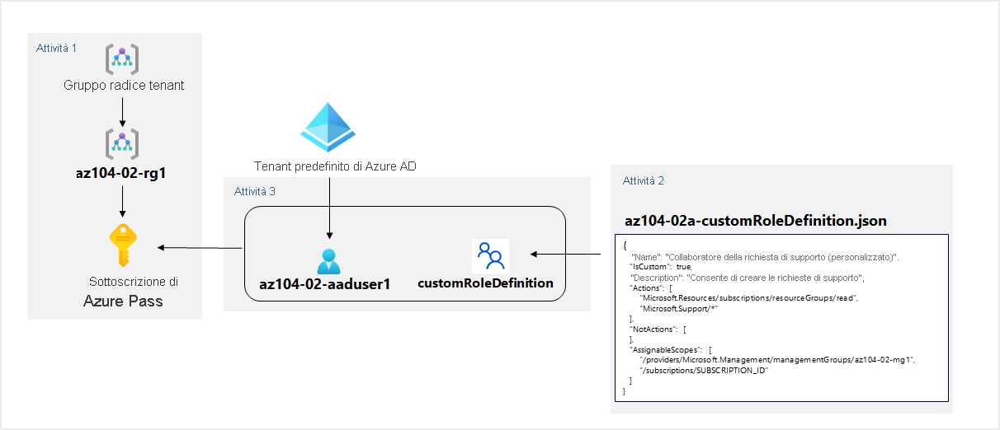

---
lab:
  title: 02a - Gestire le sottoscrizioni e il controllo degli accessi in base al ruolo
  module: Module 02 - Governance and Compliance
ms.openlocfilehash: 14b37fcd923ad1b45c83c3a6c41889db3869ed40
ms.sourcegitcommit: 6df80c7697689bcee3616cdd665da0a38cdce6cb
ms.translationtype: HT
ms.contentlocale: it-IT
ms.lasthandoff: 06/26/2022
ms.locfileid: "146587440"
---
# <a name="lab-02a---manage-subscriptions-and-rbac"></a>Lab 02a - Gestire le sottoscrizioni e il controllo degli accessi in base al ruolo
# <a name="student-lab-manual"></a>Manuale del lab per studenti

## <a name="lab-requirements"></a>Requisiti del lab

Per questo lab sono necessarie le autorizzazioni per creare utenti di Azure Active Directory (Azure AD), creare ruoli Controllo degli accessi in base al ruolo di Azure personalizzati e assegnarli a utenti di Azure AD. Non tutti i provider di servizi di hosting possono fornire questa funzionalità. Chiedere al docente informazioni sulla disponibilità di questo lab.

## <a name="lab-scenario"></a>Scenario del lab

Per migliorare la gestione delle risorse di Azure in Contoso, è stato chiesto di implementare le funzionalità seguenti:

- Creazione di un gruppo di gestione che includa tutte le sottoscrizioni di Azure di Contoso

- Concessione di autorizzazioni per l'invio di richieste di supporto per tutte le sottoscrizioni incluse nel gruppo di gestione a un utente di Azure Active Directory designato. Le autorizzazioni dell'utente devono essere limitate solo a: 

    - Creazione dei ticket della richiesta di supporto
    - Visualizzazione dei gruppi di risorse 

## <a name="objectives"></a>Obiettivi

In questo lab si eseguiranno le attività seguenti:

+ Attività 1: Implementare i gruppi di gestione
+ Attività 2: Creare ruoli Controllo degli accessi in base al ruolo personalizzati 
+ Attività 3: Assegnare ruoli Controllo degli accessi in base al ruolo


## <a name="estimated-timing-30-minutes"></a>Tempo stimato: 30 minuti

## <a name="architecture-diagram"></a>Diagramma dell'architettura




## <a name="instructions"></a>Istruzioni

### <a name="exercise-1"></a>Esercizio 1

#### <a name="task-1-implement-management-groups"></a>Attività 1: Implementare i gruppi di gestione

In questa attività si creeranno e configureranno gruppi di gestione. 

1. Accedere al [**portale di Azure**](http://portal.azure.com).

1. Cercare e selezionare **Gruppi di gestione** per passare al pannello **Gruppi di gestione**.

1. Esaminare i messaggi nella parte superiore del pannello **Gruppi di gestione**. Se viene visualizzato il messaggio **Si è registrati come amministratore della directory ma non sono disponibili le autorizzazioni necessarie per accedere al gruppo di gestione radice**, eseguire questa sequenza di passaggi:

    1. Nel portale di Azure cercare e selezionare **Azure Active Directory**.
    
    1.  Nel pannello che visualizza le proprietà del tenant di Azure Active Directory selezionare **Proprietà** nella sezione **Gestisci** del menu verticale a sinistra.
    
    1.  Nel pannello **Proprietà** del tenant di Azure Active Directory, nella sezione **Gestione degli accessi per le risorse di Azure**, selezionare **Sì** e quindi **Salva**.
    
    1.  Tornare nel pannello **Gruppi di gestione** e selezionare **Aggiorna**.

1. Nel pannello **Gruppi di gestione** fare clic su **+ Crea**.

    >**Nota**: se in precedenza non sono stati creati gruppi di gestione, selezionare **Inizia a usare i gruppi di gestione**

1. Creare un gruppo di gestione con le impostazioni seguenti:

    | Impostazione | Valore |
    | --- | --- |
    | ID gruppo di gestione | **az104-02-mg1** |
    | Nome visualizzato del gruppo di gestione | **az104-02-mg1** |

1. Nell'elenco dei gruppi di gestione fare clic sulla voce che rappresenta il gruppo di gestione appena creato.

1. Nel pannello **az104-02-mg1** fare clic su **Sottoscrizioni**. 

1. Nel pannello **az104-02-mg1 \| Sottoscrizioni** fare clic su **+Aggiungi**, quindi nell'elenco a discesa **Sottoscrizione** del pannello **Aggiungi sottoscrizione** selezionare la sottoscrizione in uso in questo lab e fare clic su **Salva**.

    >**Nota**: nel pannello **az104-02-mg1 \| Sottoscrizioni** copiare l'ID della sottoscrizione di Azure negli Appunti. Sarà necessario nell'attività successiva.

#### <a name="task-2-create-custom-rbac-roles"></a>Attività 2: Creare ruoli Controllo degli accessi in base al ruolo personalizzati

In questa attività si creerà una definizione di un ruolo Controllo degli accessi in base al ruolo personalizzato.

1. Nel computer del lab aprire il file **\\Allfiles\\Labs\\02\\ az104-02a-customRoleDefinition.json** nel Blocco note ed esaminarne il contenuto:

   ```json
   {
      "Name": "Support Request Contributor (Custom)",
      "IsCustom": true,
      "Description": "Allows to create support requests",
      "Actions": [
          "Microsoft.Resources/subscriptions/resourceGroups/read",
          "Microsoft.Support/*"
      ],
      "NotActions": [
      ],
      "AssignableScopes": [
          "/providers/Microsoft.Management/managementGroups/az104-02-mg1",
          "/subscriptions/SUBSCRIPTION_ID"
      ]
   }
   ```
    > **Nota**: se non si è certi della posizione in cui i file vengono archiviati in locale nell'ambiente lab, rivolgersi all'insegnante.

1. Sostituire il segnaposto `SUBSCRIPTION_ID` nel file JSON con l'ID sottoscrizione copiato negli Appunti e salvare la modifica.

1. Nel portale di Azure aprire il riquadro **Cloud Shell** facendo clic sull'icona della barra degli strumenti accanto alla casella di testo della ricerca.

1. Se viene richiesto di selezionare **Bash** o **PowerShell**, selezionare **PowerShell**. 

    >**Nota**: se è la prima volta che si avvia **Cloud Shell** e viene visualizzato il messaggio **Non sono state montate risorse di archiviazione**, selezionare la sottoscrizione in uso nel lab e quindi fare clic su **Crea archivio**. 

1. Sulla barra degli strumenti del riquadro Cloud Shell fare clic sull'icona **Carica/Scarica file**, nel menu a discesa fare clic su **Carica** e caricare il file **\\Allfiles\\Labs\\02\\az104-02a-customRoleDefinition.json** nella home directory di Cloud Shell.

1. Nel riquadro Cloud Shell eseguire il comando seguente per creare la definizione del ruolo personalizzato:

   ```powershell
   New-AzRoleDefinition -InputFile $HOME/az104-02a-customRoleDefinition.json
   ```

1. Chiudere il riquadro Cloud Shell.

#### <a name="task-3-assign-rbac-roles"></a>Attività 3: Assegnare ruoli Controllo degli accessi in base al ruolo

In questa attività si creerà un utente di Azure Active Directory a cui si assegnerà il ruolo Controllo degli accessi in base al ruolo creato nell'attività precedente, quindi si verificherà che l'utente possa eseguire l'attività specificata nella definizione del ruolo.

1. Nel portale di Azure cercare e selezionare **Azure Active Directory**, nel pannello Azure Active Directory fare clic su **Utenti**,e quindi su **+ Nuovo utente**.

1. Creare un nuovo utente con le impostazioni seguenti (lasciare i valori predefiniti per le altre impostazioni):

    | Impostazione | Valore |
    | --- | --- |
    | Nome utente | **az104-02-aaduser1**|
    | Nome | **az104-02-aaduser1**|
    | Consenti la creazione manuale della password | Enabled |
    | Password iniziale | **Specificare una password sicura** |

    >**Nota**: **copiare negli Appunti** il valore completo di **Nome utente**. Sarà necessario più avanti in questa attività.

1. Nel portale di Azure tornare nel gruppo di gestione **az104-02-mg1** e visualizzarne i **dettagli**.

1. Fare clic su **Controllo di accesso (IAM)** , fare clic su **+ Aggiungi** e quindi su **Aggiungi un'assegnazione di ruolo** e assegnare il ruolo **Collaboratore richiesta di supporto (personalizzato)** all'account utente appena creato.

1. Aprire una finestra **InPrivate** del browser e accedere al [portale di Azure](https://portal.azure.com) con l'account utente appena creato. Quando viene richiesto di aggiornare la password, cambiare la password per l'utente.

    >**Nota**: invece di digitare il nome utente, è possibile incollare il contenuto degli Appunti.

1. Nella finestra del browser **InPrivate** cercare e selezionare **Gruppi di risorse** nel portale di Azure per verificare che l'utente az104-02-aaduser1 possa visualizzare tutti i gruppi di risorse.

1. Nella finestra del browser **InPrivate** cercare e selezionare **Tutte le risorse** nel portale di Azure per verificare che l'utente az104-02-aaduser1 non possa visualizzare nessuna risorsa.

1. Nella finestra del browser **InPrivate**, nel portale di Azure, cercare e selezionare **Guida e supporto** e quindi fare clic su **+ Crea una richiesta di supporto**. 

1. Nella finestra del browser **InPrivate**, nella scheda **Descrizione del problema/Riepilogo** del pannello **Guida e supporto - Nuova richiesta di supporto**, digitare **Limiti del servizio e della sottoscrizione** nel campo Riepilogo e selezionare il tipo di problema **Limiti del servizio e della sottoscrizione (quote)** . Si noti che la sottoscrizione in uso in questo lab è elencata nell'elenco a discesa **Sottoscrizione**.

    >**Nota**: la presenza della sottoscrizione in uso in questo lab nell'elenco a discesa **Sottoscrizione** indica che l'account in uso ha le autorizzazioni necessarie per creare la richiesta di supporto specifica della sottoscrizione.

    >**Nota**: se l'opzione **Limiti del servizio e della sottoscrizione (quote)** non è visualizzata, disconnettersi dal portale di Azure e accedere di nuovo.

1. Non continuare con la creazione della richiesta di supporto. Al contrario, disconnettersi come utente az104-02-aaduser1 dal portale di Azure e chiudere la finestra InPrivate del browser.

#### <a name="task-4-clean-up-resources"></a>Attività 4: Eseguire la pulizia delle risorse

   >**Nota**: ricordarsi di rimuovere tutte le risorse di Azure appena create che non vengono più usate. La rimozione delle risorse inutilizzate garantisce che non verranno effettuati addebiti imprevisti, anche se le risorse create in questo lab non comportano costi aggiuntivi.

   >**Nota**: non è necessario preoccuparsi se le risorse del lab non possono essere rimosse immediatamente. A volte le risorse hanno dipendenze e l'eliminazione può richiedere più tempo. Si tratta di un'attività comune dell'amministratore per monitorare l'utilizzo delle risorse, quindi è sufficiente esaminare periodicamente le risorse nel portale per verificare il funzionamento della pulizia.

1. Nel portale di Azure cercare e selezionare **Azure Active Directory**, quindi nel pannello Azure Active Directory fare clic su **Utenti**.

1. Nel pannello **Utenti - Tutti gli utenti** fare clic su **az104-02-aaduser1**.

1. Nel pannello **az104-02-aaduser1 - Profilo** copiare il valore dell'attributo **ID oggetto**.

1. Nel portale di Azure avviare una sessione di **PowerShell** all'interno di **Cloud Shell**.

1. Nel riquadro Cloud Shell eseguire il comando seguente per rimuovere l'assegnazione della definizione del ruolo personalizzato (sostituire il segnaposto `[object_ID]` con il valore dell'attributo **ID oggetto** dell'account utente di Azure Active Directory **az104-02-aaduser1** copiato in precedenza in questa attività):

   ```powershell
   
   $scope = (Get-AzRoleDefinition -Name 'Support Request Contributor (Custom)').AssignableScopes[0]

   Remove-AzRoleAssignment -ObjectId '[object_ID]' -RoleDefinitionName 'Support Request Contributor (Custom)' -Scope $scope
   ```

1. Nel riquadro Cloud Shell eseguire il comando seguente per rimuovere la definizione del ruolo personalizzato:

   ```powershell
   Remove-AzRoleDefinition -Name 'Support Request Contributor (Custom)' -Force
   ```

1. Nel portale di Azure tornare nel pannello **Utenti - Tutti gli utenti** di **Azure Active Directory** ed eliminare l'account utente **az104-02-aaduser1**.

1. Nel portale di Azure tornare nel pannello **Gruppi di gestione**. 

1. Nel pannello **Gruppi di gestione** selezionare l'icona con i **puntini di sospensione** accanto alla sottoscrizione nel gruppo di gestione **az104-02-mg1** e selezionare **Sposta** per spostare la sottoscrizione nel **gruppo di gestione radice tenant**.

   >**Nota**: è probabile che il gruppo di gestione di destinazione sia il **gruppo di gestione radice tenant**, a meno che non sia stata creata una gerarchia di gruppi di gestione personalizzata prima di eseguire questo lab.
   
1. Selezionare **Aggiorna** per verificare che la sottoscrizione sia stata spostata correttamente nel **gruppo di gestione radice tenant**.

1. Tornare nel pannello **Gruppi di gestione**, fare clic sull'icona con i **puntini di sospensione** a destra del gruppo di gestione **az104-02-mg1** e fare clic su **Elimina**.

#### <a name="review"></a>Verifica

In questo lab sono state eseguite le attività seguenti:

- Implementazione di gruppi di gestione
- Creazione di ruoli Controllo degli accessi in base al ruolo personalizzati 
- Assegnazione di ruoli Controllo degli accessi in base al ruolo
