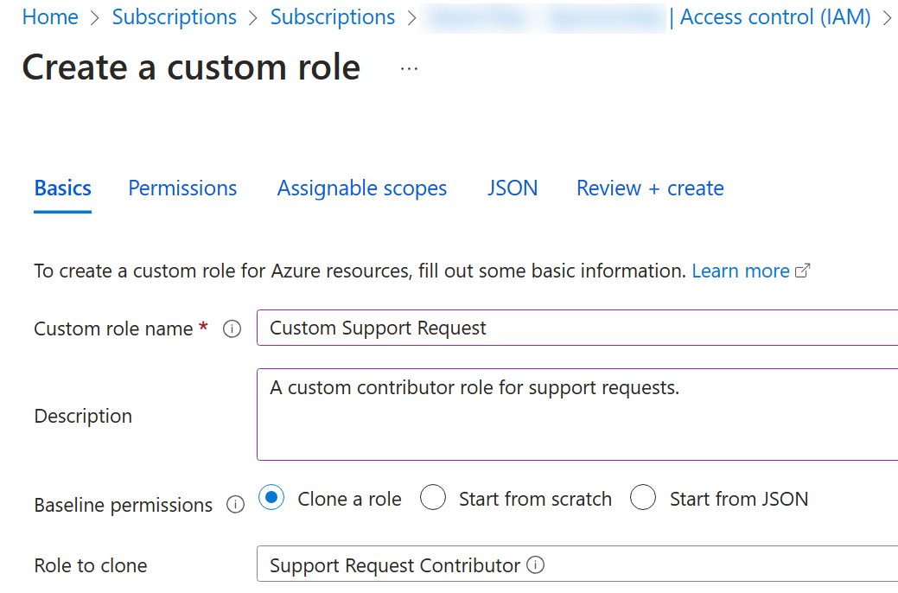

---
lab:
  title: 'Lab 02a: Gestire le sottoscrizioni e il controllo degli accessi in base al ruolo'
  module: Administer Governance and Compliance
---

# Lab 02a - Gestire le sottoscrizioni e il controllo degli accessi in base al ruolo

## Introduzione al lab

In questo lab vengono fornite informazioni sul controllo degli accessi in base al ruolo. Si apprenderà come usare autorizzazioni e ambiti per controllare le azioni che le identità possono e non possono eseguire. Si apprenderà anche come semplificare la gestione delle sottoscrizioni usando i gruppi di gestione. 

Questo lab richiede una sottoscrizione di Azure. Il tipo di sottoscrizione può influire sulla disponibilità delle funzionalità in questo lab. È possibile modificare l'area, ma i passaggi vengono scritti usando **Stati Uniti** orientali. 

## Tempo stimato: 30 minuti

## Scenario laboratorio

Per semplificare la gestione delle risorse di Azure nell'organizzazione, è stato richiesto di implementare le funzionalità seguenti:

- Creazione di un gruppo di gestione che include tutte le sottoscrizioni di Azure.

- Concessione delle autorizzazioni per inviare richieste di supporto per tutte le sottoscrizioni nel gruppo di gestione. Le autorizzazioni devono essere limitate solo a: 

    - Creare e gestire macchine virtuali
    - Creare ticket di richiesta di supporto (non includere l'aggiunta di provider di Azure)

## Simulazioni di lab interattive

Esistono alcune simulazioni di lab interattive che potrebbero risultare utili per questo argomento. La simulazione consente di fare clic su uno scenario simile al proprio ritmo. Esistono differenze tra la simulazione interattiva e questo lab, ma molti dei concetti di base sono gli stessi. Non è necessaria una sottoscrizione di Azure. 

+ [Gestire l'accesso con il controllo degli accessi in base al ruolo](https://mslearn.cloudguides.com/en-us/guides/AZ-900%20Exam%20Guide%20-%20Azure%20Fundamentals%20Exercise%2014). Assegnare un ruolo predefinito a un utente e monitorare i log attività. 

+ [Gestire le sottoscrizioni e il controllo degli accessi in base al ruolo](https://mslabs.cloudguides.com/guides/AZ-104%20Exam%20Guide%20-%20Microsoft%20Azure%20Administrator%20Exercise%202). Implementare un gruppo di gestione e creare e assegnare un ruolo controllo degli accessi in base al ruolo personalizzato.

+ [Aprire una richiesta](https://mslearn.cloudguides.com/en-us/guides/AZ-900%20Exam%20Guide%20-%20Azure%20Fundamentals%20Exercise%2022) di supporto. Esaminare le opzioni del piano di supporto, quindi creare e monitorare una richiesta di supporto, una fatturazione o tecnica.

## Diagramma dell'architettura

## Competenze mansione

+ Attività 1: Implementare i gruppi di gestione.
+ Attività 2: Esaminare e assegnare un ruolo di Azure predefinito.
+ Attività 3: Creare un ruolo controllo degli accessi in base al ruolo personalizzato.
+ Attività 4: Monitorare le assegnazioni di ruolo con il log attività.

## Attività 1: Implementare i gruppi di gestione

In questa attività si creeranno e configureranno gruppi di gestione. I gruppi di gestione vengono usati per organizzare logicamente le sottoscrizioni. Le sottoscrizioni devono essere segmentate e consentire il controllo degli accessi in base al ruolo e Criteri di Azure essere assegnate e ereditate ad altri gruppi di gestione e sottoscrizioni. Ad esempio, se l'organizzazione ha un team di supporto dedicato per l'Europa, è possibile organizzare le sottoscrizioni europee in un gruppo di gestione per fornire al personale di supporto l'accesso a tali sottoscrizioni (senza fornire l'accesso individuale a tutte le sottoscrizioni). Nello scenario tutti gli utenti dell'Help Desk dovranno creare una richiesta di supporto in tutte le sottoscrizioni. 

1. Accedere al **portale di Azure** - `https://portal.azure.com`.

1. Cercare e selezionare `Microsoft Entra ID`.

1. Nel pannello **Gestisci** selezionare **Proprietà**.

1. Esaminare l'area **Gestione degli accessi per le risorse** di Azure. Assicurarsi di poter gestire l'accesso a tutte le sottoscrizioni e i gruppi di gestione di Azure nel tenant.
   
1. Cercare e selezionare `Management groups`.

1. Nel pannello **Gruppi di gestione** fare clic su **+ Crea**.

1. Creare un gruppo di gestione con le impostazioni seguenti. Al termine, selezionare **Invia** . 

    | Impostazione | Valore |
    | --- | --- |
    | ID gruppo di gestione | `az104-mg1` (deve essere univoco nella directory) |
    | Nome visualizzato del gruppo di gestione | `az104-mg1` |

1. **Aggiornare** la pagina del gruppo di gestione per assicurarsi che venga visualizzato il nuovo gruppo di gestione. L'operazione potrebbe richiedere un minuto. 

   >**Nota:** si è notato il gruppo di gestione radice? Il gruppo di gestione radice è integrato nella gerarchia in modo che tutti i gruppi di gestione e le sottoscrizioni si ripieghino su di esso. Il gruppo di gestione radice permette l'applicazione di criteri globali e assegnazioni di ruolo di Azure a livello di directory. Dopo aver creato un gruppo di gestione, aggiungere tutte le sottoscrizioni che devono essere incluse nel gruppo. 

## Attività 2: Esaminare e assegnare un ruolo di Azure predefinito

In questa attività si esamineranno i ruoli predefiniti e si assegnerà il ruolo Collaboratore macchina virtuale a un membro dell'Help Desk. Azure offre un numero elevato di [ruoli](https://learn.microsoft.com/azure/role-based-access-control/built-in-roles) predefiniti. 

1. Selezionare il **gruppo di gestione az104-mg1** .

1. Selezionare il **pannello Controllo di accesso (IAM)** e quindi la **scheda Ruoli** .

1. Scorrere le definizioni di ruolo predefinite disponibili. **Visualizzare** un ruolo per ottenere informazioni dettagliate su **Autorizzazioni**, **JSON** e **Assegnazioni**. Spesso si useranno *proprietario*, *collaboratore* e *lettore*. 

1. Selezionare **+ Aggiungi** dal menu a discesa, selezionare **Aggiungi assegnazione di** ruolo. 

1. Nel pannello **Aggiungi assegnazione di** ruolo cercare e selezionare Collaboratore **** macchina virtuale. Il ruolo collaboratore macchina virtuale consente di gestire le macchine virtuali, ma non di accedere al sistema operativo o di gestire la rete virtuale e l'account di archiviazione a cui sono connessi. Questo è un buon ruolo per l'Help Desk. Selezionare **Avanti**.

    >**Lo sapevi?** Azure inizialmente ha fornito solo il **modello di distribuzione classica** . Questa operazione è stata sostituita dal **modello di distribuzione Azure Resource Manager** . Come procedura consigliata, non usare le risorse classiche. 

1. Nella **scheda **Membri** selezionare Membri**.

    >**Nota:** il passaggio successivo assegna il ruolo al gruppo helpdesk****. Se non si ha un gruppo help desk, è necessario un minuto per crearlo.

1. Cercare e selezionare il `helpdesk` gruppo. Fare clic su **Seleziona**. 

1. Fare clic su **Verifica e assegna** due volte per creare l'assegnazione di ruolo.

1. Continuare nel pannello **Controllo di accesso (IAM).** **Nella scheda Assegnazioni** di ruolo verificare che il **gruppo helpdesk** disponga del **ruolo Collaboratore** macchina virtuale. 

    >**Nota:** come procedura consigliata assegnare sempre ruoli a gruppi non singoli. 

    >**Lo sapevi?** Questa assegnazione potrebbe non concedere privilegi aggiuntivi. Se si ha già il ruolo Proprietario, tale ruolo include tutte le autorizzazioni associate al ruolo Collaboratore macchina virtuale.
    
## Attività 3: Creare un ruolo controllo degli accessi in base al ruolo personalizzato

In questa attività verrà creato un ruolo controllo degli accessi in base al ruolo personalizzato. I ruoli personalizzati sono una parte fondamentale dell'implementazione del principio dei privilegi minimi per un ambiente. I ruoli predefiniti potrebbero avere troppe autorizzazioni per lo scenario. In questa attività verrà creato un nuovo ruolo e verranno rimosse le autorizzazioni non necessarie. Si prevede di gestire le autorizzazioni sovrapposte?

1. Continuare a lavorare sul gruppo di gestione. Nel pannello **Controllo di accesso (IAM)** selezionare la **scheda Controlla accesso** .

1. **Nella casella Crea un ruolo** personalizzato selezionare **Aggiungi**.

1. Nella scheda Informazioni di base completare la configurazione.

    | Impostazione | Valore |
    | --- | --- |
    | Nome del ruolo personalizzato | `Custom Support Request` |
    | Descrizione | ''Un ruolo collaboratore personalizzato per le richieste di supporto'. |

1. Per **Autorizzazioni** di base selezionare **Clona un ruolo**. **Nel menu a discesa Role to clone (Ruolo da clonare**) selezionare Support Request Contributor (Collaboratore **** richiesta di supporto).

    

1. Selezionare **Avanti** per passare alla **scheda Autorizzazioni** e quindi selezionare **+ Escludi autorizzazioni**.

1. Nel campo di ricerca del provider di risorse immettere `.Support` e selezionare **Microsoft.Support**.

1. Nell'elenco delle autorizzazioni posizionare una casella di controllo accanto a **Altro: Registra il provider** di risorse di supporto e quindi selezionare **Aggiungi**. Il ruolo deve essere aggiornato per includere questa autorizzazione come *NotAction*.

    >**Nota:** un provider di risorse di Azure è un set di operazioni REST che abilitano la funzionalità per un servizio di Azure specifico. Non vogliamo che l'Help Desk sia in grado di avere questa funzionalità, quindi viene rimossa dal ruolo clonato. È anche possibile selete e aggiungere altre funzionalità al nuovo ruolo. 

1. Nella **scheda Ambiti** assegnabili verificare che il gruppo di gestione sia elencato e quindi fare clic su **Avanti**.

1. Esaminare il codice JSON per Azioni**, *NotActions* e *AssignableScopes* personalizzati nel ruolo. 

1. Selezionare **Rivedi e crea** e quindi **Crea**.

    >**Nota:** a questo punto, è stato creato un ruolo personalizzato e assegnato al gruppo di gestione.  

## Attività 4: Monitorare le assegnazioni di ruolo con il log attività

In questa attività viene visualizzato il log attività per determinare se qualcuno ha creato un nuovo ruolo. 

1. Nel portale individuare la **risorsa az104-mg1** e selezionare **Log** attività. Il log attività fornisce informazioni dettagliate sugli eventi a livello di sottoscrizione. 

1. Esaminare le attività per le assegnazioni di ruolo. Il log attività può essere filtrato per operazioni specifiche. 

    

## Pulire le risorse

Se si usa **la propria sottoscrizione** , è necessario un minuto per eliminare le risorse del lab. In questo modo le risorse vengono liberate e i costi vengono ridotti al minimo. Il modo più semplice per eliminare le risorse del lab consiste nell'eliminare il gruppo di risorse del lab. 

+ Nella portale di Azure selezionare il gruppo di risorse, selezionare **Elimina il gruppo di risorse, **Immettere il nome** del gruppo** di risorse e quindi fare clic su **Elimina**.
+ Uso di Azure PowerShell, `Remove-AzResourceGroup -Name resourceGroupName`.
+ Uso dell'interfaccia della riga di comando di `az group delete --name resourceGroupName`.
  
## Punti chiave

Congratulazioni per il completamento del lab. Ecco le principali considerazioni per questo lab. 

+ I gruppi di gestione vengono usati per organizzare logicamente le sottoscrizioni.
+ Il gruppo di gestione radice predefinito include tutti i gruppi di gestione e le sottoscrizioni.
+ Azure ha molti ruoli predefiniti. È possibile assegnare questi ruoli per controllare l'accesso alle risorse.
+ È possibile creare nuovi ruoli o personalizzare i ruoli esistenti.
+ I ruoli vengono definiti in un file in formato JSON e includono *Actions*, *NotActions* e *AssignableScopes*.
+ È possibile usare il log attività per monitorare le assegnazioni di ruolo. 

## Altre informazioni con la formazione autogestita

+ [Proteggere le risorse di Azure con il controllo degli accessi in base al ruolo di Azure](https://learn.microsoft.com/training/modules/secure-azure-resources-with-rbac/). Usare il controllo degli accessi in base al ruolo di Azure per gestire l'accesso alle risorse in Azure.
+ [Creare ruoli personalizzati per le risorse di Azure con il controllo](https://learn.microsoft.com/training/modules/create-custom-azure-roles-with-rbac/) degli accessi in base al ruolo. Informazioni sulla struttura delle definizioni di ruolo per il controllo di accesso. Identificare le proprietà dei ruoli da usare per definire le autorizzazioni del ruolo personalizzato. Creare un ruolo personalizzato di Azure e assegnarlo a un utente.

