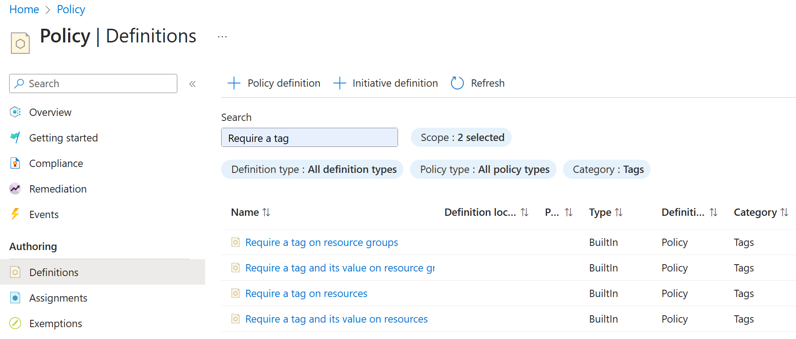

---
lab:
  title: 'Lab 02b: Gestire la governance tramite Criteri di Azure'
  module: Administer Governance and Compliance
---

# Lab 02b – Gestire la governance tramite Criteri di Azure

## Introduzione al lab

In questo lab si apprenderà come implementare i piani di governance dell'organizzazione. Verrà illustrato come i criteri di Azure possono garantire l'applicazione delle decisioni operative in tutta l'organizzazione. Si apprenderà come usare l'assegnazione di tag alle risorse per migliorare la creazione di report. 

Questo lab richiede una sottoscrizione di Azure. Il tipo di sottoscrizione può influire sulla disponibilità delle funzionalità in questo lab. È possibile modificare l'area, ma i passaggi vengono scritti usando **Stati Uniti orientali**. 

## Tempo stimato: 30 minuti

## Scenario laboratorio

Il footprint del cloud dell'organizzazione è cresciuto notevolmente nell'ultimo anno. Durante un controllo recente è stato rilevato un numero considerevole di risorse che non hanno un proprietario, un progetto o un centro di costo definiti. Per migliorare la gestione delle risorse di Azure nell'organizzazione, si decide di implementare le funzionalità seguenti:

- applicare tag di risorsa per allegare metadati importanti alle risorse di Azure

- applicare l'uso dei tag di risorsa per le nuove risorse usando Criteri di Azure

- aggiornare le risorse esistenti con i tag delle risorse

- usare i blocchi delle risorse per proteggere le risorse configurate

## Diagramma dell'architettura

## Competenze mansione

+ Attività 1. Creare e assegnare tag tramite il portale di Azure.
+ Attività 2. Eseguire l'assegnazione di tag tramite Criteri di Azure.
+ Attività 3. Applicare l'assegnazione di tag tramite Criteri di Azure.
+ Attività 4: Configurare e testare i blocchi delle risorse. 

## Attività 1: Assegnare tag tramite il portale di Azure

In questa attività si creerà e si assegnerà un tag a un gruppo di risorse di Azure tramite il portale di Azure. I tag sono un componente fondamentale di una strategia di governance, come descritto da Microsoft Well-Architected Framework e Cloud Adoption Framework. I tag consentono di identificare rapidamente i proprietari delle risorse, le date di scadenza, i contatti di gruppo e altre coppie nome/valore ritenute importanti dall'organizzazione. Per questa attività si assegna un tag che identifica il Centro costi risorse. 

1. Accedere al **portale di Azure** - `https://portal.azure.com`.
      
1. Cercare e selezionare `Resource groups`.

1. In Gruppi di risorse, selezionare **+ Crea**.

    | Impostazione | Valore |
    | --- | --- |
    | Nome della sottoscrizione | sottoscrizione in uso |
    | Nome gruppo di risorse | `az104-rg2` |
    | Ufficio | **Stati Uniti orientali** |

    >**Nota:** Per ogni lab di questo corso si creerà un nuovo gruppo di risorse. In questo modo è possibile individuare e gestire rapidamente le risorse del lab. 

1. Selezionare **Avanti** e passare alla **scheda Tag** . Specificare le informazioni per un nuovo tag.

    | Impostazione | valore |
    | --- | --- |
    | Name | Centro costi |
    | Valore | 000 |

1. Selezionare **Rivedi e crea** e quindi **Crea**.

## Attività 2: Applicare l'assegnazione di tag tramite Criteri di Azure

In questa attività si assegnerà il criterio predefinito *Richiedi un tag con il relativo valore sulle risorse* al gruppo di risorse e si valuterà il risultato. Criteri di Azure può essere usato per applicare la configurazione e in questo caso la governance alle risorse di Azure. 

1. Nel portale di Azure, cercare e selezionare `Policy`. 

1. Nel pannello **Creazione** selezionare **Definizioni**. Esaminare l'elenco delle [definizioni dei criteri predefiniti](https://learn.microsoft.com/azure/governance/policy/samples/built-in-policies) disponibili per l'uso. Si noti che è anche possibile cercare una definizione.

    

1. Cercare i `Require a tag and its value on resources` criteri predefiniti. Selezionare il criterio e prendere un minuto per esaminare la definizione. 

1. Seleziona **Assegna criterio**.

1. Specificare un valore per **Ambito** facendo clic sul pulsante con i puntini di sospensione e selezionando le opzioni seguenti. Al termine, fare clic su **Seleziona**. 

    | Impostazione | valore |
    | --- | --- |
    | Subscription | *sottoscrizione in uso* |
    | Gruppo di risorse | **az104-rg2** |

    >**Nota**: È possibile assegnare criteri a livello di gruppo di gestione, sottoscrizione o gruppo di risorse. È anche possibile specificare esclusioni, ad esempio singole sottoscrizioni, gruppi di risorse o risorse. In questo scenario si vuole il tag in tutte le risorse del gruppo di risorse.

1. Nella scheda **Informazioni di base** configurare le proprietà dell'assegnazione specificando le impostazioni seguenti (lasciare i valori predefiniti per le altre impostazioni):

    | Impostazione | Valore |
    | --- | --- |
    | Nome dell'assegnazione | `Require Cost Center tag and its value on resources` |
    | Descrizione | `Require Cost Center tag and its value on all resources in the resource group`|
    | Applicazione dei criteri | Attivata |

    >**Nota** il valore di **Nome dell'assegnazione** viene popolato automaticamente con il nome del criterio selezionato, ma è possibile cambiarlo. La **descrizione** è facoltativa. Si noti che è possibile disabilitare il criterio in qualsiasi momento. 

1. Fare clic su **Avanti** e impostare **Parametri** sui valori seguenti:

    | Impostazione | Valore |
    | --- | --- |
    | Nome del tag | `Cost Center` |
    | Valore del tag | `000` |

1. Fare clic su **Avanti** ed esaminare la scheda **Correzione**. Lasciare deselezionata la casella di controllo **Crea un'identità gestita**. 

1. Fare clic su **Rivedi e crea** e quindi su **Crea**.

    >**Nota**: Ora si verificherà che la nuova assegnazione di criteri sia effettiva tentando di creare un account di archiviazione di Azure nel gruppo di risorse. Si creerà l'account di archiviazione senza aggiungere il tag necessario. 
    
    >**Nota**: L'applicazione del criterio potrebbe richiedere da 5 a 10 minuti.

1. Nel portale cercare e selezionare `Storage Accounts`, quindi selezionare **+ Crea**. 

1. Nella scheda **Informazioni di base** del pannello **Crea account di archiviazione** completare la configurazione.

    | Impostazione | valore |
    | --- | --- |
    | Gruppo di risorse | **az104-rg2** |
    | Nome account di archiviazione | *Qualsiasi combinazione univoca globale di 3-24 lettere minuscole e numeri, a partire da una lettera* |

1. Selezionare **Rivedi** e quindi fare clic su **Crea**.

1. Verrà visualizzato un messaggio di **Convalida non riuscita**. Visualizzare il messaggio per identificare il motivo dell'errore. Verificare che il messaggio di errore indichi che la distribuzione delle risorse non è consentita dai criteri. 

     

>**Nota**: facendo clic sulla **scheda Errore** non elaborato, è possibile trovare altri dettagli sull'errore, incluso il nome della definizione **del ruolo Richiedi un tag e il relativo valore sulle risorse**. La distribuzione non è riuscita perché l'account di archiviazione che si è tentato di creare non ha un tag denominato **Centro di costo** con il relativo valore impostato su **Impostazione predefinita**.

## Attività 3: Applicare l'assegnazione di tag tramite Criteri di Azure

In questa attività verrà usata una nuova definizione di criteri per correggere eventuali risorse non conformi. In questo scenario verranno create tutte le risorse figlio di un gruppo di risorse che ereditano il tag **Centro di costo** definito nel gruppo di risorse.

1. Nel portale di Azure, cercare e selezionare `Policy`. 

1. Nella sezione **Creazione** fare clic su **Assegnazioni**. 

1. Nell'elenco delle assegnazioni fare clic sull'icona con i puntini di sospensione nella riga che rappresenta il **tag Richiedi un tag e il relativo valore per l'assegnazione dei criteri delle risorse** e usare la **voce di menu Elimina assegnazione** per eliminare l'assegnazione.

1. Fare clic su **Assegna criteri** e specificare un valore per **Ambito** facendo clic sul pulsante con i puntini di sospensione e selezionando le opzioni seguenti:

    | Impostazione | valore |
    | --- | --- |
    | Subscription | sottoscrizione di Azure |
    | Gruppo di risorse | `az104-rg2` |

1. Per specificare la **Definizione dei criteri**, fare clic sul pulsante con i puntini di sospensione e quindi cercare e selezionare `Inherit a tag from the resource group if missing`.

1. Selezionare **Aggiungi** e quindi configurare le **proprietà di base** rimanenti dell'assegnazione.

    | Impostazione | Valore |
    | --- | --- |
    | Nome dell'assegnazione | `Inherit the Cost Center tag and its value 000 from the resource group if missing` |
    | Descrizione | `Inherit the Cost Center tag and its value 000 from the resource group if missing` |
    | Applicazione dei criteri | Attivata |

1. Fare clic su **Avanti** e impostare **Parametri** sui valori seguenti:

    | Impostazione | Valore |
    | --- | --- |
    | Nome del tag | `Cost Center` |

1. Fare clic su **Avanti** e quindi, nella scheda **Correzione**, configurare le impostazioni seguenti (lasciare i valori predefiniti per le altre impostazioni):

    | Impostazione | Valore |
    | --- | --- |
    | Creare un'attività di correzione | Enabled |
    | Criterio da correggere | **Eredita un tag dal gruppo di risorse se mancante** |

    >**Nota**: questa definizione dei criteri include l'effetto **Modify**. È quindi necessaria un'identità gestita. 

     

1. Fare clic su **Rivedi e crea** e quindi su **Crea**.

    >**Nota**: Per verificare se la nuova assegnazione del criterio è effettiva, si creerà un altro account di archiviazione di Azure nello stesso gruppo di risorse senza aggiungere esplicitamente il tag necessario. 
    
    >**Nota**: L'applicazione del criterio potrebbe richiedere da 5 a 10 minuti.

1. Cercare e selezionare `Storage Account` e fare clic su **+ Crea**. 

1. Nella scheda **Informazioni di base** del pannello **Crea account di archiviazione** verificare di usare il gruppo di risorse a cui è stato applicato il criterio e specificare le impostazioni seguenti (lasciare i valori predefiniti per le altre impostazioni), quindi fare clic su **Rivedi**:

    | Impostazione | valore |
    | --- | --- |
    | Nome account di archiviazione | *Qualsiasi combinazione univoca globale di 3-24 lettere minuscole e numeri, a partire da una lettera* |

1. Verificare che questa volta la convalida sia stata superata e fare clic su **Crea**.

1. Dopo aver effettuato il provisioning del nuovo account di archiviazione, fare clic su **Vai alla risorsa**.

1. Nel pannello **Tag** si noti che il **centro di costo** con il valore **000** è stato assegnato automaticamente alla risorsa.

    >**Suggerimenti utili** Se si cerca e si seleziona **Tag** nel portale, è possibile visualizzare le risorse con un tag specifico. 

## Attività 4: Configurare e testare i blocchi delle risorse

In questa attività viene configurato e testato un blocco delle risorse. I blocchi impediscono eliminazioni o modifiche di una risorsa. 

1. Cercare e selezionare il gruppo di risorse.
   
1. Nel pannello **Impostazioni** selezionare **Blocchi**.

1. Selezionare **Aggiungi** e completare le informazioni sul blocco delle risorse. Al termine, selezionare **Ok**. 

    | Impostazione | Valore |
    | --- | --- |
    | Nome del blocco | `rg-lock` |
    | Tipo di blocco | **eliminare** (si noti la selezione per sola lettura) |
    
1. Passare al pannello **Panoramica** del gruppo di risorse e selezionare **Elimina gruppo di risorse**.

1. Nella casella di testo **Immettere il nome del gruppo di risorse per confermare l'eliminazione** specificare il nome del gruppo di risorse, `az104-rg2`. Si noti che è possibile copiare e incollare il nome del gruppo di risorse. 

1. Si noti l'avviso: L'eliminazione di questo gruppo di risorse e delle relative risorse dipendenti è un'azione permanente e non può essere annullata. Selezionare **Elimina**.

1. Si dovrebbe ricevere una notifica che nega l'eliminazione. 

     

    >**Nota:** Sarà necessario rimuovere il blocco se si intende eliminare il gruppo di risorse. 
    
## Pulire le risorse

Se si usa la **sottoscrizione personale**, dedicare qualche minuto all’eliminazione delle risorse del lab. In questo modo le risorse vengono liberate e i costi vengono ridotti al minimo. Il modo più semplice per eliminare le risorse del lab consiste nell'eliminare il gruppo di risorse lab. 

+ Nel portale di Azure selezionare il gruppo di risorse, selezionare **Elimina il gruppo di risorse**, **Immettere il nome del gruppo di risorse**, quindi fare clic su **Elimina**.
+ Tramite Azure PowerShell, `Remove-AzResourceGroup -Name resourceGroupName`.
+ Usando l’interfaccia della riga di comando, `az group delete --name resourceGroupName`.

## Estendere l'apprendimento con Copilot
Copilot può essere utile per imparare a usare gli strumenti di scripting di Azure. Copilot può essere utile anche in aree non coperte nel lab o dove occorrono altre informazioni. Aprire un browser Edge e scegliere Copilot (in alto a destra) o passare a *copilot.microsoft.com*. Dedicare qualche minuto alla prova di queste richieste.
+ Quali sono i comandi di Azure PowerShell e dell'interfaccia della riga di comando per aggiungere ed eliminare blocchi di risorse in un gruppo di risorse?
+ Le differenze tra i criteri di Azure e il controllo degli accessi in base al ruolo di Azure includono esempi.
+ Quali sono i passaggi per applicare i criteri di Azure e correggere le risorse che non sono conformi?
+ Come è possibile ottenere un report delle risorse di Azure con tag specifici?

## Punti chiave

Congratulazioni per aver completato il lab. Ecco i concetti chiave per questo lab. 

+ I tag di Azure sono metadati costituiti da una coppia chiave-valore. I tag descrivono una determinata risorsa nell'ambiente. In particolare, l'assegnazione di tag in Azure consente di etichettare le risorse in modo logico.
+ Criteri di Azure stabilisce le convenzioni per le risorse. Le definizioni di criteri descrivono le condizioni di conformità delle risorse e l'azione da eseguire se viene soddisfatta una condizione. Una condizione confronta un valore o un campo proprietà della risorsa con un valore richiesto. Esistono molte definizioni di criteri predefinite ed è possibile personalizzare i criteri. 
+ La funzionalità di attività di correzione di Criteri di Azure viene usata per rendere le risorse conformi in base a una definizione e un'assegnazione. Le risorse non conformi a un'assegnazione di definizione modify o deployIfNotExist possono essere inserite in conformità usando un'attività di correzione.
+ È possibile configurare un blocco delle risorse in una sottoscrizione, un gruppo di risorse o una risorsa. Il blocco può proteggere una risorsa da eliminazioni e modifiche accidentali dell'utente. Un blocco esegue l'override di tutte le autorizzazioni utente.
+ Criteri di Azure è una procedura di sicurezza pre-distribuzione. Il controllo degli accessi in base al ruolo e i blocchi delle risorse sono procedure di sicurezza post-distribuzione.

