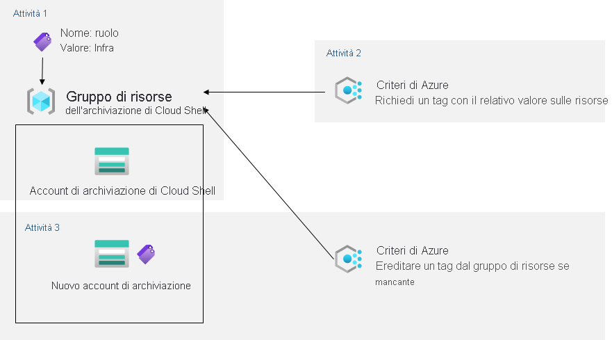

---
lab:
  title: 02b – Gestire la governance tramite Criteri di Azure
  module: Module 02 - Governance and Compliance
ms.openlocfilehash: eefaa58ce49ba0e36628d48bcfc5981f40d1bcd8
ms.sourcegitcommit: 45e0b1e448ecf9cbdda8c7e84384d0d4d90b277f
ms.translationtype: HT
ms.contentlocale: it-IT
ms.lasthandoff: 03/07/2022
ms.locfileid: "139275323"
---
# <a name="lab-02b---manage-governance-via-azure-policy"></a>Lab 02b – Gestire la governance tramite Criteri di Azure
# <a name="student-lab-manual"></a>Manuale del lab per studenti

## <a name="lab-scenario"></a>Scenario del lab

Per migliorare la gestione delle risorse di Azure in Contoso, è stato chiesto di implementare le funzionalità seguenti:

- Assegnazione di tag a gruppi di risorse che includono solo risorse dell'infrastruttura (ad esempio account di archiviazione Cloud Shell)

- Verifica che sia possibile aggiungere solo le risorse con il tag appropriato ai gruppi di risorse dell'infrastruttura

- Correzione di eventuali risorse non conformi 

## <a name="objectives"></a>Obiettivi

In questo lab si eseguiranno le attività seguenti:

+ Attività 1: Creare e assegnare tag tramite il portale di Azure
+ Attività 2: Imporre l'assegnazione di tag tramite criteri di Azure
+ Attività 3: Applicare l'assegnazione di tag tramite Criteri di Azure

## <a name="estimated-timing-30-minutes"></a>Tempo stimato: 30 minuti

## <a name="architecture-diagram"></a>Diagramma dell'architettura



## <a name="instructions"></a>Istruzioni

### <a name="exercise-1"></a>Esercizio 1

#### <a name="task-1-assign-tags-via-the-azure-portal"></a>Attività 1: Assegnare tag tramite il portale di Azure

In questa attività si creerà e si assegnerà un tag a un gruppo di risorse di Azure tramite il portale di Azure.

1. Nel portale di Azure avviare una sessione di **PowerShell** all'interno di **Cloud Shell**.

    >**Nota**: se è la prima volta che si avvia **Cloud Shell** e viene visualizzato il messaggio **Non sono state montate risorse di archiviazione**, selezionare la sottoscrizione in uso nel lab e quindi fare clic su **Crea archivio**. 

1. Nel riquadro Cloud Shell eseguire quanto segue per identificare il nome dell'account di archiviazione usato da Cloud Shell:

   ```powershell
   df
   ```

1. Nell'output del comando prendere nota della prima parte del percorso completo che indica il montaggio dell'unità home di Cloud Shell (contrassegnato qui come `xxxxxxxxxxxxxx`:

   ```
   //xxxxxxxxxxxxxx.file.core.windows.net/cloudshell   (..)  /usr/csuser/clouddrive
   ```

1. Nel portale di Azure cercare e selezionare **Account di archiviazione**, quindi fare clic sulla voce dell'elenco che rappresenta l'account di archiviazione identificato nel passaggio precedente.

1. Nel pannello dell'account di archiviazione fare clic sul collegamento che rappresenta il nome del gruppo di risorse contenente l'account di archiviazione.

    **Nota**: prendere nota del gruppo di risorse in cui è contenuto l'account di archiviazione, perché sarà necessario più avanti nel lab.

1. Nel pannello del gruppo di risorse fare clic su **modifica** accanto a **Tag** per creare nuovi tag.

1. Creare un tag con le impostazioni seguenti e applicare la modifica:

    | Impostazione | Valore |
    | --- | --- |
    | Nome | **Ruolo** |
    | Valore | **Infra** |

1. Tornare nel pannello dell'account di archiviazione. Esaminare le informazioni di **Panoramica** e notare che il nuovo tag non è stato assegnato automaticamente all'account di archiviazione. 

#### <a name="task-2-enforce-tagging-via-an-azure-policy"></a>Attività 2: Imporre l'assegnazione di tag tramite criteri di Azure

In questa attività si assegnerà il criterio predefinito *Richiedi un tag con il relativo valore sulle risorse* al gruppo di risorse e si valuterà il risultato. 

1. Nel portale di Azure cercare e selezionare **Criteri**. 

1. Nella sezione **Creazione** fare clic su **Definizioni**. Esaminare l'elenco delle definizioni dei criteri predefiniti disponibili per l'uso. Elencare tutti i criteri predefiniti che comportano l'uso di tag selezionando la voce **Tag** (e deselezionando tutte le altre voci) nell'elenco a discesa **Categoria**. 

1. Fare clic sulla voce che rappresenta il criterio predefinito **Richiedi un tag con il relativo valore sulle risorse** ed esaminarne la definizione.

1. Nel pannello della definizione del criterio predefinito **Richiedi un tag con il relativo valore sulle risorse** fare clic su **Assegna**.

1. Specificare un valore per **Ambito** facendo clic sul pulsante con i puntini di sospensione e selezionando le opzioni seguenti:

    | Impostazione | Valore |
    | --- | --- |
    | Subscription | Nome della sottoscrizione di Azure usata in questo lab |
    | Gruppo di risorse | Nome del gruppo di risorse contenente l'account Cloud Shell identificato nell'attività precedente |

    >**Nota**: un ambito determina le risorse o i gruppi di risorse in cui ha effetto l'assegnazione dei criteri. È possibile assegnare criteri a livello di gruppo di gestione, sottoscrizione o gruppo di risorse. È anche possibile specificare esclusioni, ad esempio singole sottoscrizioni, gruppi di risorse o risorse (a seconda dell'ambito di assegnazione). 

1. Nella scheda **Informazioni di base** configurare le proprietà dell'assegnazione specificando le impostazioni seguenti (lasciare i valori predefiniti per le altre impostazioni):

    | Impostazione | Valore |
    | --- | --- |
    | Nome dell'assegnazione | **Require Role tag with Infra value**|
    | Descrizione | **Require Role tag with Infra value for all resources in the Cloud Shell resource group**|
    | Imposizione dei criteri | Attivato |

    >**Nota** il valore di **Nome dell'assegnazione** viene popolato automaticamente con il nome del criterio selezionato, ma è possibile cambiarlo. È anche possibile aggiungere una **descrizione** facoltativa. Il valore di **Assegnato da** viene popolato automaticamente in base al nome dell'utente che crea l'assegnazione. 

1. Fare clic su **Avanti** e impostare **Parametri** sui valori seguenti:

    | Impostazione | Valore |
    | --- | --- |
    | Nome del tag | **Ruolo** |
    | Valore del tag | **Infra** |

1. Fare clic su **Avanti** ed esaminare la scheda **Correzione**. Lasciare deselezionata la casella di controllo **Crea un'identità gestita**. 

    >**Nota**: questa impostazione può essere usata quando il criterio o l'iniziativa include l'effetto **deployIfNotExists** o **Modify**.

1. Fare clic su **Rivedi e crea** e quindi su **Crea**.

    >**Nota**: a questo punto si verificherà se la nuova assegnazione del criterio è effettiva provando a creare un altro account di archiviazione di Azure nel gruppo di risorse senza aggiungere esplicitamente il tag necessario. 
    
    >**Nota**: l'applicazione del criterio potrebbe richiedere da 5 a 15 minuti.

1. Tornare nel pannello del gruppo di risorse che ospita l'account di archiviazione usato per l'unità home di Cloud Shell, identificato nell'attività precedente.

1. Nel pannello del gruppo di risorse fare clic su **+ Crea**, quindi cercare **Account di archiviazione** e fare clic su **+ Crea**. 

1. Nella scheda **Informazioni di base** del pannello **Crea account di archiviazione** verificare di usare il gruppo di risorse a cui è stato applicato il criterio e specificare le impostazioni seguenti (lasciare i valori predefiniti per le altre impostazioni), fare clic su **Rivedi e crea** e quindi su **Crea**:

    | Impostazione | Valore |
    | --- | --- |
    | Nome dell'account di archiviazione | Qualsiasi combinazione univoca globale di 3-24 lettere minuscole e numeri, a partire da una lettera |

1. Dopo aver creato la distribuzione, verrà visualizzato il messaggio **Distribuzione non riuscita** nell'elenco **Notifiche** del portale. Nell'elenco **Notifiche** passare alla panoramica della distribuzione e fare clic su l messaggio **Distribuzione non riuscita. Fare clic qui per i dettagli** per identificare il motivo dell'errore. 

    >**Nota**: verificare se il messaggio di errore indica che la distribuzione della risorsa non è consentita dai criteri. 

    >**Nota**: facendo clic sulla scheda **Tag**, è possibile trovare altri dettagli sull'errore, tra cui il nome della definizione del ruolo **Require Role tag with Infra value** (Richiedi tag ruolo con valore Infra). La distribuzione non è riuscita perché l'account di archiviazione che si è tentato di creare non ha un tag denominato **Role** con il relativo valore impostato su **Infra**.

#### <a name="task-3-apply-tagging-via-an-azure-policy"></a>Attività 3: Applicare l'assegnazione di tag tramite Criteri di Azure

In questa attività verrà usata una definizione di criteri diversa per correggere eventuali risorse non conformi. 

1. Nel portale di Azure cercare e selezionare **Criteri**. 

1. Nella sezione **Creazione** fare clic su **Assegnazioni**. 

1. Nell'elenco di assegnazioni fare clic con il pulsante destro del mouse sull'icona con i puntini di sospensione nella riga che rappresenta l'assegnazione di criteri **Require Role tag with Infra value** e usare la voce di menu **Elimina assegnazione** per eliminare l'assegnazione. 

1. Fare clic su **Assegna criteri** e specificare un valore per **Ambito** facendo clic sul pulsante con i puntini di sospensione e selezionando le opzioni seguenti:

    | Impostazione | Valore |
    | --- | --- |
    | Subscription | Nome della sottoscrizione di Azure usata in questo lab |
    | Gruppo di risorse | Il nome del gruppo di risorse contenente l'account Cloud Shell identificato nella prima attività |

1. Per specificare il valore di **Definizione dei criteri**, fare clic sul pulsante con i puntini di sospensione e quindi cercare e selezionare **Eredita un tag dal gruppo di risorse se mancante**.

1. Nella scheda **Informazioni di base** configurare le rimanenti proprietà dell'assegnazione specificando le impostazioni seguenti (lasciare i valori predefiniti per le altre impostazioni):

    | Impostazione | Valore |
    | --- | --- |
    | Nome dell'assegnazione | **Inherit the Role tag and its Infra value from the Cloud Shell resource group if missing**|
    | Descrizione | **Inherit the Role tag and its Infra value from the Cloud Shell resource group if missing**|
    | Imposizione dei criteri | Attivato |

1. Fare clic su **Avanti** e impostare **Parametri** sui valori seguenti:

    | Impostazione | Valore |
    | --- | --- |
    | Nome del tag | **Ruolo** |

1. Fare clic su **Avanti** e quindi, nella scheda **Correzione**, configurare le impostazioni seguenti (lasciare i valori predefiniti per le altre impostazioni):

    | Impostazione | Valore |
    | --- | --- |
    | Creare un'attività di correzione | Enabled |
    | Criterio da correggere | **Eredita un tag dal gruppo di risorse se mancante** |

    >**Nota**: questa definizione dei criteri include l'effetto **Modify**.

1. Fare clic su **Rivedi e crea** e quindi su **Crea**.

    >**Nota**: per verificare se la nuova assegnazione del criterio è effettiva, si creerà un altro account di archiviazione di Azure nello stesso gruppo di risorse senza aggiungere esplicitamente il tag necessario. 
    
    >**Nota**: l'applicazione del criterio potrebbe richiedere da 5 a 15 minuti.

1. Tornare nel pannello del gruppo di risorse che ospita l'account di archiviazione usato per l'unità home di Cloud Shell, identificato nella prima attività.

1. Nel pannello del gruppo di risorse fare clic su **+ Crea**, quindi cercare **Account di archiviazione** e fare clic su **+ Crea**. 

1. Nella scheda **Informazioni di base** del pannello **Crea account di archiviazione** verificare di usare il gruppo di risorse a cui è stato applicato il criterio e specificare le impostazioni seguenti (lasciare i valori predefiniti per le altre impostazioni), quindi fare clic su **Rivedi e crea**:

    | Impostazione | Valore |
    | --- | --- |
    | Nome dell'account di archiviazione | Qualsiasi combinazione univoca globale di 3-24 lettere minuscole e numeri, a partire da una lettera |

1. Verificare che questa volta la convalida sia stata superata e fare clic su **Crea**.

1. Dopo aver effettuato il provisioning del nuovo account di archiviazione, fare clic sul pulsante **Vai alla risorsa**, quindi nel pannello **Panoramica** dell'account di archiviazione appena creato si noti che il tag **Role** con il valore **Infra** è stato assegnato automaticamente alla risorsa.

#### <a name="task-4-clean-up-resources"></a>Attività 4: Eseguire la pulizia delle risorse

   >**Nota**: ricordarsi di rimuovere tutte le risorse di Azure appena create che non vengono più usate. La rimozione delle risorse inutilizzate garantisce che non verranno effettuati addebiti imprevisti; tenere comunque presente che i criteri di Azure non comportano costi aggiuntivi.
   
   >**Nota**: non è necessario preoccuparsi se le risorse del lab non possono essere rimosse immediatamente. A volte le risorse hanno dipendenze e l'eliminazione può richiedere più tempo. Si tratta di un'attività comune dell'amministratore per monitorare l'utilizzo delle risorse, quindi è sufficiente esaminare periodicamente le risorse nel portale per verificare il funzionamento della pulizia. 

1. Nel portale cercare e selezionare **Criteri**.

1. Nella sezione **Creazione** fare clic su **Assegnazioni**, fare clic sull'icona con i puntini di sospensione a destra dell'assegnazione creata nell'attività precedente, quindi fare clic su **Elimina assegnazione**. 

1. Nel portale cercare e selezionare **Account di archiviazione**.

1. Nell'elenco degli account di archiviazione selezionare il gruppo di risorse corrispondente all'account di archiviazione creato nell'ultima attività del lab. Selezionare **Tag**, fare clic su **Elimina** (il cestino a destra) per il tag **Role:Infra** e premere **Applica**. 

1. Fare clic su **Panoramica** e quindi su **Elimina** nella parte superiore del pannello dell'account di archiviazione. Quando viene richiesta la conferma, nel pannello **Elimina account di archiviazione** digitare il nome dell'account di archiviazione da confermare e fare clic su **Elimina**. 

#### <a name="review"></a>Verifica

In questo lab sono state eseguite le attività seguenti:

- Creazione e assegnazione di tag tramite il portale di Azure
- Imposizione dei tag tramite un criterio di Azure
- Applicazione dei tag tramite un criterio di Azure
