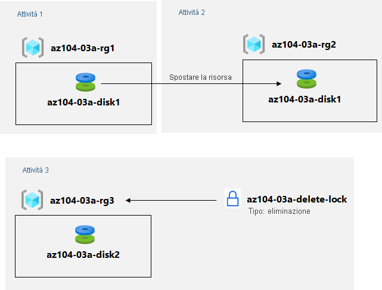

---
lab:
  title: 'Lab 03a: Gestire le risorse di Azure usando il portale di Azure'
  module: Administer Azure Resources
---

# Lab 03a - Gestire le risorse di Azure tramite il portale di Azure
# Manuale del lab per studenti

## Scenario del lab

È necessario esplorare le funzionalità di amministrazione di base di Azure associate al provisioning delle risorse e organizzarle in base ai gruppi di risorse, incluso lo spostamento di risorse tra gruppi. È anche consigliabile esplorare le opzioni per proteggere le risorse disco dall'eliminazione accidentale, consentendo al tempo stesso di modificarne le caratteristiche di prestazioni e le dimensioni.

                **Nota:** è disponibile una **[simulazione di lab interattiva](https://mslabs.cloudguides.com/guides/AZ-104%20Exam%20Guide%20-%20Microsoft%20Azure%20Administrator%20Exercise%204)** che consente di eseguire questo lab in base ai propri tempi. Si potrebbero notare piccole differenza tra la simulazione interattiva e il lab ospitato, ma i concetti e le idee principali dimostrati sono gli stessi. 

## Obiettivi

In questo lab si eseguiranno le attività seguenti:

+ Attività 1: Creare gruppi di risorse e distribuire risorse al loro interno
+ Attività 2: Spostare le risorse tra gruppi di risorse
+ Attività 3: Implementare e testare i blocchi delle risorse

## Tempo stimato: 20 minuti

## Diagramma dell'architettura

### Istruzioni

## Esercizio 1

## Attività 1: Creare gruppi di risorse e distribuire risorse al loro interno

In questa attività si userà il portale di Azure per creare gruppi di risorse e un disco al loro interno.

1. Accedere al [**portale di Azure**](http://portal.azure.com).

1. Nel portale di Azure cercare e selezionare **Dischi**, fare clic su **+ Crea** e specificare le impostazioni seguenti:

    |Impostazione|Valore|
    |---|---|
    |Subscription| Nome della sottoscrizione di Azure in cui è stato creato il gruppo di risorse |
    |Gruppo di risorse| Il nome di un nuovo gruppo di risorse **az104-03a-rg1** |
    |Nome del disco| **az104-03a-disk1** |
    |Region| **(Stati Uniti) Stati Uniti orientali** |
    |Zona di disponibilità| **Nessuno** |
    |Tipo di origine| **Nessuno** |

    >**Nota**: quando si crea una risorsa, è possibile creare un nuovo gruppo di risorse oppure usarne uno esistente.

1. Impostare il tipo e le dimensioni del disco rispettivamente su **HDD Standard** e su **32 GiB**.

1. Fare clic su **Rivedi e crea** e quindi su **Crea**.

    >**Nota**: attendere che il disco venga creato. L'operazione dovrebbe richiedere meno di un minuto.

## Attività 2: Spostare le risorse tra gruppi di risorse 

In questa attività la risorsa disco creata nell'attività precedente verrà spostata in un nuovo gruppo di risorse. 

1. Cercare e selezionare **Gruppi di risorse**. 

1. Nel pannello **Gruppi di risorse** fare clic sulla voce che rappresenta il gruppo di risorse **az104-03a-rg1** creato nell'attività precedente.

1. Nel pannello **Panoramica** del gruppo di risorse selezionare nell'elenco delle risorse la voce che rappresenta il disco appena creato, fare clic su **Sposta** sulla barra degli strumenti e quindi, nell'elenco a discesa, selezionare **Sposta in un altro gruppo di risorse**.

    >**Nota**: questo metodo consente di spostare più risorse contemporaneamente. 

1. Sotto la casella di testo **Gruppo di risorse** fare clic su **Crea nuovo** e quindi digitare **az104-03a-rg2** nella casella di testo. Nella scheda Revisione selezionare la casella di controllo **Dichiaro di aver compreso che gli strumenti e gli script associati alle risorse spostate non funzioneranno fino a quando non li aggiornerò con i nuovi ID di risorsa**, quindi fare clic su **Sposta**.

    >**Nota**: non attendere il completamento dello spostamento, ma procedere con l'attività successiva. Lo spostamento potrebbe richiedere circa 10 minuti. Per determinare se l'operazione è stata completata, è possibile monitorare le voci del log attività del gruppo di risorse di origine o di destinazione. Rivedere questo passaggio dopo aver completato l'attività successiva.

## Attività 3: Implementare blocchi delle risorse

In questa attività si applicherà un blocco a un gruppo di risorse di Azure contenente una risorsa disco.

1. Nel portale di Azure cercare e selezionare **Dischi**, fare clic su **+ Crea** e specificare le impostazioni seguenti:

    |Impostazione|Valore|
    |---|---|
    |Subscription| Il nome della sottoscrizione usata in questo lab |
    |Gruppo di risorse| Fare clic su **Crea nuovo gruppo di risorse** e assegnare il nome **az104-03a-rg3** |
    |Nome del disco| **az104-03a-disk2** |
    |Region| Il nome dell'area di Azure in cui sono stati creati gli altri gruppi di risorse di questo lab |
    |Zona di disponibilità| **Nessuno** |
    |Tipo di origine| **Nessuno** |

1. Impostare il tipo e le dimensioni del disco rispettivamente su **HDD Standard** e su **32 GiB**.

1. Fare clic su **Rivedi e crea** e quindi su **Crea**.

1. Fare clic su **Vai alla risorsa**.

1. Nella pagina Panoramica del disco fare clic sul nome del gruppo di risorse, **az104-03a-rg3**.

1. Nel pannello del gruppo di risorse **az104-03a-rg3** fare clic su **Blocchi**, quindi su **+ Aggiungi** e specificare le impostazioni seguenti:

    |Impostazione|Valore|
    |---|---|
    |Nome del blocco| **az104-03a-delete-lock** |
    |Tipo di blocco| **Elimina** |
    
1. Fare clic su **OK**.    

1. Nel pannello del gruppo di risorse **az104-03a-rg3** fare clic su **Panoramica** e selezionare nell'elenco delle risorse la voce che rappresenta il disco creato in precedenza in questa attività, quindi fare clic su **Elimina** sulla barra degli strumenti. 

1. Quando viene visualizzato il messaggio **Eliminare le risorse selezionate?** , digitare **Sì** nella casella di testo **Conferma eliminazione** e quindi fare clic su **Elimina**.

1. Verrà visualizzato un messaggio di errore che avvisa che l'operazione di eliminazione non è riuscita. 

    >**Nota**: come indica il messaggio di errore, questo comportamento è previsto a causa del blocco di eliminazione applicato a livello di gruppo di risorse.

1. Tornare nell'elenco delle risorse del gruppo **az104-03a-rg3** e fare clic sulla voce che rappresenta la risorsa **az104-03a-disk2**. 

1. Nel pannello **az104-03a-disk2**, nella sezione **Impostazioni**, fare clic su **Dimensioni e prestazioni**, impostare il tipo e le dimensioni del disco rispettivamente su **SSD Premium** e **64 GiB**, quindi fare clic su **Salva** per applicare la modifica. Verificare che la modifica sia stata applicata correttamente.

    >**Nota**: questo comportamento è previsto, perché il blocco a livello di gruppo di risorse si applica solo alle operazioni di eliminazione. 

## Pulire le risorse

   >**Nota**: non eliminare le risorse distribuite in questo lab. Verranno usate nel lab successivo di questo modulo. Rimuovere solo il blocco delle risorse creato in questo lab.

1. Passare al pannello del gruppo di risorse **az104-03a-rg3**, visualizzare il relativo pannello **Blocchi** e rimuovere il blocco **az104-03a-delete-lock** facendo clic sul collegamento **Elimina** a destra della voce **Elimina blocco**.

## Verifica

In questo lab sono state eseguite le attività seguenti:

- Creazione di gruppi di risorse e distribuzione di risorse al loro interno
- Spostamento di risorse tra gruppi di risorse
- Implementazione e test dei blocchi delle risorse
