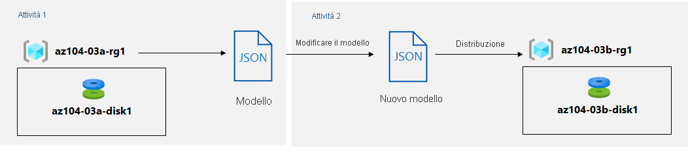

---
lab:
  title: 03b - Gestire le risorse di Azure usando i modelli di ARM
  module: Module 03 - Azure Administration
ms.openlocfilehash: 4d50e205d76db7bfeffd89a970ffcb42bd9c2f42
ms.sourcegitcommit: 8a0ced6338608682366fb357c69321ba1aee4ab8
ms.translationtype: HT
ms.contentlocale: it-IT
ms.lasthandoff: 11/08/2021
ms.locfileid: "132625525"
---
# <a name="lab-03b---manage-azure-resources-by-using-arm-templates"></a>Lab 03b - Gestire le risorse di Azure usando i modelli di ARM
# <a name="student-lab-manual"></a>Manuale del lab per studenti

## <a name="lab-scenario"></a>Scenario del lab
Dopo aver esplorato le funzionalità di amministrazione di base di Azure associate al provisioning delle risorse e averle organizzate in base ai gruppi di risorse usando portale di Azure, è necessario eseguire l'attività equivalente usando i modelli di Azure Resource Manager.

## <a name="objectives"></a>Obiettivi

In questo lab si eseguiranno le attività seguenti:

+ Attività 1: Esaminare un modello di ARM per la distribuzione di un disco gestito di Azure
+ Attività 2: Creare un disco gestito di Azure usando un modello di ARM
+ Attività 3: Esaminare la distribuzione del disco gestito basata sul modello di ARM

## <a name="estimated-timing-20-minutes"></a>Tempo stimato: 20 minuti

## <a name="architecture-diagram"></a>Diagramma dell'architettura



## <a name="instructions"></a>Istruzioni

### <a name="exercise-1"></a>Esercizio 1

#### <a name="task-1-review-an-arm-template-for-deployment-of-an-azure-managed-disk"></a>Attività 1: Esaminare un modello di ARM per la distribuzione di un disco gestito di Azure

In questa attività si creerà una risorsa disco di Azure usando un modello di Azure Resource Manager.

1. Accedere al [**portale di Azure**](https://portal.azure.com).

1. Accedere al portale di Azure e selezionare **Gruppi di risorse**. 

1. Nell'elenco dei gruppi di risorse fare clic su **az104-03a-rg1**.

1. Nel pannello del gruppo di risorse **az104-03a-rg1**, nella sezione **Impostazioni**, fare clic su **Distribuzioni**.

1. Nel pannello **az104-03a-rg1 - Distribuzioni** fare clic sulla prima voce nell'elenco delle distribuzioni.

1. Nel pannello **Microsoft.ManagedDisk-* XXXXXXXXX* \| Panoramica** fare clic su **Modello**.

    >**Nota**: esaminare il contenuto del modello e notare che sono disponibili le opzioni **Scarica** per scaricarlo nel computer locale, **Aggiungi alla raccolta** e **Distribuisci** per distribuirlo di nuovo.

1. Fare clic su **Scarica** e salvare il file compresso contenente i file del modello e dei parametri nella cartella **Download** del computer del lab.

1. Nel pannello **Microsoft.ManagedDisk-* XXXXXXXXX* \| Modello** fare clic su **Input**.

1. Prendere nota del valore del parametro **location**. Sarà necessario nell'attività successiva.

1. Estrarre il contenuto del file scaricato nella cartella **Download** nel computer del lab.

    >**Nota**: questi file sono anche disponibili come **\\Allfiles\\Labs\\03\\az104-03b-md-template.json** e **\\Allfiles\\Labs\\03\\az104-03b-md-parameters.json**
    
1. Chiudere tutte le finestre di **Esplora file**.

#### <a name="task-2-create-an-azure-managed-disk-by-using-an-arm-template"></a>Attività 2: Creare un disco gestito di Azure usando un modello di ARM

1. Nel portale di Azure cercare e selezionare **Distribuisci un modello personalizzato**.

1. Fare clic sull'opzione **Distribuzione modelli (distribuzione tramite modelli personalizzati)** disponibile nel gruppo **Marketplace**.

1. Nel pannello **Distribuzione personalizzata** fare clic su **Creare un modello personalizzato nell'editor**.

1. Nel pannello **Modifica del modello** fare clic su **Carica file** e caricare il file **template.json** scaricato nell'attività precedente.

1. Nel riquadro dell'editor rimuovere le righe seguenti:

   ```json
   "sourceResourceId": {
       "type": "String"
   },
   "sourceUri": {
       "type": "String"
   },
   "osType": {
       "type": "String"
   },
   ```

   ```json
   "hyperVGeneration": {
       "defaultValue": "V1",
       "type": "String"
   },      
   ```

   ```json
   "osType": "[parameters('osType')]",
   ```

    >**Nota**: questi parametri vengono rimossi perché non sono applicabili alla distribuzione corrente. In particolare, i parametri sourceResourceId, sourceUri, osType e hyperVGeneration parameters sono applicabili alla creazione di un disco di Azure da un file VHD esistente.

1. Fare clic su **Salva** per salvare le modifiche.

1. Tornare nel pannello **Distribuzione personalizzata** e fare clic su **Modifica parametri**. 

1. Nel pannello **Modifica modello** fare clic su **Carica file** e caricare il file **parameters.json** scaricato nell'attività precedente, quindi fare clic su **Salva** per salvare le modifiche.

1. Tornare nel pannello **Distribuzione personalizzata** e specificare le impostazioni seguenti:

    | Impostazione | Valore |
    | --- |--- |
    | Sottoscrizione | *Nome della sottoscrizione di Azure usata in questo lab* |
    | Gruppo di risorse | Il nome di un **nuovo** gruppo di risorse **az104-03b-rg1** |
    | Area geografica | Il nome di qualsiasi area di Azure disponibile nella sottoscrizione usata in questo lab |
    | Nome del disco | **az104-03b-disk1** |
    | Posizione | Il valore del parametro location annotato nell'attività precedente |
    | Sku | **Standard_LRS** |
    | Dimensioni disco (GB) | **32** |
    | Opzione Crea | **empty** |
    | Set di crittografia dischi | **EncryptionAtRestWithPlatformKey** |
    | Criteri di accesso alla rete | **AllowAll** |

1. Selezionare **Rivedi e crea** e quindi **Crea**.

1. Verificare che la distribuzione sia stata completata correttamente.

#### <a name="task-3-review-the-arm-template-based-deployment-of-the-managed-disk"></a>Attività 3: Esaminare la distribuzione del disco gestito basata sul modello di ARM

1. Accedere al portale di Azure e selezionare **Gruppi di risorse**. 

1. Nell'elenco dei gruppi di risorse fare clic su **az104-03b-rg1**.

1. Nel pannello del gruppo di risorse **az104-03b-rg1**, nella sezione **Impostazioni**, fare clic su **Distribuzioni**.

1. Nel **pannello az104-03b-rg1 - Distribuzioni** fare clic sulla prima voce nell'elenco delle distribuzioni ed esaminare il contenuto dei pannelli **Input** e **Modello**.

#### <a name="clean-up-resources"></a>Pulire le risorse

   >**Nota**: non eliminare le risorse distribuite in questo lab. Verranno usate nel lab successivo di questo modulo.

#### <a name="review"></a>Verifica

In questo lab sono state eseguite le attività seguenti:

- Esplorazione di un modello di ARM per la distribuzione di un disco gestito di Azure
- Creazione di un disco gestito di Azure usando un modello di ARM
- Verifica della distribuzione del disco gestito basata sul modello di ARM
