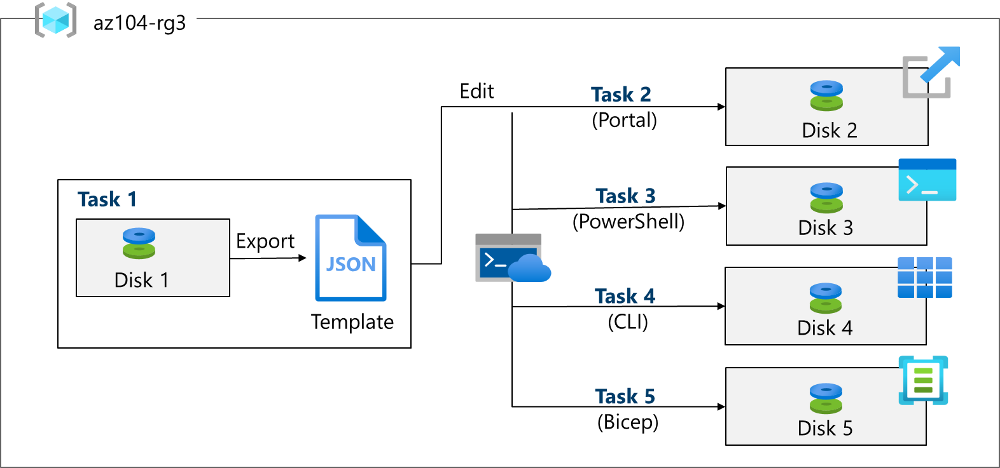

---
lab:
  title: 'Lab 03: Gestire le risorse di Azure usando i modelli di Azure Resource Manager'
  module: Administer Azure Resources
---

# Lab 03 - Gestire le risorse di Azure usando i modelli di Azure Resource Manager

## Introduzione al lab

In questo lab si apprenderà come automatizzare le distribuzioni delle risorse. Vengono fornite informazioni sui modelli di Azure Resource Manager e sui modelli Bicep. Vengono illustrati i diversi modi per distribuire i modelli. 

Questo lab richiede una sottoscrizione di Azure. Il tipo di sottoscrizione può influire sulla disponibilità delle funzionalità in questo lab. È possibile modificare l'area, ma i passaggi vengono scritti usando **Stati Uniti orientali**. 

## Tempo stimato: 50 minuti

## Simulazioni interattive del lab

Esistono simulazioni di lab interattive che potrebbero risultare utili per questo argomento. La simulazione consente di eseguire uno scenario simile al proprio ritmo. Esistono differenze tra la simulazione interattiva e questo lab, ma molti concetti fondamentali sono identici. Non è necessaria una sottoscrizione di Azure. 

+ [Gestire le risorse di Azure usando i modelli di Azure Resource Manager](https://mslabs.cloudguides.com/guides/AZ-104%20Exam%20Guide%20-%20Microsoft%20Azure%20Administrator%20Exercise%205). Esaminare, creare e distribuire dischi gestiti con un modello.
  
+ [Creare una macchina virtuale con un modello](https://mslearn.cloudguides.com/en-us/guides/AZ-900%20Exam%20Guide%20-%20Azure%20Fundamentals%20Exercise%209). Distribuire una macchina virtuale con un modello di avvio rapido.
  
## Scenario laboratorio

Il team vuole esaminare i modi per automatizzare e semplificare le distribuzioni delle risorse. L'organizzazione sta cercando modi per ridurre il sovraccarico amministrativo, ridurre l'errore umano e aumentare la coerenza.  

## Diagramma dell'architettura



## Competenze mansione

+ Attività 1: Creare un modello di Azure Resource Manager.
+ Attività 2. Modificare un modello di Azure Resource Manager e ridistribuirlo.
+ Attività 3. Configurare Cloud Shell e distribuire un modello con Azure PowerShell.
+ Attività 4: Distribuire un modello con l'interfaccia della riga di comando. 
+ Attività 5: Distribuire una risorsa usando Azure Bicep.

## Attività 1: Creare un modello di Azure Resource Manager

In questa attività verrà creato un disco gestito nel portale di Azure. I dischi gestiti sono risorse di archiviazione progettate per essere usate con le macchine virtuali. Dopo aver distribuito il disco, verrà esportato un modello che è possibile usare in altre distribuzioni.

1. Accedere al **portale di Azure** - `https://portal.azure.com`.

1. Cercare e selezionare `Disks`.

1. Nella pagina Dischi selezionare **Crea**.

1. Nella pagina **Creare un disco gestito** configurare il disco e quindi selezionare **Ok**. 
    
    | Impostazione | Valore |
    | --- | --- |
    | Subscription | *sottoscrizione in uso* | 
    | Gruppo di risorse | `az104-rg3` (Se necessario, selezionare **Crea nuovo**).
    | Disk name | `az104-disk1` | 
    | Area geografica | **Stati Uniti orientali** |
    | Zona di disponibilità | **La ridondanza dell'infrastruttura non è richiesta** | 
    | Source type | **Nessuno** |
    | Prestazioni | **HDD Standard** (modifica dimensione) |
    | Dimensione | **32 Gib** | 

    >**Nota:** Stiamo creando un semplice disco gestito in modo da poter praticare con i modelli. I dischi gestiti di Azure sono volumi di archiviazione a livello di blocco gestiti da Azure.

1. Fare clic su **Rivedi e crea** quindi selezionare **Crea**.

1. Monitorare le notifiche (in alto a destra) e dopo la distribuzione selezionare **Vai alla risorsa**. 

1. Nel pannello **Automazione** selezionare **Esporta modello**. 

1. Esaminare i file **modello** e **parametri**.

1. Fare clic su **Scarica** e salvare i modelli nell'unità locale. Verrà creato un file zippato compresso. 

1. Usare Esplora file per estrarre il contenuto del file scaricato nella cartella **Download** nel computer. Si noti che sono presenti due file JSON (modello e parametri). 

   >**Suggerimenti utili**  È possibile esportare un intero gruppo di risorse o solo risorse specifiche all'interno di tale gruppo di risorse.

## Attività 2: Modificare un modello di Azure Resource Manager e quindi ridistribuire il modello

In questa attività si usa il modello scaricato per distribuire un nuovo disco gestito. Questa attività illustra come ripetere rapidamente e facilmente le distribuzioni. 

1. Nel portale di Azure, cercare e selezionare `Deploy a custom template`.

1. Nel pannello **Distribuzione personalizzata** si noti che è possibile usare un **modello di avvio rapido**. Esistono molti modelli predefiniti, come illustrato nel menu a discesa. 

1. Invece di usare una guida introduttiva, selezionare **Compila un modello personalizzato nell'editor**.

1. Nel pannello **Modifica modello** fare clic su **Caricare file** e caricare il file **template.json** scaricato nel disco locale.

1. Nel riquadro dell'editor apportare queste modifiche.

    + Modificare **disks_az104_disk1_name** in `disk_name` (due posizioni da modificare)
    + Modificare **az104-disk1** in `az104-disk2` (una posizione da modificare)

1. Si noti che si tratta di un disco **Standard**. La posizione è **eastus**. Le dimensioni del disco sono di **32 GB**.

1. Selezionare **Salva** per salvare le modifiche.

1. Non dimenticare il file dei parametri. Selezionare **Modifica parametri**, fare clic su **Carica file** e caricare il **parameters.json**. 

1. Apportare questa modifica in modo che corrisponda al file modello.

    Modificare **disks_az104_disk1_name** in **disk_name** (un'unica posizione da modificare)

1. Selezionare **Salva** per salvare le modifiche. 

1. Completare le impostazioni di distribuzione personalizzate:

    | Impostazione | Valore |
    | --- |--- |
    | Subscription | *sottoscrizione in uso* |
    | Gruppo di risorse | `az104-rg3` |
    | Paese | **(Stati Uniti) Stati Uniti orientali** |
    | Disk_name | `az104-disk2` |

1. Selezionare **Rivedi e crea** e quindi **Crea**.

1. Selezionare **Vai alla risorsa**. Verificare che **az104-disk2** sia stato creato.

1. Nel pannello **Panoramica** selezionare il gruppo di risorse, **az104-rg3**. A questo punto dovrebbero essere presenti due dischi.
   
1. Nella sezione **Impostazioni** fare clic su **Distribuzioni**.

    >**Nota:** Tutti i dettagli delle distribuzioni sono documentati nel gruppo di risorse. È consigliabile esaminare le prime distribuzioni basate su modelli per garantire il successo prima di usare i modelli per operazioni su larga scala.

1. Selezionare una distribuzione ed esaminare il contenuto dei pannelli **Input** e **Modello**.

## Attività 3: Configurare Cloud Shell e distribuire un modello con PowerShell 

In questa attività si lavora con Azure Cloud Shell e Azure PowerShell. Azure Cloud Shell è un terminale interattivo, autenticato e accessibile dal browser per la gestione delle risorse di Azure. Offre la possibilità di scegliere l'esperienza shell più adatta al proprio modo di lavorare, Bash o PowerShell. In questa attività si usa PowerShell per distribuire un modello. 

1. Selezionare l'icona **Cloud Shell** in alto a destra nel portale di Azure. In alternativa, è possibile passare direttamente a `https://shell.azure.com`.

   

1. Quando viene chiesto di selezionare **Bash** o **PowerShell**, selezionare **PowerShell**. 

    >**Suggerimenti utili**  Se si lavora principalmente con sistemi Linux, Bash (CLI) risulta più familiare. Se si lavora principalmente con i sistemi Windows, Azure PowerShell risulta più familiare. 

1. Nella **schermata Attività iniziali** selezionare **Montare l'account** di archiviazione, selezionare la **sottoscrizione** dell'account di archiviazione e quindi selezionare **Applica**.

1. Selezionare **Voglio creare un account** di archiviazione e quindi **Avanti**. Completare le **informazioni su Crea account** di archiviazione. 
    
    | Impostazione | Valori |
    |  -- | -- |
    | Gruppo di risorse | **az104-rg3** |
    | Paese | *Selezionare l'area* | 
    | Account di archiviazione (crea nuovo) | *deve essere univoco a livello globale, tra 3 e 24 caratteri, e usare solo numeri e lettere minuscole* |
    | Condivisione file (creare nuova) | `fs-cloudshell` |

1. Al termine, selezionare **Crea**.

    >Il provisioning dell'archiviazione richiederà alcuni minuti.

1. Selezionare **Impostazioni** (barra superiore) e quindi **Vai alla versione** classica.

1. Selezionare l'icona **Carica/Scarica file** (barra superiore) e quindi selezionare **Carica**.

1. Caricare sia i file di modello che di parametri dalla **directory Download** . 

1. Selezionare l'icona **Editor (parentesi graffe)** e passare al file JSON del modello a sinistra nel riquadro di spostamento.

1. Apportare una modifica. Ad esempio, modificare il nome del disco in **az104-disk3**. Usare **CTRL+S** per salvare le modifiche. 

    >**Nota**: È possibile impostare come destinazione la distribuzione del modello in un gruppo di risorse, una sottoscrizione, un gruppo di gestione o un tenant. A seconda dell'ambito della distribuzione, vengono usati comandi diversi.

1. Per eseguire la distribuzione in un gruppo di risorse, usare **New-AzResourceGroupDeployment**.

    ```powershell
    New-AzResourceGroupDeployment -ResourceGroupName az104-rg3 -TemplateFile template.json -TemplateParameterFile parameters.json
    ```
1. Verificare che il comando venga completato e ProvisioningState sia **Operazione completata**.

1. Verificare che il disco sia stato creato.

   ```powershell
   Get-AzDisk
   ```
   
## Attività 4: Distribuire un modello con l'interfaccia della riga di comando 

1. Continuare in **Cloud Shell**, selezionare **Bash**. **Confermare** la scelta.

1. Verificare che i file siano disponibili nell'archiviazione di Cloud Shell. Se l'attività precedente è stata completata, devono essere disponibili i file di modello. 

    ```sh
    ls
    ```

1. Selezionare l'icona **Editor** (parentesi graffe) e passare al file JSON del modello.

1. Apportare una modifica. Ad esempio, modificare il nome del disco in **az104-disk4**. Usare **CTRL+S** per salvare le modifiche. 

    >**Nota**: È possibile impostare come destinazione la distribuzione del modello in un gruppo di risorse, una sottoscrizione, un gruppo di gestione o un tenant. A seconda dell'ambito della distribuzione, vengono usati comandi diversi.

1. Per eseguire la distribuzione in un gruppo di risorse, usare **az deployment group create**.

    ```sh
    az deployment group create --resource-group az104-rg3 --template-file template.json --parameters parameters.json
    ```
    
1. Verificare che il comando venga completato e ProvisioningState sia **Operazione completata**.

1. Verificare che il disco sia stato creato.

     ```sh
     az disk list --output table
     ```
   
## Attività 5: Distribuire una risorsa usando Azure Bicep

In questa attività si userà un file Bicep per distribuire un disco gestito. Bicep è uno strumento di automazione dichiarativa basato su modelli di Resource Manager.

1. Continuare a lavorare in **Cloud Shell** in una sessione **Bash**.

1. Individuare e scaricare il file **\Allfiles\Lab03\azuredeploydisk.bicep**.

1. **Caricare** il file bicep in Cloud Shell. 

1. Selezionare l'icona **Editor** (parentesi graffe) e passare al file.

1. Prendersi un momento per leggere il file modello bicep. Si noti come viene definita la risorsa disco. 
   
1. Apportare le modifiche seguenti:

    + Modificare il valore **managedDiskName** in `Disk4`.
    + Modificare il valore del **nome sku** in `StandardSSD_LRS`.
    + Modificare il valore **diskSizeinGiB** in `32`.

1. Usare **CTRL+S** per salvare le modifiche.

1. Distribuire ora il modello.

    ```
    az deployment group create --resource-group az104-rg3 --template-file azuredeploydisk.bicep
    ```

1. Verificare che il disco sia stato creato.

    ```sh
    az disk list --output table
    ```

    >**Nota:** Sono stati distribuiti cinque dischi gestiti, ognuno in modo diverso. L'operazione è stata completata.

## Pulire le risorse

Se si usa la **sottoscrizione personale**, dedicare qualche minuto all’eliminazione delle risorse del lab. In questo modo le risorse vengono liberate e i costi vengono ridotti al minimo. Il modo più semplice per eliminare le risorse del lab consiste nell'eliminare il gruppo di risorse lab. 

+ Nel portale di Azure selezionare il gruppo di risorse, selezionare **Elimina il gruppo di risorse**, **Immettere il nome del gruppo di risorse**, quindi fare clic su **Elimina**.
+ Tramite Azure PowerShell, `Remove-AzResourceGroup -Name resourceGroupName`.
+ Usando l’interfaccia della riga di comando, `az group delete --name resourceGroupName`.

## Estendere l'apprendimento con Copilot

Copilot può essere utile per imparare a usare gli strumenti di scripting di Azure. Copilot può essere utile anche in aree non coperte nel lab o dove occorrono altre informazioni. Aprire un browser Edge e scegliere Copilot (in alto a destra) o passare a *copilot.microsoft.com*. Dedicare qualche minuto alla prova di queste richieste.

+ Qual è il formato del file modello di Azure Resource Manager? Spiegare ogni componente con esempi. 
+ Come si usa un modello di Azure Resource Manager esistente?
+ Confrontare e contrapporre i modelli di Azure Resource Manager e i modelli di Azure Bicep. 


## Altre informazioni con la formazione autogestita

+ [Distribuire l'infrastruttura di Azure usando i modelli di Resource Manager in formato JSON](https://learn.microsoft.com/training/modules/create-azure-resource-manager-template-vs-code/). Scrivere modelli di Azure Resource Manager (modelli di ARM) in formato JSON usando Visual Studio Code per distribuire l'infrastruttura in Azure in modo coerente e affidabile.
+ [Esaminare le funzionalità e gli strumenti di Azure Cloud Shell](https://learn.microsoft.com/training/modules/review-features-tools-for-azure-cloud-shell/). Funzionalità e strumenti di Cloud Shell. 
+ [Gestire le risorse di Azure con Windows PowerShell](https://learn.microsoft.com/training/modules/manage-azure-resources-windows-powershell/). Questo modulo illustra come installare i moduli necessari per la gestione dei servizi cloud e come usare i comandi di PowerShell per eseguire semplici attività amministrative sulle risorse cloud, ad esempio macchine virtuali di Azure, sottoscrizioni di Azure e account di archiviazione di Azure.
+ [Introduzione a Bash](https://learn.microsoft.com/training/modules/bash-introduction/). Usare Bash per gestire l'infrastruttura IT.
+ [Creare il primo modello Bicep](https://learn.microsoft.com/training/modules/build-first-bicep-template/). Definire le risorse di Azure all'interno di un modello Bicep. Migliorare la coerenza e l'affidabilità delle distribuzioni, ridurre le attività manuali necessarie e ridimensionare le distribuzioni in ambienti diversi. Il modello risulterà flessibile e potrà essere riusato mediante l'impiego di parametri, variabili, espressioni e moduli.

## Punti chiave

Congratulazioni per aver completato il lab. Ecco i concetti chiave per questo lab. 

+ I modelli di Azure Resource Manager consentono di distribuire, gestire e monitorare tutte le risorse per la soluzione come gruppo, anziché gestire queste risorse singolarmente.
+ Un modello di Azure Resource Manager è un file JSON (JavaScript Object Notation) che consente di gestire l'infrastruttura in modo dichiarativo anziché con gli script.
+ Anziché passare parametri come valori inline nel modello, è possibile usare un file JSON separato che contiene i valori dei parametri.
+ I modelli di Azure Resource Manager possono essere distribuiti in diversi modi, tra cui il portale di Azure, Azure PowerShell e l'interfaccia della riga di comando.
+ Bicep è un'alternativa ai modelli di Azure Resource Manager. Bicep usa una sintassi dichiarativa per distribuire le risorse di Azure.
+ Bicep offre sintassi concisa, indipendenza dai tipi affidabile e supporto per il riutilizzo del codice. Bicep offre un'esperienza di creazione di prima classe per le soluzioni di infrastruttura come codice in Azure.


