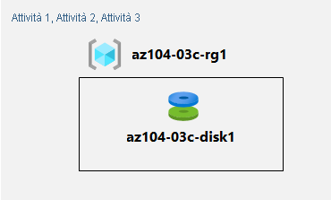

---
lab:
  title: 'Lab 03c: Gestire le risorse di Azure usando Azure PowerShell (facoltativo)'
  module: Administer Azure Resources
---

# Lab 03c - Gestire le risorse di Azure usando Azure PowerShell
# Manuale del lab per studenti

## Scenario del lab

Dopo aver esplorato le funzionalità di amministrazione di base di Azure associate al provisioning delle risorse e averle organizzate in base ai gruppi di risorse usando portale di Azure e i modelli di Azure Resource Manager, è necessario eseguire l'attività equivalente usando Azure PowerShell. Per evitare di installare moduli di Azure PowerShell, si userà l'ambiente PowerShell disponibile in Azure Cloud Shell.

                **Nota:** è disponibile una **[simulazione di lab interattiva](https://mslabs.cloudguides.com/guides/AZ-104%20Exam%20Guide%20-%20Microsoft%20Azure%20Administrator%20Exercise%206)** che consente di eseguire questo lab in base ai propri tempi. Si potrebbero notare piccole differenza tra la simulazione interattiva e il lab ospitato, ma i concetti e le idee principali dimostrati sono gli stessi. 

>**Nota:** Questo lab richiede il completamento del lab 03b. 

## Obiettivi

In questo lab si eseguiranno le attività seguenti:

+ Attività 1: Avviare una sessione di PowerShell in Azure Cloud Shell
+ Attività 2: Creare un gruppo di risorse e un disco gestito di Azure usando Azure PowerShell
+ Attività 3: Configurare il disco gestito usando Azure PowerShell

## Tempo stimato: 20 minuti

## Diagramma dell'architettura



### Istruzioni

> **Nota**:  creare sempre la propria password sicura per qualsiasi macchina virtuale o account utente creato. Se la macchina virtuale viene creata automaticamente, usare **Reimposta password** nel portale per aggiornare la password. 

## Esercizio 1

## Attività 1: Avviare una sessione di PowerShell in Azure Cloud Shell

In questa attività si aprirà una sessione di PowerShell in Cloud Shell. 

1. Nel portale di Azure aprire **Azure Cloud Shell** facendo clic sull'icona nell'angolo in alto a destra.

1. Se viene richiesto di selezionare **Bash** o **PowerShell**, selezionare **PowerShell**. 

    >**Nota**: se è la prima volta che si avvia **Cloud Shell** e viene visualizzato il messaggio **Non sono state montate risorse di archiviazione**, selezionare la sottoscrizione in uso nel lab e quindi fare clic su **Crea archivio**. 

1. Quando richiesto, fare clic su **Crea archivio** e attendere che venga visualizzato il riquadro Azure Cloud Shell. 

1. Accertarsi che nel menu a discesa nell'angolo in alto a sinistra del riquadro Cloud Shell sia visualizzato **PowerShell**.

## Attività 2: Creare un gruppo di risorse e un disco gestito di Azure usando Azure PowerShell

In questa attività si creeranno un gruppo di risorse e un disco gestito di Azure usando la sessione di Azure PowerShell all'interno di Cloud Shell

1. Per creare un gruppo di risorse nella stessa area di Azure del gruppo di risorse **az104-03b-rg1** creato nel lab precedente, nella sessione di PowerShell all'interno di Cloud Shell eseguire quanto segue:

   ```powershell
   $location = (Get-AzResourceGroup -Name az104-03b-rg1).Location

   $rgName = 'az104-03c-rg1'

   New-AzResourceGroup -Name $rgName -Location $location
   ```
1. Per recuperare le proprietà del gruppo di risorse appena creato, eseguire quanto segue:

   ```powershell
   Get-AzResourceGroup -Name $rgName
   ```
1. Per creare un nuovo disco gestito con le stesse caratteristiche di quello creato nei lab precedenti di questo modulo, eseguire quanto segue:

   ```powershell
   $diskConfig = New-AzDiskConfig `
    -Location $location `
    -CreateOption Empty `
    -DiskSizeGB 32 `
    -SkuName Standard_LRS

   $diskName = 'az104-03c-disk1'

   New-AzDisk `
    -ResourceGroupName $rgName `
    -DiskName $diskName `
    -Disk $diskConfig
   ```

1. Per recuperare le proprietà del disco appena creato, eseguire quanto segue:

   ```powershell
   Get-AzDisk -ResourceGroupName $rgName -Name $diskName
   ```

## Attività 3: Configurare il disco gestito usando Azure PowerShell

In questa attività si gestirà la configurazione del disco gestito di Azure usando la sessione di Azure PowerShell all'interno di Cloud Shell. 

1. Per aumentare le dimensioni del disco gestito di Azure a **64 GB**, nella sessione di PowerShell all'interno di Cloud Shell eseguire quanto segue:

   ```powershell
   New-AzDiskUpdateConfig -DiskSizeGB 64 | Update-AzDisk -ResourceGroupName $rgName -DiskName $diskName
   ```

1. Per verificare che la modifica abbia avuto effetto, eseguire quanto segue:

   ```powershell
   Get-AzDisk -ResourceGroupName $rgName -Name $diskName
   ```

1. Per verificare che lo SKU corrente sia **Standard_LRS**, eseguire quanto segue:

   ```powershell
   (Get-AzDisk -ResourceGroupName $rgName -Name $diskName).Sku
   ```

1. Per impostare lo SKU delle prestazioni del disco su **Premium_LRS**, nella sessione di PowerShell all'interno di Cloud Shell eseguire quanto segue:

   ```powershell
   New-AzDiskUpdateConfig -SkuName Premium_LRS | Update-AzDisk -ResourceGroupName $rgName -DiskName $diskName
   ```

1. Per verificare che la modifica abbia avuto effetto, eseguire quanto segue:

   ```powershell
   (Get-AzDisk -ResourceGroupName $rgName -Name $diskName).Sku
   ```

## Pulire le risorse

   >**Nota**: non eliminare le risorse distribuite in questo lab. Verranno usate nel lab successivo di questo modulo.

## Verifica

In questo lab sono state eseguite le attività seguenti:

- Avvio di una sessione di PowerShell in Azure Cloud Shell
- Creazione di un gruppo di risorse e di un disco gestito di Azure usando Azure PowerShell
- Configurazione del disco gestito usando Azure PowerShell
