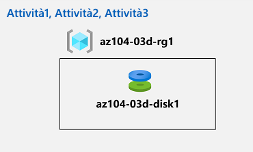

---
lab:
  title: 'Lab 03d: Gestire le risorse di Azure tramite l''interfaccia della riga di comando di Azure'
  module: Administer Azure Resources
---

# Lab 03d - Gestire le risorse di Azure usando l'interfaccia della riga di comando di Azure
# Manuale del lab per studenti

## Scenario del lab

Dopo aver esplorato le funzionalità di amministrazione di base di Azure associate al provisioning delle risorse e averle organizzate in base ai gruppi di risorse usando portale di Azure, i modelli di Azure Resource Manager e Azure PowerShell, è necessario eseguire l'attività equivalente usando l'interfaccia della riga di comando di Azure. Per evitare di installare l'interfaccia della riga di comando di Azure, si sfrutta l'ambiente Bash disponibile in Azure Cloud Shell.

                **Nota:** è disponibile una **[simulazione di lab interattiva](https://mslabs.cloudguides.com/guides/AZ-104%20Exam%20Guide%20-%20Microsoft%20Azure%20Administrator%20Exercise%207)** che consente di eseguire questo lab in base ai propri tempi. Si potrebbero notare piccole differenza tra la simulazione interattiva e il lab ospitato, ma i concetti e le idee principali dimostrati sono gli stessi. 

>**Nota:** Questo lab richiede il completamento del lab 03b.

## Obiettivi

In questo lab si eseguiranno le attività seguenti:

+ Attività 1: Avviare una sessione Bash in Azure Cloud Shell
+ Attività 2: Creare un gruppo di risorse e un disco gestito di Azure usando l'interfaccia della riga di comando di Azure
+ Attività 3: Configurare il disco gestito usando l'interfaccia della riga di comando di Azure

## Tempo stimato: 20 minuti

## Diagramma dell'architettura



### Istruzioni

## Esercizio 1

## Attività 1: Avviare una sessione Bash in Azure Cloud Shell

In questa attività si aprirà una sessione Bash in Cloud Shell. 

1. Nel portale di Azure aprire **Azure Cloud Shell** facendo clic sull'icona nell'angolo in alto a destra.

1. Se viene richiesto di selezionare **Bash** o **PowerShell**, selezionare **Bash**. 

    >**Nota**: se è la prima volta che si avvia **Cloud Shell** e viene visualizzato il messaggio **Non sono state montate risorse di archiviazione**, selezionare la sottoscrizione in uso nel lab e quindi fare clic su **Crea archivio**. 

1. Quando richiesto, fare clic su **Crea archivio** e attendere che venga visualizzato il riquadro Azure Cloud Shell. 

1. Accertarsi che nel menu a discesa nell'angolo in alto a sinistra del riquadro Cloud Shell sia visualizzato **Bash**.

## Attività 2: Creare un gruppo di risorse e un disco gestito di Azure usando l'interfaccia della riga di comando di Azure

In questa attività si creeranno un gruppo di risorse e un disco gestito di Azure usando la sessione dell'interfaccia della riga di comando di Azure all'interno di Cloud Shell.

1. Per creare un gruppo di risorse nella stessa area di Azure del gruppo di risorse **az104-03c-rg1** creato nel lab precedente, nella sessione Bash all'interno di Cloud Shell eseguire quanto segue:

   ```sh
   LOCATION=$(az group show --name 'az104-03c-rg1' --query location --out tsv)

   RGNAME='az104-03d-rg1'

   az group create --name $RGNAME --location $LOCATION
   ```
1. Per recuperare le proprietà del gruppo di risorse appena creato, eseguire quanto segue:

   ```sh
   az group show --name $RGNAME
   ```
1. Per creare un nuovo disco gestito con le stesse caratteristiche di quello creato nei lab precedenti di questo modulo, nella sessione Bash all'interno di Cloud Shell eseguire quanto segue:

   ```sh
   DISKNAME='az104-03d-disk1'

   az disk create \
   --resource-group $RGNAME \
   --name $DISKNAME \
   --sku 'Standard_LRS' \
   --size-gb 32
   ```
    >**Nota**: se si usa la sintassi su più righe, assicurarsi che ogni riga termini con la barra rovesciata (`\`) senza spazi finali e che non siano presenti spazi iniziali all'inizio di ogni riga.

1. Per recuperare le proprietà del disco appena creato, eseguire quanto segue:

   ```sh
   az disk show --resource-group $RGNAME --name $DISKNAME
   ```

## Attività 3: Configurare il disco gestito usando l'interfaccia della riga di comando di Azure

In questa attività si gestirà la configurazione del disco gestito di Azure usando la sessione dell'interfaccia della riga di comando di Azure all'interno di Cloud Shell. 

1. Per aumentare le dimensioni del disco gestito di Azure a **64 GB**, nella sessione Bash all'interno di Cloud Shell eseguire quanto segue:

   ```sh
   az disk update --resource-group $RGNAME --name $DISKNAME --size-gb 64
   ```

1. Per verificare che la modifica abbia avuto effetto, eseguire quanto segue:

   ```sh
   az disk show --resource-group $RGNAME --name $DISKNAME --query diskSizeGB
   ```

1. Per impostare lo SKU delle prestazioni del disco su **Premium_LRS**, nella sessione Bash all'interno di Cloud Shell eseguire quanto segue:

   ```sh
   az disk update --resource-group $RGNAME --name $DISKNAME --sku 'Premium_LRS'
   ```

1. Per verificare che la modifica abbia avuto effetto, eseguire quanto segue:

   ```sh
   az disk show --resource-group $RGNAME --name $DISKNAME --query sku
   ```

## Pulire le risorse

 > **Nota**: ricordarsi di rimuovere tutte le risorse di Azure appena create che non vengono più usate. La rimozione delle risorse inutilizzate garantisce che non verranno addebitati costi imprevisti.

 > **Nota**: non è necessario preoccuparsi se le risorse del lab non possono essere rimosse immediatamente. A volte le risorse hanno dipendenze e l'eliminazione può richiedere molto tempo. Si tratta di un'attività comune dell'amministratore per monitorare l'utilizzo delle risorse, quindi è sufficiente esaminare periodicamente le risorse nel portale per verificare il funzionamento della pulizia. 

1. Nel portale di Azure aprire la sessione shell **Bash** all'interno del riquadro **Cloud Shell**.

1. Elencare tutti i gruppi di risorse creati nei lab di questo modulo eseguendo il comando seguente:

   ```sh
   az group list --query "[?starts_with(name,'az104-03')].name" --output tsv
   ```

1. Eliminare tutti i gruppi di risorse creati nei lab di questo modulo eseguendo il comando seguente:

   ```sh
   az group list --query "[?starts_with(name,'az104-03')].[name]" --output tsv | xargs -L1 bash -c 'az group delete --name $0 --no-wait --yes'
   ```

    >**Nota**: il comando viene eseguito in modo asincrono, in base a quanto determinato dal parametro --nowait, quindi, sebbene sia possibile eseguire un altro comando dell'interfaccia della riga di comando di Azure immediatamente dopo nella stessa sessione Bash, il gruppo di risorse verrà rimosso dopo alcuni minuti.

## Verifica

In questo lab sono state eseguite le attività seguenti:

- Avvio di una sessione Bash in Azure Cloud Shell
- Creazione di un gruppo di risorse e di un disco gestito di Azure usando l'interfaccia della riga di comando di Azure
- Configurazione del disco gestito usando l'interfaccia della riga di comando di Azure
