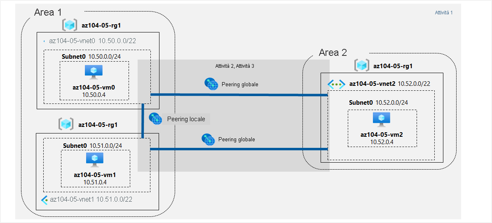

---
lab:
  title: 05 - Implementare la connettività tra siti
  module: Administer Intersite Connectivity
---

# <a name="lab-05---implement-intersite-connectivity"></a>Lab 05 - Implementare la connettività tra siti
# <a name="student-lab-manual"></a>Manuale del lab per studenti

## <a name="lab-scenario"></a>Scenario del lab

Contoso has its datacenters in Boston, New York, and Seattle offices connected via a mesh wide-area network links, with full connectivity between them. You need to implement a lab environment that will reflect the topology of the Contoso's on-premises networks and verify its functionality.

<bpt id="p1">**</bpt>Note:<ept id="p1">**</ept> An <bpt id="p2">**</bpt><bpt id="p3">[</bpt>interactive lab simulation<ept id="p3">](https://mslabs.cloudguides.com/guides/AZ-104%20Exam%20Guide%20-%20Microsoft%20Azure%20Administrator%20Exercise%209)</ept><ept id="p2">**</ept> is available that allows you to click through this lab at your own pace. You may find slight differences between the interactive simulation and the hosted lab, but the core concepts and ideas being demonstrated are the same. 

## <a name="objectives"></a>Obiettivi

In questo lab si eseguiranno le attività seguenti:

+ Attività 1: Effettuare il provisioning dell'ambiente lab
+ Attività 2: Configurare il peering di rete virtuale locale e globale
+ Attività 3: Testare la connettività tra siti

## <a name="estimated-timing-30-minutes"></a>Tempo stimato: 30 minuti

## <a name="architecture-diagram"></a>Diagramma dell'architettura



### <a name="instructions"></a>Istruzioni

#### <a name="task-1-provision-the-lab-environment"></a>Attività 1: Effettuare il provisioning dell'ambiente lab

In questa attività verranno distribuite tre macchine virtuali, ognuna in una rete virtuale separata, con due macchine virtuali nella stessa area di Azure e la terza in un'altra area di Azure.

1. Accedere al [portale di Azure](https://portal.azure.com).

1. Nel portale di Azure aprire **Azure Cloud Shell** facendo clic sull'icona nell'angolo in alto a destra.

1. Se viene richiesto di selezionare **Bash** o **PowerShell**, selezionare **PowerShell**.

    >**Nota**: se è la prima volta che si avvia **Cloud Shell** e viene visualizzato il messaggio **Non sono state montate risorse di archiviazione**, selezionare la sottoscrizione in uso nel lab e quindi fare clic su **Crea archivio**.

1. Sulla barra degli strumenti del riquadro Cloud Shell fare clic sull'icona **Carica/Scarica file**, nel menu a discesa fare clic su **Carica** e caricare i file **\\Allfiles\\Labs\\05\\az104-05-vnetvm-loop-template.json** e **\\Allfiles\\Labs\\05\\az104-05-vnetvm-loop-parameters.json** nella home directory di Cloud Shell.

1. Edit the <bpt id="p1">**</bpt>Parameters<ept id="p1">**</ept> file you just uploaded and change the password. If you need help editing the file in the Shell please ask your instructor for assistance. As a best practice, secrets, like passwords, should be more securely stored in the Key Vault. 

1. From the Cloud Shell pane, run the following to create the resource group that will be hosting the lab environment. The first two virtual networks and a pair of virtual machines will be deployed in [Azure_region_1]. The third virtual network and the third virtual machine will be deployed in the same resource group but another [Azure_region_2]. (replace the [Azure_region_1] and [Azure_region_2] placeholder, including the square brackets, with the names of two different Azure regions where you intend to deploy these Azure virtual machines. An example is $location1 = 'eastus'. You can use Get-AzLocation to list all locations.):

   ```powershell
   $location1 = 'eastus'

   $location2 = 'westus'

   $rgName = 'az104-05-rg1'

   New-AzResourceGroup -Name $rgName -Location $location1
   ```

   ><bpt id="p1">**</bpt>Note<ept id="p1">**</ept>: The regions used above were tested and known to work when this lab was last officially reviewed. If you would prefer to use different locations, or they no longer work, you will need to identify two different regions that Standard D2Sv3 virtual machines can be deployed into.
   >
   >Per identificare le aree di Azure, in una sessione di PowerShell in Cloud Shell eseguire **(Get-AzLocation).Location**
   >
   >Dopo aver identificato due aree da usare, eseguire il comando seguente in Cloud Shell per ogni area per verificare che sia possibile distribuire macchine virtuali D2Sv3 Standard
   >
   >```az vm list-skus --location <Replace with your location> -o table --query "[? contains(name,'Standard_D2s')].name" ```
   >
   >Le sedi di Boston, New York e Seattle dei data center di Contoso sono connesse tramite collegamenti WAN (Wide Area Network) mesh con connettività completa tra le sedi.

1. Nel riquadro Cloud Shell eseguire il codice seguente per creare tre reti virtuali e distribuire macchine virtuali in tali reti usando il modello e i file di parametri caricati:

   ```powershell
   New-AzResourceGroupDeployment `
      -ResourceGroupName $rgName `
      -TemplateFile $HOME/az104-05-vnetvm-loop-template.json `
      -TemplateParameterFile $HOME/az104-05-vnetvm-loop-parameters.json `
      -location1 $location1 `
      -location2 $location2
   ```

    >È necessario implementare un ambiente lab che rispecchierà la topologia delle reti locali di Contoso e ne verificherà la funzionalità.

1. Chiudere il riquadro Cloud Shell.

#### <a name="task-2-configure-local-and-global-virtual-network-peering"></a>Attività 2: Configurare il peering di rete virtuale locale e globale

In questa attività verrà configurato il peering locale e globale tra le reti virtuali distribuite nelle attività precedenti.

1. Nel portale di Azure cercare e selezionare **Reti virtuali**.

1. Esaminare le reti virtuali create nell'attività precedente e verificare che le prime due si trovino nella stessa area di Azure e che la terza si trovi in un'area di Azure diversa.

    >**Nota**: il modello usato per la distribuzione delle tre reti virtuali garantisce che gli intervalli di indirizzi IP delle tre reti virtuali non si sovrappongano.

1. Nell'elenco di reti virtuali fare clic su **az104-05-vnet0**.

1. Nel pannello della rete virtuale **az104-05-vnet0**, nella sezione **Impostazioni**, fare clic su **Peering**e quindi su **+ Aggiungi**.

1. Aggiungere un peering con le impostazioni seguenti e non modificare i valori predefiniti per le altre impostazioni, quindi fare clic su **Aggiungi**:

    | Impostazione | Valore|
    | --- | --- |
    | Questa rete virtuale: Nome del collegamento di peering | **az104-05-vnet0_to_az104-05-vnet1** |
    | Questa rete virtuale: Traffico verso la rete virtuale remota | **Consenti (impostazione predefinita)** |
    | Questa rete virtuale: Traffico inoltrato dalla rete virtuale remota | **Blocca il traffico originato dall'esterno di questa rete virtuale** |
    | Gateway di rete virtuale | **Nessuno** |
    | Rete virtuale remota: Nome del collegamento di peering | **az104-05-vnet1_to_az104-05-vnet0** |
    | Modello di distribuzione della rete virtuale | **Resource Manager** |
    | Conosco l'ID della risorsa | non selezionata |
    | Subscription | Nome della sottoscrizione di Azure usata in questo lab |
    | Rete virtuale | **az104-05-vnet1** |
    | Traffico verso la rete virtuale remota | **Consenti (impostazione predefinita)** |
    | Traffico inoltrato dalla rete virtuale remota | **Blocca il traffico originato dall'esterno di questa rete virtuale** |
    | Gateway di rete virtuale | **Nessuno** |

    >**Nota**: questo passaggio stabilisce due peering locali, uno da az104-05-vnet0 ad az104-05-vnet1 e l'altro da az104-05-vnet1 ad az104-05-vnet0.

    >**Nota**: se si verifica un problema con l'interfaccia del portale di Azure che non mostra le reti virtuali create nell'attività precedente, è possibile configurare il peering eseguendo i comandi di PowerShell seguenti da Cloud Shell:
    
   ```powershell
   $rgName = 'az104-05-rg1'

   $vnet0 = Get-AzVirtualNetwork -Name 'az104-05-vnet0' -ResourceGroupName $rgname

   $vnet1 = Get-AzVirtualNetwork -Name 'az104-05-vnet1' -ResourceGroupName $rgname

   Add-AzVirtualNetworkPeering -Name 'az104-05-vnet0_to_az104-05-vnet1' -VirtualNetwork $vnet0 -RemoteVirtualNetworkId $vnet1.Id

   Add-AzVirtualNetworkPeering -Name 'az104-05-vnet1_to_az104-05-vnet0' -VirtualNetwork $vnet1 -RemoteVirtualNetworkId $vnet0.Id
   ``` 

1. Nel pannello della rete virtuale **az104-05-vnet0**, nella sezione **Impostazioni**, fare clic su **Peering**e quindi su **+ Aggiungi**.

1. Aggiungere un peering con le impostazioni seguenti e non modificare i valori predefiniti per le altre impostazioni, quindi fare clic su **Aggiungi**:

    | Impostazione | Valore|
    | --- | --- |
    | Questa rete virtuale: Nome del collegamento di peering | **az104-05-vnet0_to_az104-05-vnet2** |
    | Questa rete virtuale: Traffico verso la rete virtuale remota | **Consenti (impostazione predefinita)** |
    | Questa rete virtuale: Traffico inoltrato dalla rete virtuale remota | **Blocca il traffico originato dall'esterno di questa rete virtuale** |
    | Gateway di rete virtuale | **Nessuno** |
    | Rete virtuale remota: Nome del collegamento di peering | **az104-05-vnet2_to_az104-05-vnet0** |
    | Modello di distribuzione della rete virtuale | **Resource Manager** |
    | Conosco l'ID della risorsa | non selezionata |
    | Subscription | Nome della sottoscrizione di Azure usata in questo lab |
    | Rete virtuale | **az104-05-vnet2** |
    | Traffico verso la rete virtuale remota | **Consenti (impostazione predefinita)** |
    | Traffico inoltrato dalla rete virtuale remota | **Blocca il traffico originato dall'esterno di questa rete virtuale** |
    | Gateway di rete virtuale | **Nessuno** |

    >**Nota**: questo passaggio stabilisce due peering globali, uno da az104-05-vnet0 ad az104-05-vnet2 e l'altro da az104-05-vnet2 ad az104-05-vnet0.

    >**Nota**: se si verifica un problema con l'interfaccia del portale di Azure che non mostra le reti virtuali create nell'attività precedente, è possibile configurare il peering eseguendo i comandi di PowerShell seguenti da Cloud Shell:
    
   ```powershell
   $rgName = 'az104-05-rg1'

   $vnet0 = Get-AzVirtualNetwork -Name 'az104-05-vnet0' -ResourceGroupName $rgname

   $vnet2 = Get-AzVirtualNetwork -Name 'az104-05-vnet2' -ResourceGroupName $rgname

   Add-AzVirtualNetworkPeering -Name 'az104-05-vnet0_to_az104-05-vnet2' -VirtualNetwork $vnet0 -RemoteVirtualNetworkId $vnet2.Id

   Add-AzVirtualNetworkPeering -Name 'az104-05-vnet2_to_az104-05-vnet0' -VirtualNetwork $vnet2 -RemoteVirtualNetworkId $vnet0.Id
   ``` 

1. Tornare al pannello **Reti virtuali** e nell'elenco di reti virtuali fare clic su **az104-05-vnet1**.

1. Nel pannello della rete virtuale **az104-05-vnet1**, nella sezione **Impostazioni**, fare clic su **Peering**e quindi su **+ Aggiungi**.

1. Aggiungere un peering con le impostazioni seguenti e non modificare i valori predefiniti per le altre impostazioni, quindi fare clic su **Aggiungi**:

    | Impostazione | Valore|
    | --- | --- |
    | Questa rete virtuale: Nome del collegamento di peering | **az104-05-vnet1_to_az104-05-vnet2** |
    | Questa rete virtuale: Traffico verso la rete virtuale remota | **Consenti (impostazione predefinita)** |
    | Questa rete virtuale: Traffico inoltrato dalla rete virtuale remota | **Blocca il traffico originato dall'esterno di questa rete virtuale** |
    | Gateway di rete virtuale | **Nessuno** |
    | Rete virtuale remota: Nome del collegamento di peering | **az104-05-vnet2_to_az104-05-vnet1** |
    | Modello di distribuzione della rete virtuale | **Resource Manager** |
    | Conosco l'ID della risorsa | non selezionata |
    | Subscription | Nome della sottoscrizione di Azure usata in questo lab |
    | Rete virtuale | **az104-05-vnet2** |
    | Traffico verso la rete virtuale remota | **Consenti (impostazione predefinita)** |
    | Traffico inoltrato dalla rete virtuale remota | **Blocca il traffico originato dall'esterno di questa rete virtuale** |
    | Gateway di rete virtuale | **Nessuno** |

    >**Nota**: questo passaggio stabilisce due peering globali, uno da az104-05-vnet1 ad az104-05-vnet2 e l'altro da az104-05-vnet2 ad az104-05-vnet1.

    >**Nota**: se si verifica un problema con l'interfaccia del portale di Azure che non mostra le reti virtuali create nell'attività precedente, è possibile configurare il peering eseguendo i comandi di PowerShell seguenti da Cloud Shell:
    
   ```powershell
   $rgName = 'az104-05-rg1'

   $vnet1 = Get-AzVirtualNetwork -Name 'az104-05-vnet1' -ResourceGroupName $rgname

   $vnet2 = Get-AzVirtualNetwork -Name 'az104-05-vnet2' -ResourceGroupName $rgname

   Add-AzVirtualNetworkPeering -Name 'az104-05-vnet1_to_az104-05-vnet2' -VirtualNetwork $vnet1 -RemoteVirtualNetworkId $vnet2.Id

   Add-AzVirtualNetworkPeering -Name 'az104-05-vnet2_to_az104-05-vnet1' -VirtualNetwork $vnet2 -RemoteVirtualNetworkId $vnet1.Id
   ``` 

#### <a name="task-3-test-intersite-connectivity"></a>Attività 3: Testare la connettività tra siti

In questa attività verrà testata la connettività tra le macchine virtuali nelle tre reti virtuali connesse tramite peering locale e globale nell'attività precedente.

1. Nel portale di Azure cercare e selezionare **Macchine virtuali**.

1. Nell'elenco di macchine virtuali fare clic su **az104-05-vm0**.

1. Nel pannello **az104-05-vm0** fare clic su **Connetti**, nel menu a discesa fare clic su **RDP**, nel pannello **Connetti tramite RDP** selezionare **Scarica file RDP** e seguire le istruzioni per avviare la sessione di Desktop remoto.

    ><bpt id="p1">**</bpt>Note<ept id="p1">**</ept>: This step refers to connecting via Remote Desktop from a Windows computer. On a Mac, you can use Remote Desktop Client from the Mac App Store and on Linux computers you can use an open source RDP client software.

    >**Nota**: è possibile ignorare eventuali richieste di avviso durante la connessione alle macchine virtuali di destinazione.

1. Quando richiesto, accedere usando il nome utente e la password dello **studente** presenti nel file dei parametri. 

1. Nella sessione di Desktop remoto in **az104-05-vm0**, fare clic con il pulsante destro del mouse sul pulsante **Avvia** e nel menu di scelta rapida fare clic su **Windows PowerShell (amministratore)** .

1. Nella finestra della console di Windows PowerShell eseguire il codice seguente per testare la connettività ad **az104-05-vm1**, con indirizzo IP privato **10.51.0.4**, sulla porta TCP 3389:

   ```powershell
   Test-NetConnection -ComputerName 10.51.0.4 -Port 3389 -InformationLevel 'Detailed'
   ```

    >**Nota**: il test usa TCP 3389 perché questa porta è consentita per impostazione predefinita dal firewall del sistema operativo.

1. Esaminare l'output del comando e verificare che la connessione abbia avuto esito positivo.

1. Nella finestra della console di Windows PowerShell eseguire il codice seguente per testare la connettività ad **az104-05-vm2**, con indirizzo IP privato **10.52.0.4**:

   ```powershell
   Test-NetConnection -ComputerName 10.52.0.4 -Port 3389 -InformationLevel 'Detailed'
   ```

1. Tornare al portale di Azure nel computer del lab e tornare al pannello **Macchine virtuali**.

1. Nell'elenco di macchine virtuali fare clic su **az104-05-vm1**.

1. Nel pannello **az104-05-vm1** fare clic su **Connetti**, nel menu a discesa fare clic su **RDP**, nel pannello **Connetti tramite RDP** selezionare **Scarica file RDP** e seguire le istruzioni per avviare la sessione di Desktop remoto.

    >                **Nota:** è disponibile una **[simulazione di lab interattiva](https://mslabs.cloudguides.com/guides/AZ-104%20Exam%20Guide%20-%20Microsoft%20Azure%20Administrator%20Exercise%209)** che consente di eseguire questo lab in base ai propri tempi.

    >**Nota**: è possibile ignorare eventuali richieste di avviso durante la connessione alle macchine virtuali di destinazione.

1. Quando richiesto, accedere usando il nome utente e la password dello **studente** presenti nel file dei parametri. 

1. Nella sessione di Desktop remoto in **az104-05-vm1**, fare clic con il pulsante destro del mouse sul pulsante **Avvia** e nel menu di scelta rapida fare clic su **Windows PowerShell (amministratore)** .

1. Nella finestra della console di Windows PowerShell eseguire il codice seguente per testare la connettività ad **az104-05-vm2**, con indirizzo IP privato **10.52.0.4**, sulla porta TCP 3389:

   ```powershell
   Test-NetConnection -ComputerName 10.52.0.4 -Port 3389 -InformationLevel 'Detailed'
   ```

    >**Nota**: il test usa TCP 3389 perché questa porta è consentita per impostazione predefinita dal firewall del sistema operativo.

1. Esaminare l'output del comando e verificare che la connessione abbia avuto esito positivo.

#### <a name="clean-up-resources"></a>Pulire le risorse

>Si potrebbero notare piccole differenza tra la simulazione interattiva e il lab ospitato, ma i concetti e le idee principali dimostrati sono gli stessi.

><bpt id="p1">**</bpt>Note<ept id="p1">**</ept>:  Don't worry if the lab resources cannot be immediately removed. Sometimes resources have dependencies and take a longer time to delete. It is a common Administrator task to monitor resource usage, so just periodically review your resources in the Portal to see how the cleanup is going. 

1. Nel portale di Azure aprire la sessione di **PowerShell** all'interno del riquadro **Cloud Shell**.

1. Elencare tutti i gruppi di risorse creati nei lab di questo modulo eseguendo il comando seguente:

   ```powershell
   Get-AzResourceGroup -Name 'az104-05*'
   ```

1. Eliminare tutti i gruppi di risorse creati nei lab di questo modulo eseguendo il comando seguente:

   ```powershell
   Get-AzResourceGroup -Name 'az104-05*' | Remove-AzResourceGroup -Force -AsJob
   ```

    >**Nota**: il comando viene eseguito in modo asincrono, in base a quanto determinato dal parametro -AsJob, quindi, sebbene sia possibile eseguire un altro comando di PowerShell immediatamente dopo nella stessa sessione di PowerShell, i gruppi di risorse verranno rimossi dopo alcuni minuti.

#### <a name="review"></a>Verifica

In questo lab sono state eseguite le attività seguenti:

+ Provisioning dell'ambiente lab
+ Configurazione del peering di rete virtuale locale e globale
+ Test della connettività tra siti
