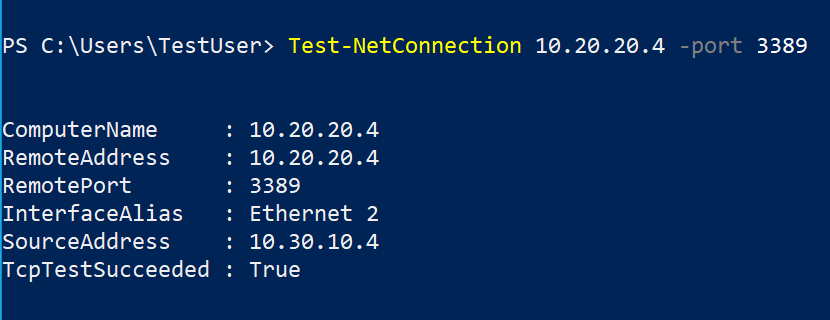

---
lab:
  title: 'Lab 05: Implementare la connettività tra siti'
  module: Administer Intersite Connectivity
---

# Lab 05 - Implementare la connettività tra siti

## Introduzione al lab

Questo lab esplora la comunicazione tra reti virtuali. Si implementa il peering di reti virtuali e si testano le connessioni. Si creerà anche una route personalizzata. 

Questo lab richiede una sottoscrizione di Azure. Il tipo di sottoscrizione può influire sulla disponibilità delle funzionalità in questo lab. È possibile modificare l'area, ma i passaggi vengono scritti usando **Stati Uniti orientali**. 

## Tempo stimato: 50 minuti
    
## Scenario laboratorio 

L'organizzazione segmenta le app e i servizi IT principali (come i servizi DNS e di sicurezza) di altre parti dell'azienda, incluso il reparto di produzione. Tuttavia, in alcuni scenari, le app e i servizi dell'area principale devono comunicare con app e servizi dell'area di produzione. In questo lab viene configurata la connettività tra le aree segmentate. Si tratta di uno scenario comune per separare la produzione dallo sviluppo o separare una filiale da un'altra.  

## Diagramma dell'architettura


## Competenze mansione

+ Attività 1: Creare una macchina virtuale in una rete virtuale.
+ Attività 2: Creare una macchina virtuale in una rete virtuale diversa.
+ Attività 3: Usare Network Watcher per testare la connessione tra macchine virtuali. 
+ Attività 4: Configurare i peering tra reti virtuali diverse.
+ Attività 5: Usare Azure PowerShell per testare la connessione tra macchine virtuali.
+ Attività 6: Creare una route personalizzata. 

## Attività 1:  Creare una macchina virtuale e una rete virtuale per i servizi principali

In questa attività si crea una rete virtuale per i servizi principali con una macchina virtuale. 

1. Accedere al **portale di Azure** - `https://portal.azure.com`.

1. Cercare e selezionare `Virtual Machines`.

1. Nella pagina macchine virtuali selezionare **Crea** e quindi macchina **virtuale**.

1. Nella scheda Informazioni di base usare le informazioni seguenti per completare il modulo e quindi selezionare **Avanti : Dischi >**. Per qualsiasi impostazione non specificata, lasciare il valore predefinito.
 
    | Impostazione | valore | 
    | --- | --- |
    | Subscription |  *sottoscrizione in uso* |
    | Gruppo di risorse |  `az104-rg5` (se necessario, **Crea nuovo**. )
    | Virtual machine name |    `CoreServicesVM` |
    | Paese | **(Stati Uniti) Stati Uniti orientali** |
    | Opzioni di disponibilità | La ridondanza dell'infrastruttura non è richiesta |
    | Tipo di sicurezza | **Standard** |
    | Immagine (Vedi tutte le immagini) | **Windows Server 2019 Datacenter - x64 Gen2** (si notino le altre opzioni) |
    | Dimensione | **Standard_DS2_v3** |
    | Username | `localadmin` | 
    | Password | **Specificare una password complessa** |
    | Porte in ingresso pubbliche | **Nessuno** |

    
   
1. Nella **scheda Dischi accettare** le impostazioni predefinite e quindi selezionare **Avanti : Rete >**.

1. Nella scheda **Rete**, per Rete virtuale selezionare **Crea nuova**.

1. Usare le informazioni seguenti per configurare la rete virtuale e quindi selezionare **OK**. Se necessario, rimuovere o sostituire le informazioni esistenti.

    | Impostazione | valore | 
    | --- | --- |
    | Name | `CoreServicesVnet` (Crea o modifica) |
    | Intervallo di indirizzi | `10.0.0.0/16`  |
    | Nome della subnet | `Core` | 
    | Intervallo di indirizzi subnet | `10.0.0.0/24` |

1. Selezionare la **scheda Monitoraggio** . Per Diagnostica di avvio selezionare **Disabilita**.

1. Selezionare **Rivedi + Crea** e quindi selezionare **Crea**.

1. Non è necessario attendere la creazione delle risorse. Passare all'attività successiva.

    >**Nota:** Si è notato che in questa attività è stata creata la rete virtuale durante la creazione della macchina virtuale? È inoltre possibile creare l'infrastruttura della rete virtuale e quindi aggiungere le macchine virtuali. 

## Attività 2: Creare una macchina virtuale in una rete virtuale diversa

In questa attività si crea una rete virtuale di servizi di produzione con una macchina virtuale. 

1. Nel portale di Azure cercare e passare a **Macchine virtuali**.

1. Nella pagina macchine virtuali selezionare **Crea** e quindi macchina **virtuale**.

1. Nella scheda Informazioni di base usare le informazioni seguenti per completare il modulo e quindi selezionare **Avanti : Dischi >**. Per qualsiasi impostazione non specificata, lasciare il valore predefinito.
 
    | Impostazione | valore | 
    | --- | --- |
    | Subscription |  *sottoscrizione in uso* |
    | Gruppo di risorse |  `az104-rg5` |
    | Virtual machine name |    `ManufacturingVM` |
    | Paese | **(Stati Uniti) Stati Uniti orientali** |
    | Tipo di sicurezza | **Standard** |
    | Opzioni di disponibilità | La ridondanza dell'infrastruttura non è richiesta |
    | Immagine (Vedi tutte le immagini) | **Windows Server 2019 Datacenter - x64 Gen2** |
    | Dimensione | **Standard_DS2_v3** | 
    | Username | `localadmin` | 
    | Password | **Specificare una password complessa** |
    | Porte in ingresso pubbliche | **Nessuno** |

1. Nella **scheda Dischi accettare** le impostazioni predefinite e quindi selezionare **Avanti : Rete >**.

1. Nella scheda Rete, per Rete virtuale selezionare **Crea nuova**.

1. Usare le informazioni seguenti per configurare la rete virtuale e quindi selezionare **OK**.  Se necessario, rimuovere o sostituire l'intervallo di indirizzi esistente.

    | Impostazione | valore | 
    | --- | --- |
    | Nome | `ManufacturingVnet` |
    | Intervallo di indirizzi | `172.16.0.0/16`  |
    | Nome della subnet | `Manufacturing` |
    | Intervallo di indirizzi subnet | `172.16.0.0/24` |

1. Selezionare la scheda **Monitoraggio**. Per Diagnostica di avvio selezionare **Disabilita**.

1. Selezionare **Rivedi + Crea** e quindi selezionare **Crea**.

## Attività 3: Usare Network Watcher per testare la connessione tra macchine virtuali 


In questa attività si verifica che le risorse nelle reti virtuali con peering possano comunicare tra loro. Verrà usato Network Watcher per testare la connessione. Prima di continuare, assicurarsi che entrambe le macchine virtuali siano state distribuite e siano in esecuzione. 

1. Nel portale di Azure, cercare e selezionare `Network Watcher`.

1. In Network Watcher, nel menu Strumenti di diagnostica di rete selezionare **Risoluzione dei problemi di connessione**.

1. Usare le informazioni seguenti per completare i campi nella pagina **Risoluzione dei problemi di connessione**.

    | Campo | Valore | 
    | --- | --- |
    | Source type           | **Macchina virtuale**   |
    | Macchina virtuale       | **CoreServicesVM**    | 
    | Tipo destinazione      | **Selezionare una macchina virtuale**   |
    | Macchina virtuale       | **ManufacturingVM**   | 
    | Versione indirizzo IP preferita  | **Entrambi**              | 
    | Protocollo              | **TCP**               |
    | Porta di destinazione      | `3389`                |  
    | Porta di origine           | *Blank*         |
    | Test di diagnostica      | *Defaults*      |

    

1. Selezionare **Esegui test diagnostici**.

    >**Nota**: La restituzione dei risultati potrebbe richiedere alcuni minuti. Le selezioni dello schermo verranno disattivate durante la raccolta dei risultati. Si noti che il **test** di connettività mostra **Unreachable**. Ciò ha senso perché le macchine virtuali si trovano in reti virtuali diverse. 

 
## Attività 4: Configurare il peering tra reti virtuali

In questa attività viene creato un peering di reti virtuali per abilitare le comunicazioni tra le risorse nelle reti virtuali. 

1. Nel portale di Azure, selezionare la `CoreServicesVnet` rete virtuale.

1. In CoreServicesVnet, in **Impostazioni** selezionare **Peer**.

1. In CoreServicesVnet, in Peering selezionare **+ Aggiungi**. Se non specificato, accettare il valore predefinito. 

    | **Parametro**                                    | **valore**                             |
    | --------------------------------------------- | ------------------------------------- |
    | Nome del collegamento di peering                             | `ManufacturingVnet-to-CoreServicesVnet` |
    | Rete virtuale    | **ManufacturingVnet (az104-rg5)**  |
    | Consentire a 'CoreServicesVnet' di accedere a 'ManufacturingVnet'            | selezionato (impostazione predefinita) |
    | Consentire a 'CoreServicesVnet' di ricevere traffico inoltrato da 'ManufacturingVnet' | Opzione selezionata |
    | Nome del collegamento di peering                             | `CoreServicesVnet-to-ManufacturingVnet` |
    | Consentire a 'ManufacturingVnet' di accedere a 'CoreServicesVnet'  | selezionato (impostazione predefinita) |
    | Consentire a 'ManufacturingVnet' di ricevere traffico inoltrato da 'CoreServicesVnet' | Opzione selezionata  |

4. Fare clic su **Aggiungi**.

5. In CoreServicesVnet, in Peering, verificare che sia elencato il **peering CoreServicesVnet-to-ManufacturingVnet** . Aggiornare la pagina per assicurarsi che lo **stato del peering** sia **Connesso**.

6. Passare a **ManufacturingVnet** e verificare che il peering **ManufacturingVnet-to-CoreServicesVnet** sia elencato. Verificare che lo **stato del peering** sia **Connesso**. Può essere necessario **aggiornare** la pagina. 

## Attività 5: Usare Azure PowerShell per testare la connessione tra macchine virtuali

In questa attività si testa di nuovo la connessione tra le macchine virtuali di reti virtuali diverse. 

### Verificare l'indirizzo IP privato di CoreServicesVM

1. Nel portale di Azure cercare e selezionare la `CoreServicesVM` macchina virtuale.

1. Nel pannello **Panoramica** della sezione **Rete** registrare l'**indirizzo IP privato** del computer. Queste informazioni sono necessarie per testare la connessione.
   
### Testare la connessione a CoreServicesVM dalla **ManufacturingVM**.

>**Suggerimenti utili** Esistono molti modi per controllare le connessioni. In questa attività si usa il **comando Esegui**. È anche possibile continuare a usare Network Watcher. In alternativa, è possibile usare una [connessione Desktop remoto](https://learn.microsoft.com/azure/virtual-machines/windows/connect-rdp#connect-to-the-virtual-machine) per accedere alla macchina virtuale. Una volta effettuata la connessione, usare **test-connection**. Se si ha tempo, provare a usare RDP. 

1. Passare alla `ManufacturingVM` macchina virtuale.

1. Nel pannello **Operazioni** selezionare il pannello **comando Esegui**.

1. Selezionare **RunPowerShellScript** ed eseguire il comando **Test-NetConnection**. Assicurarsi di usare l'indirizzo IP privato di **CoreServicesVM**.

    ```Powershell
    Test-NetConnection <CoreServicesVM private IP address> -port 3389
    ```
1. Il timeout dello script potrebbe richiedere alcuni minuti. Nella parte superiore della pagina viene visualizzato un messaggio *informativo Esecuzione script in corso...*

   
1. La connessione di test dovrebbe avere esito positivo perché il peering è stato configurato. Il nome del computer e l'indirizzo remoto in questo elemento grafico potrebbero essere diversi. 
   
   

## Attività 6: Creare una route personalizzata 

In questa attività si vuole controllare il traffico di rete tra la subnet perimetrale e la subnet dei servizi principali interni. Un'appliance di rete virtuale verrà installata nella subnet perimetrale e tutto il traffico deve essere instradato. 

1. Cercare e selezionare `CoreServicesVnet`.

1. Selezionare **Subnet** e quindi **+ Subnet**. Assicurarsi di selezionare **Aggiungi** per salvare le modifiche. 

    | Impostazione | valore | 
    | --- | --- |
    | Name | `perimeter` |
    | Indirizzo iniziale | `10.0.1.0/24`  |

   
1. Nella portale di Azure cercare e selezionare , selezionare `Route tables`**+ Crea**.

1. Immettere i dettagli seguenti, selezionare **Rivedi e crea** e quindi selezionare **Crea**. 

    | Impostazione | valore | 
    | --- | --- |
    | Subscription | sottoscrizione in uso |
    | Gruppo di risorse | `az104-rg5`  |
    | Area geografica | **Stati Uniti orientali** |
    | Nome | `rt-CoreServices` |
    | Propaga route del gateway | **No** |

1. Dopo la distribuzione della tabella di route, cercare e selezionare le tabelle** di **route.
   
1. Selezionare la risorsa (non la casella di controllo) **rt-CoreServices**

1. Espandere **Impostazioni** , quindi selezionare **Route** e quindi **+ Aggiungi**. Creare una route da un'appliance virtuale di rete (NVA) futura alla rete virtuale CoreServices. 

    | Impostazione | valore | 
    | --- | --- |
    | Nome route | `PerimetertoCore` |
    | Tipo destinazione | **Indirizzi IP** |
    | Indirizzi IP di destinazione | `10.0.0.0/16` (rete virtuale dei servizi principali) |
    | Tipo hop successivo | **Appliance virtuale** (si notino le altre opzioni) |
    | Indirizzo hop successivo | `10.0.1.7` (appliance virtuale di rete futura) |

1. Selezionare **Aggiungi**. L'ultima operazione da eseguire è associare la route alla subnet.

1. Selezionare **Subnet** e quindi **+ Associa**. Completare la configurazione.

    | Impostazione | valore | 
    | --- | --- |
    | Rete virtuale | **CoreServicesVnet (az104-rg5)** |
    | Subnet | **Core** |    

>**Nota**: È stata creata una route definita dall'utente per indirizzare il traffico dalla rete perimetrale alla nuova appliance virtuale di rete.  

## Pulire le risorse

Se si usa la **sottoscrizione personale**, dedicare qualche minuto all’eliminazione delle risorse del lab. In questo modo le risorse vengono liberate e i costi vengono ridotti al minimo. Il modo più semplice per eliminare le risorse del lab consiste nell'eliminare il gruppo di risorse lab. 

+ Nel portale di Azure selezionare il gruppo di risorse, selezionare **Elimina il gruppo di risorse**, **Immettere il nome del gruppo di risorse**, quindi fare clic su **Elimina**.
+ Tramite Azure PowerShell, `Remove-AzResourceGroup -Name resourceGroupName`.
+ Usando l’interfaccia della riga di comando, `az group delete --name resourceGroupName`.

## Estendere l'apprendimento con Copilot
Copilot può essere utile per imparare a usare gli strumenti di scripting di Azure. Copilot può essere utile anche in aree non coperte nel lab o dove occorrono altre informazioni. Aprire un browser Edge e scegliere Copilot (in alto a destra) o passare a *copilot.microsoft.com*. Dedicare qualche minuto alla prova di queste richieste.

+ Come si possono usare i comandi di Azure PowerShell o dell'interfaccia della riga di comando di Azure per aggiungere un peering di reti virtuali tra vnet1 e vnet2?
+ Creare una tabella che evidenzia vari strumenti di monitoraggio di Azure e di terze parti supportati in Azure. Evidenziare quando usare ogni strumento. 
+ Quando si crea una route di rete personalizzata in Azure?

## Altre informazioni con la formazione autogestita

+ [Distribuire i servizi nelle reti virtuali di Azure e integrarli usando il peering di reti virtuali](https://learn.microsoft.com/en-us/training/modules/integrate-vnets-with-vnet-peering/). Usare il peering di rete virtuale per consentire le comunicazioni tra le reti virtuali in modo sicuro e con la massima semplicità.
+ [Gestire e controllare il flusso del traffico nella distribuzione di Azure tramite route](https://learn.microsoft.com/training/modules/control-network-traffic-flow-with-routes/). Informazioni su come controllare il traffico di rete virtuale di Azure implementando route personalizzate.


## Punti chiave

Congratulazioni per aver completato il lab. Ecco i concetti chiave per questo lab. 

+ Per impostazione predefinita, le risorse in reti virtuali diverse non possono comunicare.
+ Il peering di reti virtuali consente di connettere facilmente due reti virtuali in Azure.
+ Le reti virtuali con peering vengono visualizzate come una sola per facilitare la connettività.
+ Il traffico tra macchine virtuali nelle reti virtuali con peering usa l'infrastruttura backbone Microsoft.
+ Le route definite dal sistema vengono create automaticamente per ogni subnet in una rete virtuale. Le route definite dall'utente sostituiscono o si aggiungono alle route di sistema predefinite. 
+ Azure Network Watcher fornisce una suite di strumenti per il monitoraggio, la diagnostica e la visualizzazione delle metriche e dei log per le risorse IaaS di Azure.
