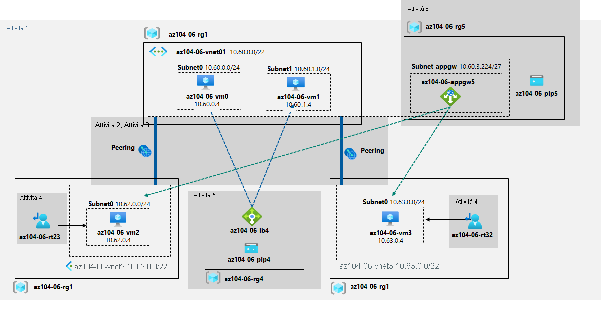

---
lab:
  title: 06 - Implementare Gestione del traffico
  module: Module 06 - Network Traffic Management
---

# <a name="lab-06---implement-traffic-management"></a>Lab 06 - Implementare Gestione del traffico
# <a name="student-lab-manual"></a>Manuale del lab per studenti

## <a name="lab-scenario"></a>Scenario del lab

You were tasked with testing managing network traffic targeting Azure virtual machines in the hub and spoke network topology, which Contoso considers implementing in its Azure environment (instead of creating the mesh topology, which you tested in the previous lab). This testing needs to include implementing connectivity between spokes by relying on user defined routes that force traffic to flow via the hub, as well as traffic distribution across virtual machines by using layer 4 and layer 7 load balancers. For this purpose, you intend to use Azure Load Balancer (layer 4) and Azure Application Gateway (layer 7).

><bpt id="p1">**</bpt>Note<ept id="p1">**</ept>: This lab, by default, requires total of 8 vCPUs available in the Standard_Dsv3 series in the region you choose for deployment, since it involves deployment of four Azure VMs of Standard_D2s_v3 SKU. If your students are using trial accounts, with the limit of 4 vCPUs, you can use a VM size that requires only one vCPU (such as Standard_B1s).

## <a name="objectives"></a>Obiettivi

In questo lab si eseguiranno le attività seguenti:

+ Attività 1: Effettuare il provisioning dell'ambiente lab
+ Attività 2: Configurare la topologia di rete hub-spoke
+ Attività 3: Testare la transitività del peering di reti virtuali
+ Attività 4: Configurare il routing nella topologia hub-spoke
+ Attività 5: Implementare Azure Load Balancer
+ Attività 6: Implementare il gateway applicazione di Azure

## <a name="estimated-timing-60-minutes"></a>Tempo stimato: 60 minuti

## <a name="architecture-diagram"></a>Diagramma dell'architettura




## <a name="instructions"></a>Istruzioni

### <a name="exercise-1"></a>Esercizio 1

#### <a name="task-1-provision-the-lab-environment"></a>Attività 1: Effettuare il provisioning dell'ambiente lab

In this task, you will deploy four virtual machines into the same Azure region. The first two will reside in a hub virtual network, while each of the remaining two will reside in a separate spoke virtual network.

1. Accedere al [portale di Azure](https://portal.azure.com).

1. Nel portale di Azure aprire **Azure Cloud Shell** facendo clic sull'icona nell'angolo in alto a destra.

1. Se viene richiesto di selezionare **Bash** o **PowerShell**, selezionare **PowerShell**.

    >**Nota**: se è la prima volta che si avvia **Cloud Shell** e viene visualizzato il messaggio **Non sono state montate risorse di archiviazione**, selezionare la sottoscrizione in uso nel lab e quindi fare clic su **Crea archivio**.

1. Sulla barra degli strumenti del riquadro Cloud Shell fare clic sull'icona **Carica/Scarica file**, nel menu a discesa fare clic su **Carica** e caricare i file **\\Allfiles\\Labs\\06\\az104-06-vms-loop-template.json** e **\\Allfiles\\Labs\\06\\az104-06-vms-loop-parameters.json** nella home directory di Cloud Shell.

1. Edit the <bpt id="p1">**</bpt>Parameters<ept id="p1">**</ept> file you just uploaded and change the password. If you need help editing the file in the Shell please ask your instructor for assistance. As a best practice, secrets, like passwords, should be more securely stored in the Key Vault. 

1. Nel riquadro Cloud Shell eseguire il comando seguente per creare il primo gruppo di risorse che ospiterà l'ambiente lab (sostituire il segnaposto "[Azure_region]" con il nome di un'area di Azure in cui si intende distribuire le macchine virtuali di Azure). È possibile usare il cmdlet "(Get-AzLocation).Location" per ottenere l'elenco delle aree:

    ```powershell 
    $location = '[Azure_region]'
    ```
    
    Ora il nome del gruppo di risorse:
    ```powershell
    $rgName = 'az104-06-rg1'
    ```
    
    Infine, creare il gruppo di risorse nella posizione desiderata:
    ```powershell
    New-AzResourceGroup -Name $rgName -Location $location
    ```


1. Nel riquadro Cloud Shell eseguire il comando seguente per creare tre reti virtuali e quattro macchine virtuali di Azure in tali reti usando il modello e i file di parametri caricati:

   ```powershell
   New-AzResourceGroupDeployment `
      -ResourceGroupName $rgName `
      -TemplateFile $HOME/az104-06-vms-loop-template.json `
      -TemplateParameterFile $HOME/az104-06-vms-loop-parameters.json
   ```

    ><bpt id="p1">**</bpt>Note<ept id="p1">**</ept>: Wait for the deployment to complete before proceeding to the next step. This should take about 5 minutes.

    >**Nota**: se viene visualizzato un errore che indica che le dimensioni della macchina virtuale non sono disponibili, chiedere assistenza all'insegnante e provare questi passaggi.
    > 1. Fare clic sul pulsante `{}` in CloudShell, selezionare il file **az104-06-vms-loop-parameters.json** nella barra laterale sinistra e prendere nota del valore del parametro `vmSize`.
    > 1. Si è stati incaricati di testare la gestione del traffico di rete per le macchine virtuali di Azure nella topologia di rete hub-spoke, che Contoso considera di implementare nell'ambiente Azure (anziché creare la topologia mesh, testata nel lab precedente).
    > 1. Eseguire `az vm list-skus --location <Replace with your location> -o table --query "[? contains(name,'Standard_D2s')].name"` in CloudShell.
    > 1. Questo test deve includere l'implementazione della connettività tra spoke basandosi su route definite dall'utente che forzano il flusso del traffico tramite l'hub, nonché la distribuzione del traffico tra macchine virtuali usando i servizi di bilanciamento del carico di livello 4 e 7.
    > 1. A questo scopo, si prevede di usare Azure Load Balancer (livello 4) e il gateway applicazione di Azure (livello 7).

1. Nel riquadro Cloud Shell eseguire il comando seguente per installare l'estensione Network Watcher nelle macchine virtuali di Azure distribuite nel passaggio precedente:

   ```powershell
   $rgName = 'az104-06-rg1'
   $location = (Get-AzResourceGroup -ResourceGroupName $rgName).location
   $vmNames = (Get-AzVM -ResourceGroupName $rgName).Name

   foreach ($vmName in $vmNames) {
     Set-AzVMExtension `
     -ResourceGroupName $rgName `
     -Location $location `
     -VMName $vmName `
     -Name 'networkWatcherAgent' `
     -Publisher 'Microsoft.Azure.NetworkWatcher' `
     -Type 'NetworkWatcherAgentWindows' `
     -TypeHandlerVersion '1.4'
   }
   ```

    ><bpt id="p1">**</bpt>Note<ept id="p1">**</ept>: Wait for the deployment to complete before proceeding to the next step. This should take about 5 minutes.


1. Chiudere il riquadro Cloud Shell.

#### <a name="task-2-configure-the-hub-and-spoke-network-topology"></a>Attività 2: Configurare la topologia di rete hub-spoke

In questa attività verrà configurato il peering locale tra le reti virtuali distribuite nelle attività precedenti per creare una topologia di rete hub-spoke.

1. Nel portale di Azure cercare e selezionare **Reti virtuali**.

1. Esaminare le reti virtuali create nell'attività precedente.

    >**Nota**: il modello usato per la distribuzione delle tre reti virtuali garantisce che gli intervalli di indirizzi IP delle tre reti virtuali non si sovrappongano.

1. Nell'elenco di reti virtuali selezionare **az104-06-vnet2**.

1. Nel pannello **az104-06-vnet2** selezionare **Proprietà**. 

1. Nel pannello **az104-06-vnet2 \| Proprietà** registrare il valore della proprietà **ID risorsa**.

1. Tornare all'elenco delle reti virtuali e selezionare **az104-06-vnet3**.

1. Nel pannello **az104-06-vnet3** selezionare **Proprietà**. 

1. Nel pannello **az104-06-vnet3 \| Proprietà** registrare il valore della proprietà **ID risorsa**.

    >**Nota:** più avanti in questa attività saranno necessari i valori della proprietà ResourceID per entrambe le reti virtuali.

    >**Nota:** si tratta di una soluzione alternativa che risolve il problema con il portale di Azure che in alcuni casi non visualizza la rete virtuale di cui è stato appena effettuato il provisioning durante la creazione di peering di reti virtuali.

1. Nell'elenco di reti virtuali fare clic su **az104-06-vnet01**.

1. Nel pannello della rete virtuale **az104-06-vnet01**, nella sezione **Impostazioni**, fare clic su **Peering** e quindi su **+ Aggiungi**.

1. Aggiungere un peering con le impostazioni seguenti e non modificare i valori predefiniti per le altre impostazioni, quindi fare clic su **Aggiungi**:

    | Impostazione | Valore |
    | --- | --- |
    | Questa rete virtuale: Nome del collegamento di peering | **az104-06-vnet01_to_az104-06-vnet2** |
    | Traffico verso la rete virtuale remota | **Consenti (impostazione predefinita)** |
    | Traffico inoltrato dalla rete virtuale remota | **Blocca il traffico originato dall'esterno di questa rete virtuale** |
    | Gateway di rete virtuale | **Nessuno (valore predefinito)** |
    | Rete virtuale remota: Nome del collegamento di peering | **az104-06-vnet2_to_az104-06-vnet01** |
    | Modello di distribuzione della rete virtuale | **Resource Manager** |
    | Conosco l'ID della risorsa | Enabled |
    | ID risorsa | Valore del parametro resourceID di **az104-06-vnet2** registrato in precedenza in questa attività |
    | Traffico verso la rete virtuale remota | **Consenti (impostazione predefinita)** |
    | Traffico inoltrato dalla rete virtuale remota | **Consenti (impostazione predefinita)** |
    | Gateway di rete virtuale | **Nessuno (valore predefinito)** |

    >**Nota**: attendere il completamento dell'operazione.

    >**Nota**: questo passaggio stabilisce due peering locali, uno da az104-06-vnet01 ad az104-06-vnet2 e l'altro da az104-06-vnet2 ad az104-06-vnet01.

    >**Nota:** **Consenti traffico inoltrato** deve essere abilitato per facilitare il routing tra reti virtuali spoke, che verrà implementato più avanti in questo lab.

1. Nel pannello della rete virtuale **az104-06-vnet01**, nella sezione **Impostazioni**, fare clic su **Peering** e quindi su **+ Aggiungi**.

1. Aggiungere un peering con le impostazioni seguenti e non modificare i valori predefiniti per le altre impostazioni, quindi fare clic su **Aggiungi**:

    | Impostazione | Valore |
    | --- | --- |
    | Questa rete virtuale: Nome del collegamento di peering | **az104-06-vnet01_to_az104-06-vnet3** |
    | Traffico verso la rete virtuale remota | **Consenti (impostazione predefinita)** |
    | Traffico inoltrato dalla rete virtuale remota | **Blocca il traffico originato dall'esterno di questa rete virtuale** |
    | Gateway di rete virtuale | **Nessuno (valore predefinito)** |
    | Rete virtuale remota: Nome del collegamento di peering | **az104-06-vnet3_to_az104-06-vnet01** |
    | Modello di distribuzione della rete virtuale | **Resource Manager** |
    | Conosco l'ID della risorsa | Enabled |
    | ID risorsa | Valore del parametro resourceID di **az104-06-vnet3** registrato in precedenza in questa attività |
    | Traffico verso la rete virtuale remota | **Consenti (impostazione predefinita)** |
    | Traffico inoltrato dalla rete virtuale remota | **Consenti (impostazione predefinita)** |
    | Gateway di rete virtuale | **Nessuno (valore predefinito)** |

    >**Nota**: per impostazione predefinita, questo lab richiede un totale di 8 vCPU disponibili nella serie Standard_Dsv3 nell'area scelta per la distribuzione, perché prevede la distribuzione di quattro macchine virtuali di Azure di Standard_D2s_v3 SKU.

    >**Nota:** **Consenti traffico inoltrato** deve essere abilitato per facilitare il routing tra reti virtuali spoke, che verrà implementato più avanti in questo lab.

#### <a name="task-3-test-transitivity-of-virtual-network-peering"></a>Attività 3: Testare la transitività del peering di reti virtuali

In questa attività si testerà la transitività del peering di reti virtuali usando Network Watcher.

1. Nel portale di Azure cercare e selezionare **Network Watcher**.

1. Nel pannello **Network Watcher** espandere l'elenco delle aree di Azure e verificare che il servizio sia abilitato nell'area in uso. 

1. Nel pannello **Network Watcher** passare a **Risoluzione dei problemi di connessione**.

1. Nel pannello **Network Watcher - Risoluzione dei problemi di connessione** avviare un controllo con le impostazioni seguenti, lasciando i valori predefiniti per le altre impostazioni:

    | Impostazione | Valore |
    | --- | --- |
    | Subscription | Nome della sottoscrizione di Azure usata in questo lab |
    | Resource group | **az104-06-rg1** |
    | Tipo di origine | **Macchina virtuale** |
    | Macchina virtuale | **az104-06-vm0** |
    | Destination | **Specificare manualmente** |
    | URI, FQDN o IPv4 | **10.62.0.4** |
    | Protocollo | **TCP** |
    | Porta di destinazione | **3389** |

    > **Nota**: **10.62.0.4** rappresenta l'indirizzo IP privato di **az104-06-vm2**

1. Se gli studenti usano account di valutazione con un limite di 4 vCPU è possibile usare una dimensione di macchina virtuale che richieda una sola vCPU (ad esempio Standard_B1s).

    > **Nota**: questo comportamento è previsto, perché la rete virtuale hub è collegata direttamente alla prima rete virtuale spoke.

1. Nel pannello **Network Watcher - Risoluzione dei problemi di connessione** avviare un controllo con le impostazioni seguenti, lasciando i valori predefiniti per le altre impostazioni:

    | Impostazione | Valore |
    | --- | --- |
    | Subscription | Nome della sottoscrizione di Azure usata in questo lab |
    | Resource group | **az104-06-rg1** |
    | Tipo di origine | **Macchina virtuale** |
    | Macchina virtuale | **az104-06-vm0** |
    | Destination | **Specificare manualmente** |
    | URI, FQDN o IPv4 | **10.63.0.4** |
    | Protocollo | **TCP** |
    | Porta di destinazione | **3389** |

    > **Nota**: **10.63.0.4** rappresenta l'indirizzo IP privato di **az104-06-vm3**

1. Click <bpt id="p1">**</bpt>Check<ept id="p1">**</ept> and wait until results of the connectivity check are returned. Verify that the status is <bpt id="p1">**</bpt>Reachable<ept id="p1">**</ept>. Review the network path and note that the connection was direct, with no intermediate hops in between the VMs.

    > **Nota**: questo comportamento è previsto, perché la rete virtuale hub è collegata direttamente alla seconda rete virtuale spoke.

1. Nel pannello **Network Watcher - Risoluzione dei problemi di connessione** avviare un controllo con le impostazioni seguenti, lasciando i valori predefiniti per le altre impostazioni:

    | Impostazione | Valore |
    | --- | --- |
    | Subscription | Nome della sottoscrizione di Azure usata in questo lab |
    | Resource group | **az104-06-rg1** |
    | Tipo di origine | **Macchina virtuale** |
    | Macchina virtuale | **az104-06-vm2** |
    | Destination | **Specificare manualmente** |
    | URI, FQDN o IPv4 | **10.63.0.4** |
    | Protocollo | **TCP** |
    | Porta di destinazione | **3389** |

1. Click <bpt id="p1">**</bpt>Check<ept id="p1">**</ept> and wait until results of the connectivity check are returned. Note that the status is <bpt id="p1">**</bpt>Unreachable<ept id="p1">**</ept>.

    > **Nota:** questo comportamento è previsto, perché le due reti virtuali spoke non sono associate tra loro (il peering di reti virtuali non è transitivo).

#### <a name="task-4-configure-routing-in-the-hub-and-spoke-topology"></a>Attività 4: Configurare il routing nella topologia hub-spoke

In questa attività verrà configurato e testato il routing tra le due reti virtuali spoke abilitando l'inoltro IP nell'interfaccia di rete della macchina virtuale **az104-06-vm0** abilitando il routing all'interno del sistema operativo e configurando route definite dall'utente nella rete virtuale spoke.

1. Nel portale di Azure cercare e selezionare **Macchine virtuali**.

1. Nel pannello **Macchine virtuali**, nell'elenco di macchine virtuali, fare clic su **az104-06-vm0**.

1. Nel pannello della macchina virtuale **az104-06-vm0**, nella sezione **Impostazioni**, fare clic su **Rete**.

1. Fare clic sul collegamento **az104-06-nic0** accanto all'etichetta **Interfaccia di rete** e quindi nel pannello dell'interfaccia di rete **az104-06-nic0** fare clic su **Configurazioni IP** nella sezione **Impostazioni**.

1. Impostare **Inoltro IP** su **Abilitato** e salvare la modifica.

   > **Nota**: questa impostazione è necessaria per il funzionamento di **az104-06-vm0** come router, che instraderà il traffico tra due reti virtuali spoke.

   > **Nota**: a questo punto è necessario configurare il sistema operativo della macchina virtuale **az104-06-vm0** per supportare il routing.

1. Nel portale di Azure tornare al pannello della macchina virtuale di Azure **az104-06-vm0** e fare clic su **Panoramica**.

1. Nel pannello **az104-06-vm0** fare clic su **Esegui comando** nella sezione **Operazioni** e nell'elenco dei comandi fare clic su **RunPowerShellScript**.

1. Nel pannello **Esegui script di comandi** digitare quanto segue e fare clic su **Esegui** per installare il ruolo Remote Access Windows Server.

   ```powershell
   Install-WindowsFeature RemoteAccess -IncludeManagementTools
   ```

   > **Nota:** attendere la conferma del completamento del comando.

1. Nel pannello **Esegui script di comandi** digitare quanto segue e fare clic su **Esegui** per installare il servizio del ruolo Routing.

   ```powershell
   Install-WindowsFeature -Name Routing -IncludeManagementTools -IncludeAllSubFeature

   Install-WindowsFeature -Name "RSAT-RemoteAccess-Powershell"

   Install-RemoteAccess -VpnType RoutingOnly

   Get-NetAdapter | Set-NetIPInterface -Forwarding Enabled
   ```

   > **Nota:** attendere la conferma del completamento del comando.

   > **Nota**: è ora necessario creare e configurare route definite dall'utente nelle reti virtuali spoke.

1. Nel portale di Azure cercare selezionare **Tabelle di route** e nel pannello **Tabelle di route** fare clic su **+ Crea**.

1. Creare una tabella di route con le impostazioni seguenti e non modificare i valori predefiniti per le altre impostazioni:

    | Impostazione | Valore |
    | --- | --- |
    | Subscription | Nome della sottoscrizione di Azure usata in questo lab |
    | Resource group | **az104-06-rg1** |
    | Location | Nome dell'area di Azure in cui sono state create le reti virtuali |
    | Nome | **az104-06-rt23** |
    | Propaga route del gateway | **No** |

1. Click <bpt id="p1">**</bpt>Review and Create<ept id="p1">**</ept>. Let validation occur, and click <bpt id="p1">**</bpt>Create<ept id="p1">**</ept> to submit your deployment.

   > <bpt id="p1">**</bpt>Note<ept id="p1">**</ept>: Wait for the route table to be created. This should take about 3 minutes.

1. Fare clic su **Vai alla risorsa**.

1. Nella sezione **Impostazioni** della tabella di route **az104-06-rt23** fare clic su **Route** e quindi su **+ Aggiungi**.

1. Aggiungere un nuova route con le impostazioni seguenti:

    | Impostazione | valore |
    | --- | --- |
    | Nome route | **az104-06-route-vnet2-to-vnet3** |
    | Destinazione prefisso indirizzo | **Indirizzi IP** |
    | Indirizzi IP/Intervalli CIDR di destinazione | **10.63.0.0/20** |
    | Tipo hop successivo | **Appliance virtuale** |
    | Indirizzo hop successivo | **10.60.0.4** |

1. Fare clic su **OK**.

1. Nella sezione **Impostazioni** della tabella di route **az104-06-rt23** fare clic su **Subnet** e quindi su **+ Associa**.

1. Associare la tabella di route **az104-06-rt23** alla subnet seguente:

    | Impostazione | valore |
    | --- | --- |
    | Rete virtuale | **az104-06-vnet2** |
    | Subnet | **subnet0** |

1. Fare clic su **OK**.

1. Tornare al pannello **Tabelle di route** e fare clic su **+ Crea**.

1. Creare una tabella di route con le impostazioni seguenti e non modificare i valori predefiniti per le altre impostazioni:

    | Impostazione | Valore |
    | --- | --- |
    | Subscription | Nome della sottoscrizione di Azure usata in questo lab |
    | Resource group | **az104-06-rg1** |
    | Region | Nome dell'area di Azure in cui sono state create le reti virtuali |
    | Nome | **az104-06-rt32** |
    | Propaga route del gateway | **No** |

1. Click Review and Create. Let validation occur, and hit Create to submit your deployment.

   > <bpt id="p1">**</bpt>Note<ept id="p1">**</ept>: Wait for the route table to be created. This should take about 3 minutes.

1. Fare clic su **Vai alla risorsa**.

1. Nella sezione **Impostazioni** della tabella di route **az104-06-rt32** fare clic su **Route** e quindi su **+ Aggiungi**.

1. Aggiungere un nuova route con le impostazioni seguenti:

    | Impostazione | valore |
    | --- | --- |
    | Nome route | **az104-06-route-vnet3-to-vnet2** |
    | Destinazione prefisso indirizzo | **Indirizzi IP** |
    | Indirizzi IP/Intervalli CIDR di destinazione | **10.62.0.0/20** |
    | Tipo hop successivo | **Appliance virtuale** |
    | Indirizzo hop successivo | **10.60.0.4** |

1. Fare clic su **OK**.

1. Nella sezione **Impostazioni** della tabella di route **az104-06-rt32** fare clic su **Subnet** e quindi su **+ Associa**.

1. Associare la tabella di route **az104-06-rt32** alla subnet seguente:

    | Impostazione | valore |
    | --- | --- |
    | Rete virtuale | **az104-06-vnet3** |
    | Subnet | **subnet0** |

1. Fare clic su **OK**.

1. Nel portale di Azure tornare al pannello **Network Watcher - Risoluzione dei problemi di connessione**.

1. Nel pannello **Network Watcher - Risoluzione dei problemi di connessione** avviare un controllo con le impostazioni seguenti, lasciando i valori predefiniti per le altre impostazioni:

    | Impostazione | Valore |
    | --- | --- |
    | Subscription | Nome della sottoscrizione di Azure usata in questo lab |
    | Resource group | **az104-06-rg1** |
    | Tipo di origine | **Macchina virtuale** |
    | Macchina virtuale | **az104-06-vm2** |
    | Destination | **Specificare manualmente** |
    | URI, FQDN o IPv4 | **10.63.0.4** |
    | Protocollo | **TCP** |
    | Porta di destinazione | **3389** |

1. Click <bpt id="p1">**</bpt>Check<ept id="p1">**</ept> and wait until results of the connectivity check are returned. Verify that the status is <bpt id="p1">**</bpt>Reachable<ept id="p1">**</ept>. Review the network path and note that the traffic was routed via <bpt id="p1">**</bpt>10.60.0.4<ept id="p1">**</ept>, assigned to the <bpt id="p2">**</bpt>az104-06-nic0<ept id="p2">**</ept> network adapter. If status is <bpt id="p1">**</bpt>Unreachable<ept id="p1">**</ept>, you should stop and then start az104-06-vm0.

    > **Nota:** questo comportamento è previsto perché il traffico tra reti virtuali spoke viene ora instradato tramite la macchina virtuale che si trova nella rete virtuale hub, che funziona come router.

    > **Nota:** è possibile usare **Network Watcher** per visualizzare la topologia della rete.

#### <a name="task-5-implement-azure-load-balancer"></a>Attività 5: Implementare Azure Load Balancer

In questa attività verrà implementata un'istanza di Azure Load Balancer davanti alle due macchine virtuali di Azure nella rete virtuale hub

1. Nel portale di Azure cercare e selezionare **Servizi di bilanciamento del carico** e, nel pannello **Servizi di bilanciamento del carico**, fare clic su **+ Crea**.

1. Creare un servizio di bilanciamento del carico con le impostazioni seguenti (lasciare le altre con i valori predefiniti) quindi fare clic su **Avanti: Configurazione IP front-end**:

    | Impostazione | Valore |
    | --- | --- |
    | Subscription | Nome della sottoscrizione di Azure usata in questo lab |
    | Resource group | **az104-06-rg1** |
    | Nome | **az104-06-lb4** |
    | Region| Nome dell'area di Azure in cui sono state distribuite tutte le altre risorse in questo lab |
    | SKU | **Standard** |
    | Tipo | **Pubblica** |
    
1. Nella scheda **Configurazione IP front-end** fare clic su **Aggiungi una configurazione IP front-end** e usare l'impostazione seguente prima di fare clic su **Aggiungi**.   
     
    | Impostazione | Valore |
    | --- | --- |
    | Nome | qualsiasi nome univoco |
    | Indirizzo IP pubblico | **Crea nuovo** |
    | Nome dell'indirizzo IP pubblico | **az104-06-pip4** |

1. Click <bpt id="p1">**</bpt>Review and Create<ept id="p1">**</ept>. Let validation occur, and hit <bpt id="p1">**</bpt>Create<ept id="p1">**</ept> to submit your deployment.

    > <bpt id="p1">**</bpt>Note<ept id="p1">**</ept>: Wait for the Azure load balancer to be provisioned. This should take about 2 minutes.

1. Nel pannello della distribuzione fare clic su **Vai alla risorsa**.

1. Nel pannello del servizio di bilanciamento del carico **az104-06-lb4**, nella sezione **Impostazioni**, fare clic su **Pool back-end**e quindi su **+ Aggiungi**.

1. Aggiungere un pool back-end con le impostazioni seguenti e non modificare i valori predefiniti per le altre impostazioni:

    | Impostazione | Valore |
    | --- | --- |
    | Nome | **az104-06-lb4-be1** |
    | Rete virtuale | **az104-06-vnet01** |
    | Versione IP | **IPv4** |
    | Macchina virtuale | **az104-06-vm0** |
    | Indirizzo IP della macchina virtuale | **ipconfig1 (10.60.0.4)** |
    | Macchina virtuale | **az104-06-vm1** |
    | Indirizzo IP della macchina virtuale | **ipconfig1 (10.60.1.4)** |

1. Fare clic su **Aggiungi**

1. Attendere il completamento della creazione del pool back-end. Nella sezione **Impostazioni** fare clic su **Probe di integrità** e quindi su **+ Aggiungi**.

1. Aggiungere un probe di integrità con le impostazioni seguenti:

    | Impostazione | Valore |
    | --- | --- |
    | Nome | **az104-06-lb4-hp1** |
    | Protocollo | **TCP** |
    | Porta | **80** |
    | Intervallo | **5** |
    | Soglia non integra | **2** |

1. Fare clic su **Aggiungi**

1. Attendere il completamento della creazione del probe di integrità. Nella sezione **Impostazioni** fare clic su **Regole di bilanciamento del carico** e quindi su **+ Aggiungi**.

1. Aggiungere una regola di bilanciamento del carico con le impostazioni seguenti e non modificare i valori predefiniti per le altre impostazioni:

    | Impostazione | Valore |
    | --- | --- |
    | Nome | **az104-06-lb4-lbrule1** |
    | Versione indirizzo IP | **IPv4** |
    | Indirizzo IP front-end | **Selezionare LoadBalancerFrontEnd dall'elenco a discesa**
    | Protocollo | **TCP** |
    | Porta | **80** |
    | Porta back-end | **80** |
    | Pool back-end | **az104-06-lb4-be1** |
    | Probe di integrità | **az104-06-lb4-hp1** |
    | Persistenza della sessione | **Nessuno** |
    | Timeout di inattività (minuti) | **4** |
    | Reimpostazione TCP | **Disabilitato** |
    | IP mobile (Direct Server Return) | **Disabilitato** |

1. Fare clic su **Aggiungi**

1. Attendere la creazione della regola di bilanciamento del carico. nella sezione **Impostazioni** fare clic su **Configurazione IP front-end** e prendere nota del valore di **Indirizzo IP pubblico**.

1. Aprire un'altra finestra del browser e passare all'indirizzo IP identificato nel passaggio precedente.

1. Verificare che nella finestra del browser sia visualizzato il messaggio **Hello World from az104-06-vm0** o **Hello World from az104-06-vm1**.

1. Aprire un'altra finestra del browser, ma questa volta usando la modalità InPrivate e verificare se la macchina virtuale di destinazione cambia (come indicato dal messaggio).

    > **Nota**: potrebbe essere necessario aggiornare la finestra del browser o aprirla di nuovo usando la modalità InPrivate.

#### <a name="task-6-implement-azure-application-gateway"></a>Attività 6: Implementare il gateway applicazione di Azure

In questa attività verrà implementato un gateway applicazione di Azure davanti alle due macchine virtuali di Azure nelle reti virtuale spoke.

1. Nel portale di Azure cercare e selezionare **Reti virtuali**.

1. Nel pannello **Reti virtuali**, nell'elenco di reti virtuali, fare clic su **az104-06-vnet01**.

1. Nel pannello della rete virtuale **az104-06-vnet01**, nella sezione **Impostazioni**, fare clic su **Subnet** e quindi su **+ Subnet**.

1. Aggiungere una subnet con le impostazioni seguenti e non modificare i valori predefiniti per le altre impostazioni:

    | Impostazione | Valore |
    | --- | --- |
    | Nome | **subnet-appgw** |
    | Intervallo di indirizzi subnet | **10.60.3.224/27** |

1. Fare clic su **Save** (Salva).

    > <bpt id="p1">**</bpt>Note<ept id="p1">**</ept>: This subnet will be used by the Azure Application Gateway instances, which you will deploy later in this task. The Application Gateway requires a dedicated subnet of /27 or larger size.

1. Nel portale di Azure cercare e selezionare **Gateway applicazione** e nel pannello **Gateway applicazione** fare clic su **+ Crea**.

1. Nella scheda **Dati principali** del pannello **Crea un gateway applicazione** specificare le impostazioni seguenti e non modificare i valori predefiniti per le altre impostazioni:

    | Impostazione | Valore |
    | --- | --- |
    | Subscription | Nome della sottoscrizione di Azure usata in questo lab |
    | Resource group | **az104-06-rg1** |
    | Nome del gateway applicazione | **az104-06-appgw5** |
    | Region | Nome dell'area di Azure in cui sono state distribuite tutte le altre risorse in questo lab |
    | Livello | **Standard V2** |
    | Abilitare la scalabilità automatica | **No** |
    | HTTP2 | **Disabilitato** |
    | Rete virtuale | **az104-06-vnet01** |
    | Subnet | **subnet-appgw** |

1. Fare clic su **Avanti: Front-end >** e nella scheda **Front-end** del pannello **Crea un gateway applicazione** fare clic su **Aggiungi nuovo**, quindi specificare le impostazioni seguenti e non modificare i valori predefiniti per le altre impostazioni:

    | Impostazione | Valore |
    | --- | --- |
    | Tipo di indirizzo IP front-end | **Pubblica** |
    | Indirizzo IP pubblico| Nome di un nuovo indirizzo IP pubblico **az104-06-pip5** |

1. Fare clic su **Avanti: Back-end >** e nella scheda **Back-end** del pannello **Crea un gateway applicazione** fare clic su **Aggiungi un pool back-end**. Nel pannello **Aggiungi un pool back-end** specificare le impostazioni seguenti e non modificare i valori predefiniti per le altre impostazioni:

    | Impostazione | Valore |
    | --- | --- |
    | Nome | **az104-06-appgw5-be1** |
    | Aggiunta di uni pool back-end senza destinazioni | **No** |
    | Tipo di destinazione | **Indirizzo IP o FQDN** |
    | Destinazione | **10.62.0.4** |
    | Tipo di destinazione | **Indirizzo IP o FQDN** |
    | Destinazione | **10.63.0.4** |

    > **Nota**: le destinazioni rappresentano gli indirizzi IP privati delle macchine virtuali nelle reti virtuali spoke **az104-06-vm2** e **az104-06-vm3**.

1. Fare clic su **Aggiungi** e su **Avanti: Configurazione >** e, nella scheda **Configurazione** del pannello **Crea un gateway applicazione**, fare clic su **+ Aggiungi una regola di routing**.

1. Nel pannello **Aggiungi una regola di routing**, nella scheda **Listener** specificare le impostazioni seguenti:

    | Impostazione | Valore |
    | --- | --- |
    | Nome regola | **az104-06-appgw5-rl1** |
    | Priorità | **10** |
    | Nome listener | **az104-06-appgw5-rl1l1** |
    | IP front-end | **Pubblica** |
    | Protocollo | **HTTP** |
    | Porta | **80** |
    | Tipo di listener | **Base** |
    | URL pagina di errore | **No** |

1. Passare alla scheda **Destinazioni back-end** del pannello **Aggiungi una regola di routing** e specificare le impostazioni seguenti, lasciando i valori predefiniti delle altre:

    | Impostazione | Valore |
    | --- | --- |
    | Tipo di destinazione | **Pool back-end** |
    | Destinazione back-end | **az104-06-appgw5-be1** |

1. Fare clic su **Aggiungi nuovo** nella casella di testo **Impostazioni backend** e nel pannello **Aggiungi impostazione backend** specificare le impostazioni seguenti lasciando i valori predefiniti delle altre:

    | Impostazione | Valore |
    | --- | --- |
    | Nome impostazioni HTTP | **az104-06-appgw5-http1** |
    | Protocollo back-end | **HTTP** |
    | Porta back-end | **80** |
    | Affinità basata sui cookie | **Disabilita** |
    | Esaurimento delle connessioni | **Disabilita** |
    | Timeout richiesta (secondi) | **20** |

1. Fare clic su **Aggiungi** nel pannello **Aggiungi un'impostazione HTTP** e nel pannello **Aggiungi una regola di routing** fare clic su **Aggiungi**.

1. Fare clic su **Avanti: Tag >** seguito da **Avanti: Revisione e creazione >** , quindi fare clic su **Crea**.

    > <bpt id="p1">**</bpt>Note<ept id="p1">**</ept>: Wait for the Application Gateway instance to be created. This might take about 8 minutes.

1. Nel portale di Azure cercare e selezionare **Gateway applicazione** e nel pannello **Gateway applicazione** fare clic su **az104-06-appgw5**.

1. Nel pannello del gateway applicazione **az104-06-appgw5** prendere nota del valore di **Indirizzo IP pubblico front-end**.

1. Aprire un'altra finestra del browser e passare all'indirizzo IP identificato nel passaggio precedente.

1. Verificare che nella finestra del browser sia visualizzato il messaggio **Hello World from az104-06-vm2** o **Hello World from az104-06-vm3**.

1. Aprire un'altra finestra del browser, ma questa volta usando la modalità InPrivate e verificare se la macchina virtuale di destinazione cambia, in base al messaggio visualizzato sulla pagina Web.

    > **Nota**: potrebbe essere necessario aggiornare la finestra del browser o aprirla di nuovo usando la modalità InPrivate.

    > **Nota**: la destinazione delle macchine virtuali in più reti virtuali non è una configurazione comune, ma è concepita per illustrare il punto in cui il gateway applicazione è in grado di impostare come destinazione macchine virtuali in più reti virtuali (nonché endpoint in altre aree di Azure o anche all'esterno di Azure), a differenza di Azure Load Balancer, che bilancia il carico tra le macchine virtuali nella stessa rete virtuale.

#### <a name="clean-up-resources"></a>Pulire le risorse

><bpt id="p1">**</bpt>Note<ept id="p1">**</ept>: Remember to remove any newly created Azure resources that you no longer use. Removing unused resources ensures you will not see unexpected charges.

><bpt id="p1">**</bpt>Note<ept id="p1">**</ept>:  Don't worry if the lab resources cannot be immediately removed. Sometimes resources have dependencies and take a longer time to delete. It is a common Administrator task to monitor resource usage, so just periodically review your resources in the Portal to see how the cleanup is going. 

1. Nel portale di Azure aprire la sessione di **PowerShell** all'interno del riquadro **Cloud Shell**.

1. Elencare tutti i gruppi di risorse creati nei lab di questo modulo eseguendo il comando seguente:

   ```powershell
   Get-AzResourceGroup -Name 'az104-06*'
   ```

1. Eliminare tutti i gruppi di risorse creati nei lab di questo modulo eseguendo il comando seguente:

   ```powershell
   Get-AzResourceGroup -Name 'az104-06*' | Remove-AzResourceGroup -Force -AsJob
   ```

    >**Nota**: il comando viene eseguito in modo asincrono, in base a quanto determinato dal parametro -AsJob, quindi, sebbene sia possibile eseguire un altro comando di PowerShell immediatamente dopo nella stessa sessione di PowerShell, i gruppi di risorse verranno rimossi dopo alcuni minuti.

#### <a name="review"></a>Verifica

In questo lab sono state eseguite le attività seguenti:

+ Provisioning dell'ambiente lab
+ Configurare la topologia di rete hub-spoke
+ Testare la transitività del peering di reti virtuali
+ Attività 4: Configurare il routing nella topologia hub-spoke
+ Attività 5: Implementare Azure Load Balancer
+ Attività 6: Implementare il gateway applicazione di Azure
