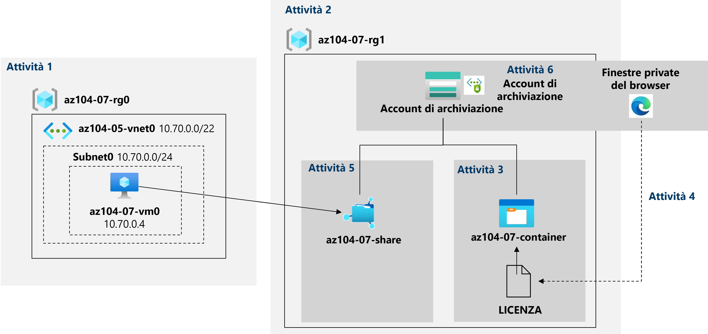

---
lab:
  title: 'Lab 07: Gestire l''archiviazione di Azure'
  module: Administer Azure Storage
---

# Lab 07 - Gestire Archiviazione di Azure
# Manuale del lab per gli studenti

## Scenario laboratorio

È necessario valutare l'uso di Archiviazione di Azure per archiviare i file che risiedono attualmente negli archivi dati locali. Anche se alla maggior parte dei file non si accede di frequente, esistono alcune eccezioni. È possibile ridurre al minimo i costi di archiviazione inserendo i file a cui si accede meno di frequente in livelli di archiviazione a prezzi più bassi. Verranno anche esplorati diversi meccanismi di protezione offerti da Archiviazione di Azure, tra cui l'accesso alla rete, l'autenticazione, l'autorizzazione e la replica. Infine, è possibile determinare in quale misura il servizio File di Azure servizio potrebbe essere adatto per ospitare le condivisioni file locali.

**Nota:** è disponibile una **[simulazione di lab interattiva](https://mslabs.cloudguides.com/guides/AZ-104%20Exam%20Guide%20-%20Microsoft%20Azure%20Administrator%20Exercise%2011)** che consente di eseguire questo lab in base ai propri tempi. Si potrebbero notare piccole differenza tra la simulazione interattiva e il lab ospitato, ma i concetti e le idee principali dimostrati sono gli stessi. 

## Obiettivi

Contenuto del lab:

+ Attività 1: Effettuare il provisioning dell'ambiente lab
+ Attività 2: Creare e configurare gli account di archiviazione di Azure
+ Attività 3: Gestire Archiviazione BLOB
+ Attività 4: Gestire l'autenticazione e l'autorizzazione per Archiviazione di Azure
+ Attività 5: Creare e configurare condivisioni di File di Azure
+ Attività 6: Gestire l'accesso alla rete per Archiviazione di Azure

## Tempo stimato: 40 minuti

## Diagramma dell'architettura




### Istruzioni

## Esercizio 1

## Attività 1: Effettuare il provisioning dell'ambiente lab

In questa attività si distribuirà una macchina virtuale di Azure che verrà usata più avanti in questo lab.

1. Accedi al **[portale di Azure](https://portal.azure.com)**.

1. Nel portale di Azure aprire **Azure Cloud Shell** facendo clic sull'icona nell'angolo in alto a destra.

1. Se viene richiesto di selezionare **Bash** o **PowerShell**, selezionare **PowerShell**.

    >**Nota**: se è la prima volta che si avvia **Cloud Shell** e viene visualizzato il messaggio **Non sono state montate risorse di archiviazione**, selezionare la sottoscrizione in uso nel lab e quindi fare clic su **Crea archivio**.

1. Sulla barra degli strumenti del riquadro Cloud Shell fare clic sull'icona**Carica/Scarica file**, nel menu a discesa fare clic su **Carica** e caricare i file **\\Allfiles\\Labs\\07\\az104-07-vm-template.json** e **\\Allfiles\\Labs\\07\\az104-07-vm-parameters.json** nella home directory di Cloud Shell.

1. Nel riquadro Cloud Shell eseguire il comando seguente per creare il gruppo di risorse che ospiterà la macchina virtuale. Sostituire il segnaposto "[Azure-region]" con il nome di un'area di Azure in cui si intende distribuire la macchina virtuale di Azure

    >**Nota**: per elencare i nomi delle aree di Azure, eseguire `(Get-AzLocation).Location`
    >**Nota**: ogni comando seguente deve essere digitato separatamente

    ```powershell
    $location = '[Azure_region]'
    ```
  
    ```powershell
     $rgName = 'az104-07-rg0'
    ```

    ```powershell
    New-AzResourceGroup -Name $rgName -Location $location
    ```
    
1. Nel riquadro Cloud Shell eseguire quanto segue per distribuire la macchina virtuale usando i file di modello e parametri caricati:

    >**Nota**: verrà richiesto di fornire una password Amministrazione.

   ```powershell
   New-AzResourceGroupDeployment `
      -ResourceGroupName $rgName `
      -TemplateFile $HOME/az104-07-vm-template.json `
      -TemplateParameterFile $HOME/az104-07-vm-parameters.json `
      -AsJob
   ```

    >**Nota**: non attendere il completamento delle distribuzioni, ma procedere con l'attività successiva.

    >**Nota**: se si riceve un errore che indica che le dimensioni della macchina virtuale non sono disponibili, chiedere all'insegnante assistenza e provare questi passaggi.
    > 1. Fare clic sul pulsante `{}` in CloudShell, selezionare **az104-07-vm-parameters.json** nella barra laterale sinistra e prendere nota del valore del parametro`vmSize`.
    > 1. Controllare il percorso in cui viene distribuito il gruppo di risorse "az104-04-rg1". È possibile eseguire `az group show -n az104-04-rg1 --query location` in CloudShell per ottenerlo.
    > 1. Eseguire `az vm list-skus --location <Replace with your location> -o table --query "[? contains(name,'Standard_D2s')].name"` in CloudShell.
    > 1. Sostituire il valore del parametro `vmSize` con uno dei valori restituiti dal comando appena eseguito.
    > 1. Ora ridistribuire i modelli eseguendo di nuovo il comando `New-AzResourceGroupDeployment`. È possibile premere il pulsante Su alcune volte per visualizzare l'ultimo comando eseguito.

1. Chiudere il riquadro Cloud Shell.

## Attività 2: Creare e configurare gli account di archiviazione di Azure

In questa attività verrà creato e configurato un account di archiviazione di Azure.

1. Nel portale di Azure cercare e selezionare **Account di archiviazione** e quindi fare clic su **+ Crea**.

1. Nella scheda **Informazioni di base** del pannello **Crea account di archiviazione** specificare le impostazioni seguenti (lasciare i valori predefiniti per le altre impostazioni):

    | Impostazione | Valore |
    | --- | --- |
    | Subscription | Nome della sottoscrizione di Azure usata in questo lab |
    | Gruppo di risorse | Il nome di un **nuovo** gruppo di risorse **az104-07-rg1** |
    | Nome account di archiviazione | Qualsiasi nome univoco globale composto da 3-24 lettere e numeri |
    | Area | Il nome di un'area di Azure in cui è possibile creare un account di archiviazione di Azure  |
    | Prestazioni | **Standard** |
    | Ridondanza | **Archiviazione con ridondanza geografica (GRS)** |

1. Fare clic su **Avanti: Avanzate >**, esaminare le opzioni disponibili nella scheda **Avanzate** del pannello **Crea account di archiviazione**, accettare le impostazioni predefinite e fare clic su **Avanti: Rete >**.

1. Nella **scheda Rete** del **pannello Crea account** di archiviazione esaminare le opzioni disponibili, accettare l'opzione **predefinita Abilita accesso pubblico da tutte le reti** e fare clic su **Avanti: Protezione dati >**.

1. Nella scheda **Protezione di dati** del pannello **Crea account di archiviazione** esaminare le opzioni disponibili, accettare le impostazioni predefinite, fare clic su **Rivedi e crea**, attendere il completamento del processo di convalida e fare clic su **Crea**.

    >**Nota**: attendere che l'account di archiviazione venga creato. L'operazione richiede circa 2 minuti.

1. Nel pannello della distribuzione fare clic su **Vai alla risorsa** per visualizzare il pannello dell'account di archiviazione di Azure.

1. Nel pannello Account di archiviazione, nella sezione **Gestione dati**, fare clic su **Ridondanza** e prendere nota della posizione secondaria. 

1. Nell'elenco a discesa **Ridondanza** selezionare **Archiviazione con ridondanza locale** e salvare la modifica. Si noti che a questo punto per l’account di archiviazione è disponibile solo la posizione primaria.

1. Nel pannello Account di archiviazione, nella sezione **Impostazioni** selezionare **Configurazione**. Impostare **Livello di accesso BLOB (predefinito)** su **Accesso sporadico** e salvare la modifica.

    > **Nota**: il livello di accesso sporadico è ottimale per i dati a cui non si accede di frequente.

## Attività 3: Gestire Archiviazione BLOB

In questa attività verrà creato un contenitore BLOB in cui verrà caricato un file BLOB.

1. Nella sezione **Archiviazione dati** del pannello dell'account di archiviazione fare clic su **Contenitori**.

1. Fare clic su **+ Contenitore** e creare un contenitore con le impostazioni seguenti:

    | Impostazione | valore |
    | --- | --- |
    | Nome | **az104-07-container**  |
    | Livello di accesso pubblico | **Privato (nessun accesso anonimo)** |

1. Nell'elenco dei contenitori fare clic su **az104-07-container** e quindi su **Carica**.

1. Passare a **\\Allfiles\\Labs\\07\\LICENSE** nel computer del lab e fare clic su **Apri**.

1. Nel pannello **Carica BLOB** espandere la sezione **Avanzate** e specificare le impostazioni seguenti (lasciare i valori predefiniti per le altre impostazioni):

    | Impostazione | Valore |
    | --- | --- |
    | Tipo di BLOB | **BLOB in blocchi** |
    | Dimensioni blocco | **4 MB** |
    | Livello di accesso | **Accesso frequente** |
    | Carica nella cartella | **Licenze** |

    > **Nota**: il livello di accesso può essere impostato per singoli BLOB.

1. Fare clic su **Carica**.

    > **Nota**: si noti che durante il caricamento è stata automaticamente creata una sottocartella denominata **licenses**.

1. Tornare nel pannello **az104-07-container**, fare clic su **licenses** e quindi su **LICENSE**.

1. Nel pannello **licenses/LICENSE** esaminare le opzioni disponibili.

    > **Nota**: è possibile scaricare il BLOB, cambiarne il livello di accesso (attualmente impostato su **Accesso frequente**), acquisire un lease, il cui stato cambierebbe in **Bloccato** (attualmente impostato su **Sbloccato)** e proteggere il BLOB dalla modifica o dall'eliminazione, nonché assegnare metadati personalizzati specificando una coppia chiave-valore arbitraria. È anche possibile scegliere **Modifica** per modificare direttamente il file all'interno dell'interfaccia del portale di Azure, senza scaricarlo prima. È inoltre possibile creare snapshot, nonché generare un token di firma di accesso condiviso (questa opzione verrà esaminata nell'attività successiva).

## Attività 4: Gestire l'autenticazione e l'autorizzazione per Archiviazione di Azure

In questa attività verranno configurate l'autenticazione e l'autorizzazione per Archiviazione di Azure.

1. Nella scheda **Panoramica** del pannello **licenses/LICENSE** fare clic sul pulsante **Copia negli Appunti** accanto alla voce **URL**.

1. Aprire un'altra finestra del browser usando la modalità InPrivate e passare all'URL copiato nel passaggio precedente.

1. Verrà visualizzato il messaggio in formato XML **ResourceNotFound**o **PublicAccessNotPermitted**.

    > **Nota**: questo comportamento è previsto, perché il livello di accesso pubblico del contenitore creato è impostato su **Privato (nessun accesso anonimo)**.

1. Chiudere la finestra del browser in modalità InPrivate, tornare nella finestra del browser che mostra il pannello **licenses/LICENSE** del contenitore di Archiviazione di Azure e passare alla scheda **Genera firma di accesso condiviso**.

1. Nella scheda **Genera firma di accesso condiviso** del pannello **licenses/LICENSE** specificare le impostazioni seguenti (lasciare i valori predefiniti per le altre impostazioni):

    | Impostazione | Valore |
    | --- | --- |
    | Chiave di firma | **Chiave 1** |
    | Autorizzazioni | **Lettura** |
    | Data di inizio | La data di ieri |
    | Ora di avvio | ora corrente |
    | Data di scadenza | La data di domani |
    | Ora di scadenza | ora corrente |
    | Indirizzi IP consentiti | lasciare vuoto |
    

1. Fare clic su **Genera URL e token di firma di accesso condiviso**.

1. Fare clic sul pulsante **Copia negli Appunti** accanto alla voce **URL firma di accesso condiviso del BLOB**.

1. Aprire un'altra finestra del browser usando la modalità InPrivate e passare all'URL copiato nel passaggio precedente.

    > **Nota**: dovrebbe essere possibile visualizzare il contenuto del file scaricandolo e aprendolo con Blocco note.

    > **Nota**: questo comportamento è previsto, perché ora l'accesso è autorizzato in base al token di firma di accesso condiviso appena generato.

    > **Nota**: salvare l'URL di firma di accesso condiviso del BLOB. Sarà necessario più avanti in questo lab.

1. Chiudere la finestra del browser in modalità InPrivate, tornare nella finestra del browser che mostra il pannello **licenses/LICENSE** del contenitore di Archiviazione di Azure e da qui tornare nel pannello **az104-07-container**.

1. Fare clic sul collegamento **Passa all'account utente Azure AD** accanto all'etichetta **Metodo di autenticazione**.

    > **Nota**: quando si cambia il metodo di autenticazione, è possibile che venga visualizzato il messaggio di errore *"Non si è autorizzati a visualizzare l'elenco dei dati con l'account utente Azure AD corrente"*. Questo comportamento è previsto.  

    > **Nota**: a questo punto non si hanno le autorizzazioni per cambiare il metodo di autenticazione.

1. Nel pannello **az104-07-container** fare clic su **Controllo di accesso (IAM)**.

1. Nella scheda **Verifica l'accesso** fare clic su **Aggiungi un'assegnazione di ruolo**.

1. Nel pannello **Aggiungi un'assegnazione di ruolo** specificare le impostazioni seguenti:

    | Impostazione | Valore |
    | --- | --- |
    | Ruolo | **Proprietario dei dati del BLOB di archiviazione** |
    | Assegna accesso a | **Utente, gruppo o entità servizio** |
    | Membri | Il nome dell'account utente |

1. Fare clic su **Verifica e assegna** e quindi su **Verifica e assegna**, poi tornare nel pannello **Panoramica** del contenitore **az104-07-container** e verificare che sia possibile impostare il metodo di autenticazione su (Passa all'account utente Azure AD).

    > **Nota**: possono essere necessari circa 5 minuti prima che la modifica diventi effettiva.

## Attività 5: Creare e configurare condivisioni di File di Azure

In questa attività verranno create e configurate le condivisioni di File di Azure.

> **Nota**: prima di avviare questa attività, verificare che la macchina virtuale di cui è stato effettuato il provisioning nella prima attività di questo lab sia in esecuzione.

1. Nel portale di Azure tornare nel pannello dell'account di archiviazione creato nella prima attività di questo lab e quindi, nella sezione **Archiviazione dati**, fare clic su **Condivisioni file**.

1. Fare clic su **+ Condivisione** file e nella **scheda Informazioni di base** assegnare alla condivisione file un nome, **az104-07-share**. Esaminare le altre impostazioni in questa scheda. 

1. Passare alla scheda Backup** e assicurarsi che **l'opzione **Abilita backup** non** sia **selezionata.

1. Fare clic su **Rivedi e crea** e quindi su **Crea**. Attendere la distribuzione della condivisione file. 

1. Fare clic sulla condivisione file appena creata e prendere nota delle informazioni disponibili nel **pannello az104-07-share** .

1. Fare clic su **Sfoglia** e notare che nella nuova condivisione file non sono presenti file o cartelle. Fare clic su **Connetti**.

1. Nel pannello **Connetti** assicurarsi che sia selezionata la scheda **Windows**. Di seguito è riportato un pulsante con l'etichetta **Mostra script**. Fare clic sul pulsante e verrà visualizzata una casella di testo grigia con uno script. Passare il mouse sull'icona delle pagine nell'angolo in basso a destra di tale casella e fare clic su **Copia negli Appunti**.

1. Nel portale di Azure cercare e selezionare **Macchine virtuali**, quindi nell'elenco di macchine virtuali fare clic su **az104-07-vm0**.

1. Nella sezione **Operazioni** del pannello **az104-07-vm0** fare clic su **Esegui comando**.

1. Nel pannello **az104-07-vm0 - Esegui comando** fare clic su **RunPowerShellScript**.

1. Nel pannello **Esegui script di comandi** incollare lo script copiato in precedenza in questa attività nel riquadro **Script di PowerShell** e fare clic su **Esegui**.

1. Verificare che lo script sia stato completato correttamente.

1. Sostituire il contenuto del riquadro **Script di PowerShell** con lo script seguente e fare clic su **Esegui**:

   ```powershell
   New-Item -Type Directory -Path 'Z:\az104-07-folder'

   New-Item -Type File -Path 'Z:\az104-07-folder\az-104-07-file.txt'
   ```

1. Verificare che lo script sia stato completato correttamente.

1. Tornare al pannello az104-07-share \| Sfoglia** condivisione file, fare clic su **Aggiorna** e verificare che az104-07-folder** **venga visualizzato nell'elenco delle **cartelle.

1. Fare clic su **az104-07-folder** e verificare che il file **az104-07-file.txt** sia visualizzato nell'elenco dei file.

## Attività 6: Gestire l'accesso alla rete per Archiviazione di Azure

In questa attività si configurerà l'accesso alla rete per Archiviazione di Azure.

1. Nel portale di Azure tornare nel pannello dell'account di archiviazione creato nella prima attività di questo lab e quindi, nella sezione **Sicurezza e rete**, fare clic su **Rete** e poi su **Firewall e reti virtuali**.

1. Fare clic sull'opzione **Abilitato da reti virtuali e indirizzi IP selezionati** ed esaminare le impostazioni di configurazione che diventano disponibili una volta abilitata questa opzione.

    > **Nota**: è possibile usare queste impostazioni per configurare la connettività diretta tra le macchine virtuali di Azure nelle subnet designate delle reti virtuali e l'account di archiviazione usando gli endpoint di servizio.

1. Fare clic sulla casella di controllo **Aggiungere l'indirizzo IP client** e salvare la modifica.

1. Aprire un'altra finestra del browser usando la modalità InPrivate e passare all'URL di firma di accesso condiviso del BLOB generato nell'attività precedente.

    > **Nota**: se non è stato registrato l'URL di firma di accesso condiviso dall'attività 4, è necessario generarne uno nuovo con la stessa configurazione. Usare i passaggi 4-6 dell'attività 4 come guida per generare un nuovo URL di firma di accesso condiviso BLOB. 

1. Verrà visualizzato il contenuto della pagina **Licenza MIT**.

    > **Nota**: questo comportamento è previsto, perché ci si connette dal proprio indirizzo IP client.

1. Chiudere la finestra del browser in modalità InPrivate e tornare nella finestra del browser in cui è visualizzato il pannello **Rete** dell'account di archiviazione di Azure.

1. Nel portale di Azure aprire **Azure Cloud Shell** facendo clic sull'icona nell'angolo in alto a destra.

1. Se viene richiesto di selezionare **Bash** o **PowerShell**, selezionare **PowerShell**.

1. Nel riquadro Cloud Shell eseguire il comando seguente per provare a scaricare il BLOB LICENSE dal contenitore **az104-07-container** dell'account di archiviazione. Sostituire il segnaposto `[blob SAS URL]` con l'URL di firma di accesso condiviso del BLOB generato nell'attività precedente:

   ```powershell
   Invoke-WebRequest -URI '[blob SAS URL]'
   ```
1. Verificare che il tentativo di download non sia riuscito.

    > **Nota**: verrà visualizzato un messaggio analogo a **AuthorizationFailure: Questa richiesta non è autorizzata a eseguire questa operazione**. Questo comportamento è previsto, perché ci si connette dall'indirizzo IP assegnato a una macchina virtuale di Azure che ospita l'istanza di Cloud Shell.

1. Chiudere il riquadro Cloud Shell.

## Pulire le risorse

>**Nota**: ricordarsi di rimuovere tutte le risorse di Azure appena create che non vengono più usate. La rimozione delle risorse inutilizzate garantisce che non verranno addebitati costi imprevisti.

>**Nota**: non è necessario preoccuparsi se le risorse del lab non possono essere rimosse immediatamente. A volte le risorse hanno dipendenze e l'eliminazione può richiedere molto tempo. Si tratta di un'attività comune dell'amministratore per monitorare l'utilizzo delle risorse, quindi è sufficiente esaminare periodicamente le risorse nel portale per verificare il funzionamento della pulizia. È anche possibile provare a eliminare il gruppo di risorse in cui si trovano le risorse. Si tratta di un collegamento rapido per l'amministratore. In caso di dubbi, parlare con l'insegnante.

1. Nel portale di Azure aprire la sessione di **PowerShell** all'interno del riquadro **Cloud Shell**.

1. Elencare tutti i gruppi di risorse creati nei lab di questo modulo eseguendo il comando seguente:

   ```powershell
   Get-AzResourceGroup -Name 'az104-07*'
   ```

1. Eliminare tutti i gruppi di risorse creati nei lab di questo modulo eseguendo il comando seguente:

   ```powershell
   Get-AzResourceGroup -Name 'az104-07*' | Remove-AzResourceGroup -Force -AsJob
   ```

    >**Nota**: il comando viene eseguito in modo asincrono, in base a quanto determinato dal parametro -AsJob, quindi, sebbene sia possibile eseguire un altro comando di PowerShell immediatamente dopo nella stessa sessione di PowerShell, i gruppi di risorse verranno rimossi dopo alcuni minuti.

## Rivedi

In questo lab sono state eseguite le attività seguenti:

- Provisioning dell'ambiente lab
- Creazione e configurazione di account di archiviazione di Azure
- Gestione di Archiviazione BLOB
- Gestione di autenticazione e autorizzazione per Archiviazione di Azure
- Creazione e configurazione di condivisioni di File di Azure
- Gestione dell'accesso alla rete per Archiviazione di Azure
