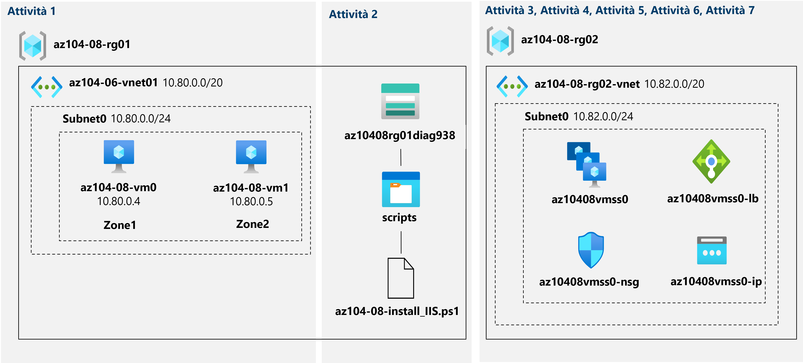

---
lab:
  title: 'Lab 08: Gestire Macchine virtuali'
  module: Administer Virtual Machines
---

# Lab 08 - Gestire le macchine virtuali
# Manuale del lab per gli studenti

## Scenario laboratorio

È necessario identificare le diverse opzioni disponibili per la distribuzione e la configurazione di macchine virtuali di Azure. Prima di tutto, è necessario determinare le diverse opzioni di resilienza e scalabilità delle risorse di calcolo e di archiviazione che è possibile implementare quando si usano le macchine virtuali di Azure. Successivamente, è necessario esaminare le opzioni di resilienza e scalabilità delle risorse di calcolo e di archiviazioni disponibili quando si usano i set di scalabilità di macchine virtuali. È anche opportuno esplorare la possibilità di configurare automaticamente le macchine virtuali e i set di scalabilità di macchine virtuali usando l'estensione per script personalizzati di macchine virtuali di Azure.

**Nota:** è disponibile una **[simulazione di lab interattiva](https://mslabs.cloudguides.com/guides/AZ-104%20Exam%20Guide%20-%20Microsoft%20Azure%20Administrator%20Exercise%2012)** che consente di eseguire questo lab in base ai propri tempi. Si potrebbero notare piccole differenza tra la simulazione interattiva e il lab ospitato, ma i concetti e le idee principali dimostrati sono gli stessi. 

## Obiettivi

Contenuto del lab:

+ Attività 1: Distribuire macchine virtuali di Azure con resilienza della zona usando il portale di Azure e un modello di Azure Resource Manager
+ Attività 2: Configurare le macchine virtuali di Azure usando le estensioni per macchine virtuali
+ Attività 3: Dimensionare le risorse di calcolo e archiviazione per le macchine virtuali di Azure
+ Attività 4: Registrare i provider di risorse Microsoft.Insights e Microsoft.AlertsManagement
+ Attività 5: Distribuire set di scalabilità di macchine virtuali di Azure con resilienza della zona usando il portale di Azure
+ Attività 6: Configurare i set di scalabilità di macchine virtuali di Azure usando le estensioni per macchine virtuali
+ Attività 7: Dimensionare le risorse di calcolo e archiviazione i set di scalabilità di macchine virtuali (facoltativo)

## Tempo stimato: 50 minuti

## Diagramma dell'architettura




### Istruzioni

## Esercizio 1

## Attività 1: Distribuire macchine virtuali di Azure con resilienza della zona usando il portale di Azure e un modello di Azure Resource Manager

In questa attività si distribuiranno macchine virtuali di Azure in diverse zone di disponibilità usando il portale di Azure e un modello di Azure Resource Manager.

1. Accedi al [portale di Azure](http://portal.azure.com).

1. Nel portale di Azure cercare e selezionare **Macchine virtuali** e nel pannello **Macchine virtuali** fare clic su **+ Crea** e poi su **+ Macchina virtuale di Azure**.

1. Nella scheda **Informazioni di base** del pannello **Crea macchina virtuale** specificare le impostazioni seguenti, mantenendo i valori predefiniti per le altre:

    | Impostazione | Valore |
    | --- | --- |
    | Abbonamento | Nome della sottoscrizione di Azure che verrà usata nel lab |
    | Gruppo di risorse | Il nome di un nuovo gruppo di risorse **az104-08-rg01** |
    | Virtual machine name | **az104-08-vm0** |
    | Region | Selezionare una delle aree che supportano le zone di disponibilità e in cui è possibile effettuare il provisioning delle macchine virtuali di Azure |
    | Opzioni di disponibilità | **Zona di disponibilità** |
    | Zona di disponibilità | **Zona 1** |
    | Immagine | **Windows Server 2019 Datacenter - Gen2** |
    | Istanza Spot di Azure | **No** |
    | Dimensione | **Standard D2s v3** |
    | Username | **Studente** |
    | Password | **Specificare una password sicura, almeno 12 caratteri** |
    | Porte in ingresso pubbliche | **Nessuna** |
    | Usare una licenza esistente di Windows Server? | **Non selezionato** |

1. Fare clic su **Avanti: Dischi** e quindi nella scheda **Dischi** del pannello **Crea macchina virtuale** specificare le impostazioni seguenti (lasciare i valori predefiniti per le altre impostazioni):

    | Impostazione | Valore |
    | --- | --- |
    | Tipo di disco del sistema operativo | **SSD Premium** |
    | Abilita compatibilità disco Ultra | **Non selezionato** |

1. Fare clic su **Avanti: Rete >** e quindi, nella scheda **Rete** del pannello **Crea macchina virtuale**, fare clic su **Crea nuovo** sotto la casella di testo **Rete virtuale**.

1. Nel pannello **Crea rete virtuale** specificare le impostazioni seguenti (lasciare i valori predefiniti per le altre impostazioni):

    | Impostazione | valore |
    | --- | --- |
    | Name | **az104-08-vnet01** |
    | Intervallo di indirizzi | **10.80.0.0/20** |
    | Nome subnet | **subnet0** |
    | Intervallo di subnet | **10.80.0.0/24** |

1. Fare clic su **OK** e quindi di nuovo nella scheda **Rete** del pannello **Crea macchina virtuale** specificare le impostazioni seguenti (lasciare i valori predefiniti per le altre impostazioni):

    | Impostazione | valore |
    | --- | --- |
    | Subnet | **subnet0** |
    | IP pubblico | **default** |
    | Gruppo di sicurezza di rete della scheda di interfaccia di rete | **basic** |
    | Porte in ingresso pubbliche | **Nessuna** |
    | Rete accelerata | **Disattivato**
    | Opzioni di bilanciamento del carico | **Nessuna** |

1. Selezionare **Avanti: Gestione >** e quindi nella scheda **Gestione** del pannello **Crea macchina virtuale** specificare le impostazioni seguenti (lasciare i valori predefiniti per le altre impostazioni):

    | Impostazione | valore |
    | --- | --- |
    | Opzioni di orchestrazione patch | **Aggiornamenti manuali** |  

1. Selezionare **Avanti: Monitoraggio>** e nella scheda **Monitoraggio** del pannello **Crea macchina virtuale** specificare le impostazioni seguenti (lasciare i valori predefiniti per le altre impostazioni):

    | Impostazione | valore |
    | --- | --- |
    | Diagnostica di avvio | **Abilita con account di archiviazione personalizzato** |
    | Account di archiviazione di diagnostica | **accettare il valore predefinito** |

    >**Nota**: se necessario, selezionare un account di archiviazione esistente nell'elenco a discesa o creare un nuovo account di archiviazione. Prendere nota del nome dell'account di archiviazione. Sarà necessario nell'attività successiva.

1. Fare clic su **Avanti: Avanzate >**, quindi nella scheda **Avanzate** del pannello **Crea macchina virtuale** esaminare le impostazioni disponibili senza modificarle e fare clic su **Rivedi e crea**.

1. Nel pannello **Rivedi e crea** fare clic su **Crea**.

1. Nel pannello della distribuzione fare clic su **Modello**.

1. Esaminare il modello che rappresenta la distribuzione in corso e fare clic su **Distribuisci**.

    >**Nota**: questa opzione verrà usata per distribuire la seconda macchina virtuale con una configurazione corrispondente, ad eccezione della zona di disponibilità.

1. Nel pannello **Distribuzione personalizzata** specificare le impostazioni seguenti (lasciare i valori predefiniti per le altre impostazioni):

    | Impostazione | Valore |
    | --- | --- |
    | Gruppo di risorse | **az104-08-rg01** |
    | Nome interfaccia di rete | **az104-08-vm1-nic1** |
    | Nome indirizzo IP pubblico | **az104-08-vm1-ip** |
    | Nome macchina virtuale, Nome macchina virtuale1, Nome computer macchina virtuale   | **az104-08-vm1** |
    | Virtual Machine RG | **az104-08-rg01** |    
    | Nome utente amministratore | **Studente** |
    | Password amministratore | **Specificare una password sicura**  |
    | EnableHotpatching | **false** |
    | Zona | **2** |

    >**Nota**: è necessario modificare i parametri corrispondenti alle proprietà delle risorse distinte da distribuire usando il modello, incluse la macchina virtuale e la relativa interfaccia di rete.

1. Fare clic su **Rivedi e crea** e quindi nel pannello **Rivedi e crea** fare clic su **Crea**.

    >**Nota**: attendere il completamento di entrambe le distribuzioni prima di procedere con l'attività successiva. L'operazione potrebbe richiedere circa cinque minuti.

## Attività 2: Configurare le macchine virtuali di Azure usando le estensioni per macchine virtuali

In questa attività si installerà il ruolo server Web di Windows Server nelle due macchine virtuali di Azure distribuite nell'attività precedente usando l'estensione per script personalizzati di macchine virtuali.

1. Nel portale di Azure cercare e selezionare **Account di archiviazione**, quindi nel pannello **Account di archiviazione** fare clic sulla voce che rappresenta l'account di archiviazione di diagnostica creato nell'attività precedente.

1. Nella sezione **Archiviazione dati** del pannello dell'account di archiviazione fare clic su **Contenitori** e quindi su **+ Contenitore**.

1. Nel pannello **Nuovo contenitore** specificare le impostazioni seguenti (lasciare i valori predefiniti per le altre opzioni) e fare clic su **Crea**:

    | Impostazione | valore |
    | --- | --- |
    | Name | **scripts** |
    | Livello di accesso pubblico | **Privato (nessun accesso anonimo)** |

1. Tornare nel pannello dell'account di archiviazione che visualizza l'elenco di contenitori e fare clic su **scripts**.

1. Nel pannello **scripts** fare clic su **Carica**.

1. Nel pannello **Carica BLOB** fare clic sull'icona della cartella, nella finestra di dialogo **Apri** passare alla cartella **\\Allfiles\\Labs\\08**, selezionare **az104-08-install_IIS.ps1**, fare clic su **Apri** e di nuovo nel pannello **Carica BLOB** fare clic su **Carica**.

1. Nel portale di Azure cercare e selezionare **Macchine virtuali** e nel pannello **Macchine virtuali** fare clic su **az104-08-vm0**.

1. Nel pannello della macchina virtuale **az104-08-vm0**, nella sezione **Impostazioni**, fare clic su **Estensioni e applicazioni**, quindi su **+ Aggiungi**.

1. Nel pannello **Installa un'estensione** fare clic su **Estensione per script personalizzati** e quindi su **Avanti**.

1. Nel pannello **Configura estensione script personalizzata** fare clic su **Sfoglia**.

1. Nel pannello **Account di archiviazione** fare clic sul nome dell'account di archiviazione in cui è stato caricato lo script **az104-08-install_IIS.ps1**, nel pannello **Contenitori** fare clic su **scripts**,nel pannello **scripts** fare clic su **az104-08-install_IIS.ps1** e quindi su **Seleziona**.

1. Nel pannello **Installa estensione** fare clic su **Rivedi e crea** e nel **pannello Rivedi e crea** fare clic su **Crea**.

1. Nel portale di Azure cercare e selezionare **Macchine virtuali** e nel pannello **Macchine virtuali** fare clic su **az104-08-vm1**.

1. Nella sezione **Automazione** del pannello **az104-08-vm1** fare clic su **Esporta modello**.

1. Nel pannello **az104-08-vm1 - Esporta modello** fare clic cu **Distribuisci**.

1. Nel pannello **Distribuzione personalizzata** fare clic su **Modifica modello**.

    >**Nota**: ignorare il messaggio **Il gruppo di risorse si trova in una località non supportata da una o più risorse nel modello. Scegliere un altro gruppo di risorse**. Questo errore è previsto e può essere ignorato in questo caso.

1. Nel pannello **Modifica modello**, nella sezione che visualizza il contenuto del modello, inserire il codice seguente a partire dalla riga **20**, direttamente sotto la riga `"resources": [`:

   >**Nota**: se si usa uno strumento che incolla il codice riga per riga, la funzionalità IntelliSense può aggiungere parentesi quadre aggiuntive che generano errori di convalida. È consigliabile incollare il codice prima nel Blocco appunti e poi nella riga 20.

   ```json
        {
            "type": "Microsoft.Compute/virtualMachines/extensions",
            "name": "az104-08-vm1/customScriptExtension",
            "apiVersion": "2018-06-01",
            "location": "[resourceGroup().location]",
            "dependsOn": [
                "az104-08-vm1"
            ],
            "properties": {
                "publisher": "Microsoft.Compute",
                "type": "CustomScriptExtension",
                "typeHandlerVersion": "1.7",
                "autoUpgradeMinorVersion": true,
                "settings": {
                    "commandToExecute": "powershell.exe Install-WindowsFeature -name Web-Server -IncludeManagementTools && powershell.exe remove-item 'C:\\inetpub\\wwwroot\\iisstart.htm' && powershell.exe Add-Content -Path 'C:\\inetpub\\wwwroot\\iisstart.htm' -Value $('Hello World from ' + $env:computername)"
              }
            }
        },

   ```

   >**Nota**: questa sezione del modello definisce la stessa estensione per script personalizzati di macchine virtuali di Azure distribuita in precedenza nella prima macchina virtuale tramite Azure PowerShell.

1. Fare clic su **Salva**, tornare nel pannello **Modello personalizzato** e fare clic su **Rivedi e crea**, quindi nel pannello **Rivedi e crea** fare clic su **Crea**

    >**Nota**: attendere il completamento della distribuzione del modello. È possibile monitorarne lo stato di avanzamento nel pannello **Estensioni** delle macchine virtuali **az104-08-vm0** e **az104-08-vm1**. Questa operazione non dovrebbe richiedere più di 3 minuti.

1. Per verificare che la configurazione basata sull'estensione per script personalizzati sia riuscita, tornare nel pannello **az104-08-vm1**, quindi nella sezione **Operazioni** fare clic su **Esegui comando** e nell'elenco dei comandi fare clic su **RunPowerShellScript**.

1. **Nel pannello Esegui script** comando digitare quanto segue e fare clic su **Esegui** per accedere al sito Web ospitato in **az104-08-vm1**:

   ```powershell
   Invoke-WebRequest -URI http://10.80.0.4 -UseBasicParsing
   ```

    >**Nota**: il parametro **-UseBasicParsing** è necessario per eliminare la dipendenza da Internet Explorer e completare l'esecuzione del cmdlet

    >**Nota**: il **parametro -URI** è l'indirizzo **** IP privato della macchina virtuale. Passare al pannello **az104-08-vm1** , nella **sezione Rete** e fare clic su **Impostazioni di rete**

    >**Nota**: è anche possibile connettersi a **az104-08-vm0** ed eseguire `Invoke-WebRequest -URI http://10.80.0.5 -UseBasicParsing` per accedere al sito Web ospitato in **az104-08-vm1**.

## Attività 3: Dimensionare le risorse di calcolo e archiviazione per le macchine virtuali di Azure

In questa attività la risorsa di calcolo per le macchine virtuali di Azure verrà dimensionata cambiando le dimensioni e la scala della relativa risorsa di storage tramite collegamento e configurazione dei dischi dati.

1. Nel portale di Azure cercare e selezionare **Macchine virtuali** e nel pannello **Macchine virtuali** fare clic su **az104-08-vm0**.

1. Nel pannello della macchina virtuale **az104-08-vm0** fare clic su **Dimensioni** e impostare le dimensioni della macchina virtuale su **Standard DS1_v2**, quindi fare clic su **Ridimensiona**

    >**Nota**: scegliere un'altra dimensione se **Standard DS1_v2** non è disponibile.

1. Nel pannello della macchina virtuale **az104-08-vm0** fare clic su **Dischi**, quindi in **Dischi dati ** fare clic su **+ Crea e collegare un nuovo disco**.

1. Creare un disco gestito con le impostazioni seguenti (lasciare altri con i valori predefiniti) e fare clic su **Applica**:

    | Impostazione | valore |
    | --- | --- |
    | Disk name | **az104-08-vm0-datadisk-0** |
    | Tipo di archiviazione | **SSD Premium** |
    | Dimensioni (GiB)| **1024** |

1. Tornare nel pannello **az104-08-vm0 - Dischi** e fare clic su **+ Crea e collega un nuovo disco** in **Dischi dati **.

1. Creare un disco gestito con le impostazioni seguenti (lasciare altri con i valori predefiniti) e fare clic su **Applica**:

    | Impostazione | valore |
    | --- | --- |
    | Disk name | **az104-08-vm0-datadisk-1** |
    | Tipo di archiviazione | **SSD Premium** |
    | Dimensioni (GB)| **1024 GiB** |


1. Nel pannello **az104-08-vm0** fare clic su **Esegui comando** nella sezione **Operazioni** e nell'elenco dei comandi fare clic su **RunPowerShellScript**.

1. Nel pannello **Esegui script di comandi** digitare quanto segue e fare clic su **Esegui** per creare un'unità Z: costituita dai due dischi appena collegati con il layout semplice e il provisioning fisso:

   ```powershell
   New-StoragePool -FriendlyName storagepool1 -StorageSubsystemFriendlyName "Windows Storage*" -PhysicalDisks (Get-PhysicalDisk -CanPool $true)

   New-VirtualDisk -StoragePoolFriendlyName storagepool1 -FriendlyName virtualdisk1 -Size 64GB -ResiliencySettingName Simple -ProvisioningType Fixed

   Initialize-Disk -VirtualDisk (Get-VirtualDisk -FriendlyName virtualdisk1)

   New-Partition -DiskNumber 4 -UseMaximumSize -DriveLetter Z
   ```

    > **Nota**: attendere la conferma del completamento corretto del comando.

1. Nel portale di Azure cercare e selezionare **Macchine virtuali** e nel pannello **Macchine virtuali** fare clic su **az104-08-vm1**.

1. Nella sezione **Automazione** del pannello **az104-08-vm1** fare clic su **Esporta modello**.

1. Nel pannello **az104-08-vm1 - Esporta modello** fare clic cu **Distribuisci**.

1. Nel pannello **Distribuzione personalizzata** fare clic su **Modifica modello**.

    >**Nota**: ignorare il messaggio **Il gruppo di risorse si trova in una località non supportata da una o più risorse nel modello. Scegliere un altro gruppo di risorse**. Questo errore è previsto e può essere ignorato in questo caso.

1. Nel pannello **Modifica modello**, nella sezione che visualizza il contenuto del modello, sostituire la riga **30** `"vmSize": "Standard_D2s_v3"` con la riga seguente:

   ```json
                    "vmSize": "Standard_DS1_v2"

   ```

    >**Nota**: questa sezione del modello definisce le stesse dimensioni della macchina virtuale di Azure specificate per la prima macchina virtuale tramite il portale di Azure.

1. **Nel pannello Modifica modello**, nella sezione che visualizza il contenuto del modello, sostituire la riga **54** (`"dataDisks": [ ],`) con il codice seguente:

   ```json
                    "dataDisks": [
                      {
                        "lun": 0,
                        "name": "az104-08-vm1-datadisk0",
                        "diskSizeGB": "1024",
                        "caching": "ReadOnly",
                        "createOption": "Empty"
                      },
                      {
                        "lun": 1,
                        "name": "az104-08-vm1-datadisk1",
                        "diskSizeGB": "1024",
                        "caching": "ReadOnly",
                        "createOption": "Empty"
                      }
                    ],
   ```

    >**Nota**: se si usa uno strumento che incolla il codice riga per riga, la funzionalità IntelliSense può aggiungere parentesi quadre aggiuntive che generano errori di convalida. È consigliabile incollare il codice prima nel Blocco appunti e poi nella riga 49.

    >**Nota**: questa sezione del modello crea due dischi gestiti e li collega a **az104-08-vm1**, in modo simile alla configurazione della risorsa di archiviazione della prima macchina virtuale tramite il portale di Azure.


1. Fare clic su **Salva**, tornare nel pannello **Distribuzione personalizzata** e fare clic su **Rivedi e crea**, quindi nel pannello **Rivedi e crea** fare clic su **Crea**.

    >**Nota**: attendere il completamento della distribuzione del modello. È possibile monitorarne lo stato di avanzamento nel pannello **Dischi** della macchina virtuale **az104-08-vm1**. Questa operazione non dovrebbe richiedere più di 3 minuti.

1. Tornare nel pannello **az104-08-vm1**, fare clic su **Esegui comando** nella sezione **Operazioni** e nell'elenco dei comandi fare clic su **RunPowerShellScript**.

1. Nel pannello **Esegui script di comandi** digitare quanto segue e fare clic su **Esegui** per creare un'unità Z: costituita dai due dischi appena collegati con il layout semplice e il provisioning fisso:

   ```powershell
   New-StoragePool -FriendlyName storagepool1 -StorageSubsystemFriendlyName "Windows Storage*" -PhysicalDisks (Get-PhysicalDisk -CanPool $true)

   New-VirtualDisk -StoragePoolFriendlyName storagepool1 -FriendlyName virtualdisk1 -Size 2046GB -ResiliencySettingName Simple -ProvisioningType Fixed

   Initialize-Disk -VirtualDisk (Get-VirtualDisk -FriendlyName virtualdisk1)

   New-Partition -DiskNumber 4 -UseMaximumSize -DriveLetter Z
   ```

    > **Nota**: attendere la conferma del completamento corretto del comando.

## Attività 4: Registrare i provider di risorse Microsoft.Insights e Microsoft.AlertsManagement

1. Nel portale di Azure aprire **Azure Cloud Shell** facendo clic sull'icona nell'angolo in alto a destra.

1. Se viene richiesto di selezionare **Bash** o **PowerShell**, selezionare **PowerShell**.

    >**Nota**: se è la prima volta che si avvia **Cloud Shell** e viene visualizzato il messaggio **Non sono state montate risorse di archiviazione**, selezionare la sottoscrizione in uso nel lab e quindi fare clic su **Crea archivio**.

1. Nel riquadro Cloud Shell eseguire il comando seguente per registrare i provider di risorse Microsoft.Insights e Microsoft.AlertsManagement.

   ```powershell
   Register-AzResourceProvider -ProviderNamespace Microsoft.Insights

   Register-AzResourceProvider -ProviderNamespace Microsoft.AlertsManagement
   ```

## Attività 5: Distribuire set di scalabilità di macchine virtuali di Azure con resilienza della zona usando il portale di Azure

In questa attività si distribuirà il set di scalabilità di macchine virtuali di Azure tra zone di disponibilità usando il portale di Azure.

1. Nel portale di Azure cercare e selezionare **Set di scalabilità di macchine virtuali** e quindi, nel pannello **Set di scalabilità di macchine virtuali**, fare clic su **+ Aggiungi** (o su **+ Crea**).

1. Nella scheda **Informazioni di base** del pannello **Crea un set di scalabilità di macchine virtuali** specificare le impostazioni seguenti (lasciare i valori predefiniti per le altre impostazioni) e fare clic su **Avanti: Dischi >**:

    | Impostazione | Valore |
    | --- | --- |
    | Abbonamento | Nome della sottoscrizione di Azure usata in questo lab |
    | Gruppo di risorse | Il nome di un nuovo gruppo di risorse **az104-08-rg02** |
    | Nome del set di scalabilità di macchine virtuali | **az10408vmss0** |
    | Region | Selezionare una delle aree che supportano le zone di disponibilità e in cui è possibile effettuare il provisioning di macchine virtuali di Azure diversa da quella usata in precedenza per distribuire le macchine virtuali in questo lab |
    | Zona di disponibilità | **Zone 1, 2, 3** |
    | Modalità di orchestrazione | **Uniforme** |
    | Immagine | **Windows Server 2019 Datacenter - Gen2** |
    | Eseguire con sconto di Spot Azure | **No** |
    | Dimensione | **Standard D2s_v3** |
    | Username | **Studente** |
    | Password | **Specificare una password sicura**  |
    | Si dispone già di una licenza di Windows Server? | **Non selezionato** |

    >**Nota**: per l'elenco delle aree di Azure che supportano la distribuzione di macchine virtuali Windows nelle zone di disponibilità, vedere [Che cosa sono le zone di disponibilità in Azure?](https://docs.microsoft.com/en-us/azure/availability-zones/az-overview)

1. Nella scheda **Dischi** del pannello **Crea un set di scalabilità di macchine virtuali** accettare i valori predefiniti e fare clic su **Avanti: Rete >**.

1. Nella **scheda Rete** del **pannello Crea un set** di scalabilità di macchine virtuali fare clic sul **collegamento Crea rete** virtuale sotto la **casella di testo Rete** virtuale e creare una nuova rete virtuale con le impostazioni seguenti (lasciare altri valori predefiniti). 

    | Impostazione | valore |
    | --- | --- |
    | Name | **az104-08-rg02-vnet** |
    | Intervallo di indirizzi | **10.82.0.0/20** |
    | Nome subnet | **subnet0** |
    | Intervallo di subnet | **10.82.0.0/24** |

    >**Nota**: dopo aver creato una nuova rete virtuale ed essere tornati nella scheda **Rete** del pannello **Crea un set di scalabilità di macchine virtuali**, il valore di **Rete virtuale** verrà automaticamente impostato su **az104-08-rg02-vnet**.

1. Tornare nella scheda **Rete** del pannello **Crea un set di scalabilità di macchine virtuali** e fare clic sull'icona **Modifica interfaccia di rete** a destra della voce dell'interfaccia di rete.

1. Nel pannello **Modifica interfaccia di rete**, nella sezione **Gruppo di sicurezza di rete della scheda di interfaccia di rete**, fare clic su **Avanzate** e quindi su **Crea nuovo** sotto l'elenco a discesa **Configura gruppo di sicurezza di rete**.

1. Nel pannello **Crea gruppo di sicurezza di rete** specificare le impostazioni seguenti (lasciare i valori predefiniti per le altre impostazioni):

    | Impostazione | valore |
    | --- | --- |
    | Name | **az10408vmss0-nsg** |

1. Fare clic su **Aggiungi una regola in ingresso** e aggiungere una regola di sicurezza in ingresso con le impostazioni seguenti (lasciare i valori predefiniti per le altre impostazioni):

    | Impostazione | Valore |
    | --- | --- |
    | Origine | **Any** |
    | Intervalli porte di origine | **\*** |
    | Destinazione | **Any** |
    | Intervalli porte di destinazione | **80** |
    | Protocollo | **TCP** |
    | Azione | **Consenti** |
    | Priorità | **1010** |
    | Name | **custom-allow-http** |

1. Fare clic su **Aggiungi** e quindi, di nuovo nel pannello **Crea gruppo di sicurezza di rete**, fare clic su **OK**.

1. Tornare nel pannello **Modifica interfaccia di rete**, quindi nella sezione **Indirizzo IP pubblico** fare clic su **Abilitato** e poi su **OK.**

1. Tornare alla **scheda Rete** del **pannello Crea un set** di scalabilità di macchine virtuali, nella **sezione Bilanciamento** del carico specificare quanto segue (lasciare altri valori predefiniti).

    | Impostazione | valore |
    | --- | --- |
    | Opzioni di bilanciamento del carico | **Azure Load Balancer** |
    | Selezionare un servizio di bilanciamento del carico | **Creare un servizio di bilanciamento del carico** |
    
1.  Nella pagina Crea un servizio di bilanciamento** del **carico specificare il nome del servizio di bilanciamento del carico e accettare le impostazioni predefinite. Al termine, fare clic su Crea** e quindi **su **Avanti : Ridimensionamento >**.
    
    | Impostazione | valore |
    | --- | --- |
    | Nome del servizio di bilanciamento del carico | **az10408vmss0-lb** |

1. Nella scheda **Dimensionamento** del pannello **Crea un set di scalabilità di macchine virtuali** specificare le impostazioni seguenti (lasciare i valori predefiniti per le altre impostazioni) e fare clic su **Avanti: Gestione >**:

    | Impostazione | valore |
    | --- | --- |
    | Numero di istanze iniziale | **2** |
    | Criteri di ridimensionamento | **Manuale** |

1. Nella scheda **Gestione** del pannello **Crea un set di scalabilità di macchine virtuali** specificare le impostazioni seguenti (lasciare i valori predefiniti per le altre impostazioni):

    | Impostazione | valore |
    | --- | --- |
    | Diagnostica di avvio | **Abilita con account di archiviazione personalizzato** |
    | Account di archiviazione di diagnostica | Accettare il valore predefinito |

    >**Nota**: il nome di questo account di archiviazione sarà necessario nell'attività successiva.

   Fare clic su **Avanti: Integrità >**:

1. Nella scheda **Integrità** del pannello **Crea un set di scalabilità di macchine virtuali** esaminare le impostazioni predefinite senza apportare modifiche e fare clic su **Avanti: Avanzate >**.

1. Nella scheda **Avanzate** del pannello **Crea un set di scalabilità di macchine virtuali** specificare le impostazioni seguenti (lasciare i valori predefiniti per le altre impostazioni) e fare clic su **Rivedi e crea**.

    | Impostazione | valore |
    | --- | --- |
    | Algoritmo di distribuzione | **Distribuzione fissa (non consigliata con le zone)** |

    >**Nota**: l'impostazione **Distribuzione massima** non è attualmente funzionante.

1. Nella scheda **Rivedi e crea** del pannello **Crea un set di scalabilità di macchine virtuali** assicurarsi che la convalida sia stata superata e fare clic su **Crea**.

    >**Nota**: attendere il completamento della distribuzione del set di scalabilità di macchine virtuali. L'operazione richiede circa 5 minuti.

## Attività 6: Configurare i set di scalabilità di macchine virtuali di Azure usando le estensioni per macchine virtuali

In questa attività si installerà il ruolo server Web di Windows Server nelle due istanze del set di scalabilità di macchine virtuali di Azure distribuite nell'attività precedente usando l'estensione per script personalizzati di macchine virtuali.

1. Nel portale di Azure cercare e selezionare **Account di archiviazione**, quindi nel pannello **Account di archiviazione** fare clic sulla voce che rappresenta l'account di archiviazione di diagnostica creato nell'attività precedente.

1. Nella sezione **Archiviazione dati** del pannello dell'account di archiviazione fare clic su **Contenitori** e quindi su **+ Contenitore**.

1. Nel pannello **Nuovo contenitore** specificare le impostazioni seguenti (lasciare i valori predefiniti per le altre opzioni) e fare clic su **Crea**:

    | Impostazione | valore |
    | --- | --- |
    | Name | **scripts** |
    | Livello di accesso pubblico | **Privato (nessun accesso anonimo)** |

1. Tornare nel pannello dell'account di archiviazione che visualizza l'elenco di contenitori e fare clic su **scripts**.

1. Nel pannello **scripts** fare clic su **Carica**.

1. Nel pannello **Carica BLOB** fare clic sull'icona della cartella, nella finestra di dialogo **Apri** passare alla cartella **\\Allfiles\\Labs\\08**, selezionare **az104-08-install_IIS.ps1**, fare clic su **Apri** e di nuovo nel pannello **Carica BLOB** fare clic su **Carica**.

1. Nel portale di Azure tornare nel pannello **Set di scalabilità di macchine virtuali** e fare clic su **az10408vmss0**.

1. Nel pannello **az10408vmss0**, nella sezione **Impostazioni**, fare clic su **Estensioni e applicazioni** e quindi su **+ Aggiungi**.

1. Nel pannello **Nuova risorsa** fare clic su **Estensione per script personalizzati** e quindi su **Avanti**.

1. Nel pannello **Installa estensione** scegliere **Sfoglia** e **Seleziona** per individuare e selezionare lo script **az104-08-install_IIS.ps1** caricato nel contenitore **scripts** nell'account di archiviazione in precedenza in questa attività, quindi fare clic su **Crea**.

    >**Nota**: attendere il completamento dell'installazione dell'estensione prima di proseguire al passaggio successivo.

1. Nella sezione **Impostazioni** del pannello **az10408vmss0** fare clic su **Istanze**, selezionare le caselle di controllo accanto alle due istanze del set di scalabilità di macchine virtuali, fare clic su **Aggiorna** e quindi, quando viene richiesta la conferma, fare clic su **Sì**.

    >**Nota**: attendere il completamento dell'aggiornamento prima di procedere con il passaggio successivo.

1. Nel portale di Azure cercare e selezionare **Servizi di bilanciamento del carico** e fare clic su **az10408vmss0-lb** nell'elenco di servizi di bilanciamento del carico.

1. Nel pannello **az10408vmss0-lb** prendere nota del valore di **Indirizzo IP pubblico** assegnato al front-end del servizio di bilanciamento del carico, aprire una nuova scheda del browser e passare a tale indirizzo IP.

    >**Nota**: verificare che nella pagina del browser sia visualizzato il nome di una delle istanze del set di scalabilità di macchine virtuali di Azure **az10408vmss0**.

## Attività 7: Dimensionare le risorse di calcolo e archiviazione i set di scalabilità di macchine virtuali

In questa attività verranno cambiate le dimensioni delle istanze del set di scalabilità di macchine virtuali, verranno configurate le relative impostazioni di scalabilità automatica e verranno collegati i dischi.

1. Nel portale di Azure cercare e selezionare **Set di scalabilità di macchine virtuali** e selezionare il set di scalabilità **az10408vmss0**

1. Nel pannello **az10408vmss0**, nella sezione **Impostazioni**, fare clic su **Dimensioni**.

1. Nell'elenco di dimensioni disponibili selezionare **Standard DS1_v2** e fare clic su **Ridimensiona**.

1. Nella sezione **Impostazioni** fare clic su **Istanze**, selezionare le caselle di controllo accanto alle due istanze del set di scalabilità di macchine virtuali, fare clic su **Aggiorna** e quindi, quando viene richiesta la conferma, fare clic su **Sì**.

1. Nell'elenco delle istanze fare clic sulla voce che rappresenta la prima istanza e nel pannello dell'istanza del set di scalabilità prendere nota del valore di **Località**, che dovrebbe essere una delle zone dell'area di Azure di destinazione in cui è stato distribuito il set di scalabilità di macchine virtuali.

1. Tornare nel pannello **az10408vmss0 - Istanze**, fare clic sulla voce che rappresenta la seconda istanza e nel pannello dell'istanza del set di scalabilità prendere nota del valore di **Località**, che dovrebbe essere una altre due zone dell'area di Azure di destinazione in cui è stato distribuito il set di scalabilità di macchine virtuali.

1. Tornare nel pannello **az10408vmss0 - Istanze** e quindi, nella sezione **Impostazioni**, fare clic su **Dimensionamento**.

1. Nel pannello **az10408vmss0 - Dimensionamento** selezionare l'opzione **Scalabilità automatica personalizzata** e configurare la scalabilità automatica con le impostazioni seguenti (lasciare i valori predefiniti per le altre impostazioni):

    | Impostazione | valore |
    | --- |--- |
    | Modalità di ridimensionamento | **Ridimensiona in base a una metrica** |

1. Fare clic sul collegamento **+ Aggiungi una regola** e quindi, nel pannello **Regola scalabilità**, specificare le impostazioni seguenti (lasciare i valori predefiniti per le altre impostazioni):

    | Impostazione | valore |
    | --- |--- |
    | Origine della metrica | **Risorsa corrente (az10480vmss0)** |
    | Spazio dei nomi delle metriche | **Host macchina virtuale** |
    | Nome metrica | **Rete in totale** |
    | Operatore | **Maggiore di** |
    | Soglia della metrica per l'attivazione dell'azione di dimensionamento | **10** |
    | Durata (in minuti) | **1** |
    | Statistica intervallo di tempo | **Media** |
    | Aggregazione temporale | **Media** |
    | Operazione | **Aumenta numero di** |
    | Numero di istanze | **1** |
    | Disattiva regole dopo (minuti) | **5** |

    >**Nota**: ovviamente questi valori non rappresentano una configurazione realistica, perché lo scopo è quello di attivare la scalabilità automatica il prima possibile, senza un periodo di attesa prolungato.

1. Fare clic su **Aggiungi** e di nuovo nel pannello **az10408vmss0 - Dimensionamento** specificare le impostazioni seguenti (lasciare i valori predefiniti per le altre impostazioni):

    | Impostazione | valore |
    | --- |--- |
    | Limiti per le istanze Minimo | **1** |
    | Limiti per le istanze Massimo | **3** |
    | Limiti per le istanze Valore predefinito | **1** |

1. Fare clic su **Salva**.

1. Nel portale di Azure aprire **Azure Cloud Shell** facendo clic sull'icona nell'angolo in alto a destra.

1. Se viene richiesto di selezionare **Bash** o **PowerShell**, selezionare **PowerShell**.

1. Nel riquadro Cloud Shell eseguire quanto segue per identificare l'indirizzo IP pubblico del servizio di bilanciamento del carico davanti al set di scalabilità di macchine virtuali di Azure **az10408vmss0**.

   ```powershell
   $rgName = 'az104-08-rg02'

   $lbpipName = 'az10408vmss0-lb-publicip'

   $pip = (Get-AzPublicIpAddress -ResourceGroupName $rgName -Name $lbpipName).IpAddress
   ```

1. Nel riquadro Cloud Shell eseguire quanto segue per avviare un ciclo infinito che invia le richieste HTTP ai siti Web ospitati nelle istanze del set di scalabilità di macchine virtuali di Azure **az10408vmss0**.

   ```powershell
   while ($true) { Invoke-WebRequest -Uri "http://$pip" }
   ```

1. Ridurre a icona il riquadro Cloud Shell, ma non chiuderlo, tornare nel pannello **az10408vmss0 - Istanze** e monitorare il numero di istanze.

    >**Nota**: potrebbe essere necessario attendere un paio di minuti e fare clic su **Aggiorna**.

1. Dopo aver effettuato il provisioning della terza istanza, passare al relativo pannello per determinarne il valore di **Località**, che dovrebbe essere diverso rispetto alle prime due zone identificate in precedenza in questa attività.

1. Chiudere il riquadro Cloud Shell.

1. Nella sezione **Impostazioni** del pannello **az10408vmss0** fare clic su **Dischi**, fare clic su **+ Crea e collega un nuovo disco** e collegare un nuovo disco gestito con le impostazioni seguenti (lasciare i valori predefiniti per le altre impostazioni):

    | Impostazione | valore |
    | --- | --- |
    | LUN | **0** |
    | Tipo di archiviazione | **Unità disco rigido Standard** |
    | Dimensioni (GB) | **32** |

1. Applicare la modifica

1. Nella sezione **Impostazioni** del pannello **az10408vmss0** fare clic su **Istanze**, selezionare le caselle di controllo accanto alle istanze del set di scalabilità di macchine virtuali, fare clic su **Aggiorna** e quindi, quando viene richiesta la conferma, fare clic su **Sì**.

    >**Nota**: il disco collegato nel passaggio precedente è un disco non formattato. Prima di poterlo usare, è necessario creare una partizione, creare un file system e montarlo. A tale scopo, si userà l'estensione per script personalizzati di macchine virtuali di Azure. Prima di tutto, è necessario rimuovere l'estensione per script personalizzati esistente.

1. Nella sezione **Impostazioni** del pannello **az10408vmss0** fare clic su **Estensioni e applicazioni**, su **CustomScriptExtension** e quindi su **Disinstalla**.

    >**Nota**: attendere il completamento della disinstallazione.

1. Nel portale di Azure aprire **Azure Cloud Shell** facendo clic sull'icona nell'angolo in alto a destra.

1. Se viene richiesto di selezionare **Bash** o **PowerShell**, selezionare **PowerShell**.

1. Sulla barra degli strumenti del riquadro Cloud Shell fare clic sull'icona **Carica/Scarica file**, nel menu a discesa fare clic su **Carica** e caricare il file **\\Allfiles\\Labs\\08\\az104-08-configure_VMSS_disks.ps1** nella home directory di Cloud Shell.

1. Nel riquadro Cloud Shell eseguire quanto segue per visualizzare il contenuto dello script:

   ```powershell
   Set-Location -Path $HOME

   Get-Content -Path ./az104-08-configure_VMSS_disks.ps1
   ```

    >**Nota**: lo script installa un'estensione per script personalizzati che configura il disco collegato.

1. Nel riquadro Cloud Shell eseguire quanto segue per eseguire lo script e configurare i dischi del set di scalabilità di macchine virtuali di Azure:

   ```powershell
   ./az104-08-configure_VMSS_disks.ps1
   ```

1. Chiudere il riquadro Cloud Shell.

1. Nella sezione **Impostazioni** del pannello **az10408vmss0** fare clic su **Istanze**, selezionare le caselle di controllo accanto alle istanze del set di scalabilità di macchine virtuali, fare clic su **Aggiorna** e quindi, quando viene richiesta la conferma, fare clic su **Sì**.

## Pulire le risorse

>**Nota**: ricordarsi di rimuovere tutte le risorse di Azure appena create che non vengono più usate. La rimozione delle risorse inutilizzate garantisce che non verranno addebitati costi imprevisti.

>**Nota**: non è necessario preoccuparsi se le risorse del lab non possono essere rimosse immediatamente. A volte le risorse hanno dipendenze e l'eliminazione può richiedere più tempo. Si tratta di un'attività comune dell'amministratore per monitorare l'utilizzo delle risorse, quindi è sufficiente esaminare periodicamente le risorse nel portale per verificare il funzionamento della pulizia. 
1. Nel portale di Azure aprire la sessione di **PowerShell** all'interno del riquadro **Cloud Shell**.

1. Rimuovere az104-08-configure_VMSS_disks.ps1 eseguendo il comando seguente:

   ```powershell
   rm ~\az104-08*
   ```

1. Elencare tutti i gruppi di risorse creati nei lab di questo modulo eseguendo il comando seguente:

   ```powershell
   Get-AzResourceGroup -Name 'az104-08*'
   ```

1. Eliminare tutti i gruppi di risorse creati nei lab di questo modulo eseguendo il comando seguente:

   ```powershell
   Get-AzResourceGroup -Name 'az104-08*' | Remove-AzResourceGroup -Force -AsJob
   ```

    >**Nota**: il comando viene eseguito in modo asincrono, in base a quanto determinato dal parametro -AsJob, quindi, sebbene sia possibile eseguire un altro comando di PowerShell immediatamente dopo nella stessa sessione di PowerShell, i gruppi di risorse verranno rimossi dopo alcuni minuti.

## Rivedi

In questo lab sono state eseguite le attività seguenti:

+ Distribuzione di macchine virtuali di Azure con resilienza della zona usando il portale di Azure e un modello di Azure Resource Manager
+ Configurazione delle macchine virtuali di Azure usando le estensioni per macchine virtuali
+ Dimensionamento delle risorse di calcolo e archiviazione per le macchine virtuali di Azure
+ Distribuzione di set di scalabilità di macchine virtuali di Azure con resilienza della zona usando il portale di Azure
+ Configurazione dei set di scalabilità di macchine virtuali di Azure usando le estensioni per macchine virtuali
+ Dimensionamento delle risorse di calcolo e archiviazione i set di scalabilità di macchine virtuali
