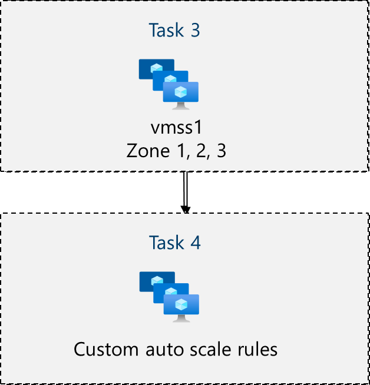
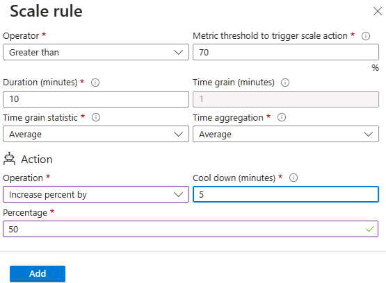

---
lab:
  title: 'Lab 08: Gestire Macchine virtuali'
  module: Administer Virtual Machines
---

# Lab 08 - Gestire le macchine virtuali

## Introduzione al lab

In questo lab vengono create e confrontate le macchine virtuali con i set di scalabilità di macchine virtuali. Si apprenderà come creare, configurare e ridimensionare una singola macchina virtuale. Si apprenderà come creare un set di scalabilità di macchine virtuali e configurare la scalabilità automatica.

Questo lab richiede una sottoscrizione di Azure. Il tipo di sottoscrizione può influire sulla disponibilità delle funzionalità in questo lab. È possibile modificare l'area, ma i passaggi vengono scritti usando **Stati Uniti** orientali.

## Tempo stimato: 50 minuti

## Scenario laboratorio

L'organizzazione vuole esplorare la distribuzione e la configurazione di macchine virtuali di Azure. Prima di tutto, si implementa una macchina virtuale di Azure con scalabilità manuale. Successivamente, si implementa un set di scalabilità di macchine virtuali ed si esplora la scalabilità automatica.

## Simulazioni di lab interattive

Esistono simulazioni di lab interattive che potrebbero risultare utili per questo argomento. La simulazione consente di fare clic su uno scenario simile al proprio ritmo. Esistono differenze tra la simulazione interattiva e questo lab, ma molti dei concetti di base sono gli stessi. Non è necessaria una sottoscrizione di Azure.

+ [Creare una macchina virtuale nel portale](https://mslearn.cloudguides.com/en-us/guides/AZ-900%20Exam%20Guide%20-%20Azure%20Fundamentals%20Exercise%201). Creare una macchina virtuale, connettersi e installare il ruolo del server Web.

+ [Distribuire una macchina virtuale con un modello](https://mslearn.cloudguides.com/en-us/guides/AZ-900%20Exam%20Guide%20-%20Azure%20Fundamentals%20Exercise%209). Esplorare la raccolta Avvio rapido e individuare un modello di macchina virtuale. Distribuire il modello e verificare la distribuzione.

+ [Creare una macchina virtuale con PowerShell](https://mslearn.cloudguides.com/en-us/guides/AZ-900%20Exam%20Guide%20-%20Azure%20Fundamentals%20Exercise%2010). Usare Azure PowerShell per distribuire una macchina virtuale. Esaminare le raccomandazioni di Azure Advisor.

+ [Creare una macchina virtuale con l'interfaccia della riga di comando](https://mslearn.cloudguides.com/en-us/guides/AZ-900%20Exam%20Guide%20-%20Azure%20Fundamentals%20Exercise%2011). Usare l'interfaccia della riga di comando per distribuire una macchina virtuale. Esaminare le raccomandazioni di Azure Advisor.

## Competenze mansione

+ Attività 1: Distribuire macchine virtuali di Azure resilienti alla zona usando il portale di Azure.
+ Attività 2: Gestire il ridimensionamento delle risorse di calcolo e archiviazione per le macchine virtuali.
+ Attività 3: Creare e configurare set di scalabilità di macchine virtuali di Azure.
+ Attività 4: Ridimensionare i set di scalabilità di macchine virtuali di Azure.
+ Attività 5: Creare una macchina virtuale con Azure PowerShell (facoltativo 1).
+ Attività 6: Creare una macchina virtuale usando l'interfaccia della riga di comando (facoltativo 2).

## Diagramma dell'architettura di Azure Macchine virtuali


## Attività 1: Distribuire macchine virtuali di Azure resilienti alla zona usando il portale di Azure

In questa attività si distribuiranno due macchine virtuali di Azure in zone di disponibilità diverse usando il portale di Azure. Le zone di disponibilità offrono il massimo livello di tempo di attività per le macchine virtuali al 99,99%. Per ottenere questo contratto di servizio, è necessario distribuire almeno due macchine virtuali in zone di disponibilità diverse.

1. Accedere al portale di Azure - `https://portal.azure.com`.

1. Cercare e selezionare `Virtual machines`, nel pannello **Macchine** virtuali fare clic su **+ Crea** e quindi selezionare nell'elenco a discesa **+ Macchina** virtuale di Azure. Si notino le altre opzioni.

1. Nel menu a discesa Zona di disponibilità della **scheda Informazioni di base** posizionare un segno di spunta accanto a **Zona 2**.**** Questa opzione deve selezionare sia La zona 1** che ****la zona 2**.

    >**Nota**: verranno distribuite due macchine virtuali nell'area selezionata, una in ogni zona. Si ottiene il contratto di servizio con tempo di attività del 99,99% perché sono distribuite almeno due macchine virtuali in almeno due zone. Nello scenario in cui potrebbe essere necessaria una sola macchina virtuale, è consigliabile distribuire comunque la macchina virtuale in un'altra zona.

1. Nella scheda Informazioni di base continuare a completare la configurazione:

    | Impostazione | Valore |
    | --- | --- |
    | Subscription | nome della sottoscrizione di Azure |
    | Gruppo di risorse |  **az104-rg8** (se necessario, fare clic su **Crea nuovo**) |
    | Nomi delle macchine virtuali | `az104-vm1` e `az104-vm2` (Dopo aver selezionato entrambe le zone di disponibilità, selezionare **Modifica nomi** nel campo Nome macchina virtuale. |
    | Area geografica | **Stati Uniti orientali** |
    | Opzioni di disponibilità | **Zona di disponibilità** |
    | Zona di disponibilità | **Zona 1, 2** (leggere la nota sull'uso dei set di scalabilità di macchine virtuali) |
    | Tipo di sicurezza | **Standard** |
    | Immagine | **Windows Server 2019 Datacenter - x64 Gen2** |
    | Istanza Spot di Azure | **unchecked** |
    | Dimensione | **Standard D2s v3** |
    | Username | `localadmin` |
    | Password | **Specificare una password sicura** |
    | Porte in ingresso pubbliche | **Nessuno** |
    | Usare una licenza esistente di Windows Server? | **Non selezionato** |

    

1. Fare clic su **Avanti: Dischi >** , specificare le impostazioni seguenti (lasciare i valori predefiniti per altri utenti):

    | Impostazione | Valore |
    | --- | --- |
    | Tipo di disco del sistema operativo | **SSD Premium** |
    | Elimina con macchina virtuale | **** selezionato (impostazione predefinita) |
    | Abilita compatibilità disco Ultra | **Non selezionato** |

1. Fare clic su **Avanti: Rete >** accettare le impostazioni predefinite, ma non fornire un servizio di bilanciamento del carico.

    | Impostazione | Valore |
    | --- | --- |
    | Eliminare l'INDIRIZZO IP pubblico e la scheda di interfaccia di rete quando viene eliminata la macchina virtuale | **Selezionato** |
    | Opzioni di bilanciamento del carico | **Nessuno** |


1. Fare clic su **Avanti: Gestione >** e specificare le impostazioni seguenti (lasciare gli altri con i valori predefiniti):

    | Impostazione | Valore |
    | --- | --- |
    | Opzioni di orchestrazione patch | **Azure orchestrato** |  

1. Fare clic su **Avanti: Monitoraggio >** e specificare le impostazioni seguenti (lasciare gli altri con i valori predefiniti):

    | Impostazione | Valore |
    | --- | --- |
    | Diagnostica di avvio | **Disabilita** |

1. Fare clic su **Avanti: Avanzate >**, impostare le impostazioni predefinite, quindi fare clic su **Rivedi e crea**.

1. Dopo la convalida, fare clic su **Crea**.

    >**Nota:** si noti che la macchina virtuale distribuisce la scheda di interfaccia di rete, il disco e l'indirizzo IP pubblico (se configurati) vengono create e gestite in modo indipendente.

1. Attendere il completamento della distribuzione, quindi selezionare **Vai alla risorsa**.

   >**Nota:** monitorare i messaggi di **notifica** .

## Attività 2: Gestire il ridimensionamento delle risorse di calcolo e archiviazione per le macchine virtuali

In questa attività si ridimensiona una macchina virtuale modificandone le dimensioni in uno SKU diverso. Azure offre flessibilità nella selezione delle dimensioni delle macchine virtuali, in modo da poter modificare una macchina virtuale per periodi di tempo se richiede più o meno risorse di calcolo e memoria allocate. Questo concetto viene esteso ai dischi, in cui è possibile modificare le prestazioni del disco o aumentare la capacità allocata.

1. **Nella macchina virtuale az104-vm1**, nel pannello **Disponibilità e scalabilità** selezionare **Dimensioni**.

1. Impostare le dimensioni della macchina virtuale su **DS1_v2** e fare clic su **Ridimensiona**. Quando richiesto, confermare la modifica.

    >**Nota**: scegliere un'altra dimensione se **Standard DS1_v2** non è disponibile. Il ridimensionamento è noto anche come ridimensionamento verticale, aumento o riduzione.

    

1. Nell'area **Impostazioni** selezionare **Dischi**.

1. In **Dischi dati** selezionare **+ Crea e collegare un nuovo disco**. Configurare le impostazioni (lasciare le altre impostazioni nei valori predefiniti).

    | Impostazione | Valore |
    | --- | --- |
    | Disk name | `vm1-disk1` |
    | Tipo di archiviazione | **Unità disco rigido Standard** |
    | Dimensioni (GB) | `32` |

1. Fare clic su **Applica**.

1. Dopo aver creato il disco, fare clic su **Scollega** (se necessario, scorrere verso destra per visualizzare l'icona di scollegamento) e quindi fare clic su **Applica**.

    >**Nota**: lo scollegamento rimuove il disco dalla macchina virtuale, ma lo mantiene nell'archiviazione per usarlo in un secondo momento.

1. Cercare e selezionare `Disks`. Nell'elenco dei dischi selezionare l'oggetto **vm1-disk1** .

    >**Nota:** il **pannello Panoramica** fornisce anche informazioni sulle prestazioni e sull'utilizzo per il disco.

1. Nel pannello Impostazioni selezionare **Dimensioni e prestazioni**.** **

1. Impostare il tipo di archiviazione su **SSD** Standard e quindi fare clic su **Salva**.

1. Tornare alla **macchina virtuale az104-vm1** e selezionare **Dischi**.

1. **Nella sezione Disco** dati selezionare **Collega dischi** esistenti.

1. Nell'elenco **a discesa Nome** disco selezionare **VM1-DISK1**. 

1. Verificare che il disco sia ora **SSD** Standard.

1. Seleziona **Applica** per salvare le modifiche. 

    >**Nota:** è stata creata una macchina virtuale, è stato ridimensionato lo SKU e le dimensioni del disco dati. Nell'attività successiva si usa set di scalabilità di macchine virtuali per automatizzare il processo di ridimensionamento.

## Diagramma dell'architettura di Azure set di scalabilità di macchine virtuali



## Attività 3: Creare e configurare Azure set di scalabilità di macchine virtuali

In questa attività si distribuirà un set di scalabilità di macchine virtuali di Azure tra zone di disponibilità. I set di scalabilità di macchine virtuali riducono il sovraccarico amministrativo dell'automazione consentendo di configurare metriche o condizioni che consentono al set di scalabilità orizzontale, scalabilità orizzontale o scalabilità orizzontale.

1. Nella portale di Azure cercare e selezionare `Virtual machine scale sets` e nel pannello **Set di scalabilità** di macchine virtuali fare clic su **+ Crea**.

1. Nella **scheda Informazioni di base** del **pannello Crea un set** di scalabilità di macchine virtuali specificare le impostazioni seguenti (lasciare gli altri con i valori predefiniti) e fare clic su **Avanti : Spot >**:

    | Impostazione | Valore |
    | --- | --- |
    | Subscription | nome della sottoscrizione di Azure  |
    | Gruppo di risorse | **az104-rg8**  |
    | Nome del set di scalabilità di macchine virtuali | `vmss1` |
    | Area | **(Stati Uniti) Stati Uniti orientali** |
    | Zona di disponibilità | **Zone 1, 2, 3** |
    | Modalità di orchestrazione | **Uniforme** |
    | Tipo di sicurezza | **Standard** |
    | Immagine | **Windows Server 2019 Datacenter - x64 Gen2** |
    | Eseguire con sconto di Spot Azure | **Non selezionato** |
    | Dimensione | **Standard D2s_v3** |
    | Username | `localadmin` |
    | Password | **Specificare una password sicura**  |
    | Si dispone già di una licenza di Windows Server? | **Non selezionato** |

    >**Nota**: per l'elenco delle aree di Azure che supportano la distribuzione di macchine virtuali Windows nelle zone di disponibilità, vedere [Che cosa sono le zone di disponibilità in Azure?](https://docs.microsoft.com/en-us/azure/availability-zones/az-overview)

    

1. Nella **scheda Spot** accettare le impostazioni predefinite e selezionare **Avanti: Dischi >**.

1. Nella **scheda Dischi** accettare i valori predefiniti e fare clic su **Avanti : Rete >**.

1. **Nella pagina Rete** fare clic sul **collegamento Crea rete** virtuale sotto la **casella di testo Rete** virtuale e creare una nuova rete virtuale con le impostazioni seguenti (lasciare altri valori predefiniti).  Al termine selezionare **OK**.

    | Impostazione | valore |
    | --- | --- |
    | Nome | `vmss-vnet` |
    | Intervallo di indirizzi | `10.82.0.0/20` (modificare ciò che c'è) |
    | Nome subnet | `subnet0` |
    | Intervallo di subnet | `10.82.0.0/24` |

1. **Nella scheda Rete** fare clic sull'icona **Modifica interfaccia** di rete a destra della voce dell'interfaccia di rete.

1. Per **la sezione Gruppo di sicurezza** di rete della scheda di interfaccia di rete selezionare **Avanzate** e quindi fare clic su **Crea nuovo** nell'elenco **a discesa Configura gruppo** di sicurezza di rete.

1. Nel pannello **Crea gruppo di sicurezza di rete** specificare le impostazioni seguenti (lasciare i valori predefiniti per le altre impostazioni):

    | Impostazione | valore |
    | --- | --- |
    | Nome | **vmss1-nsg** |

1. Fare clic su **Aggiungi una regola in ingresso** e aggiungere una regola di sicurezza in ingresso con le impostazioni seguenti (lasciare i valori predefiniti per le altre impostazioni):

    | Impostazione | Valore |
    | --- | --- |
    | Origine | **Any** |
    | Intervalli porte di origine | * |
    | Destinazione | **Any** |
    | Servizio | **HTTP** |
    | Azione | **Consenti** |
    | Priorità | **1010** |
    | Nome | `allow-http` |

1. Fare clic su **Aggiungi** e quindi, di nuovo nel pannello **Crea gruppo di sicurezza di rete**, fare clic su **OK**.

1. Nella sezione Indirizzo** IP pubblico del **pannello **Modifica interfaccia** di rete fare clic su **Abilitato** e fare clic su **OK**.

1. **Nella scheda Rete**, nella sezione Bilanciamento** del **carico, specificare quanto segue (lasciare gli altri con i valori predefiniti).

    | Impostazione | Valore |
    | --- | --- |
    | Opzioni di bilanciamento del carico | **Azure Load Balancer** |
    | Selezionare un servizio di bilanciamento del carico | **Creare un servizio di bilanciamento del carico** |

1. Nella pagina Crea un servizio di bilanciamento** del **carico specificare il nome del servizio di bilanciamento del carico e accettare le impostazioni predefinite. Al termine, fare clic su Crea** e quindi **su **Avanti : Ridimensionamento >**.

    | Impostazione | Valore |
    | --- | --- |
    | Nome del servizio di bilanciamento del carico | `vmss-lb` |

    >**Nota:** sospendere per un minuto ed esaminare le operazioni eseguite. A questo punto, è stato configurato il set di scalabilità di macchine virtuali con dischi e rete. Nella configurazione di rete è stato creato un gruppo di sicurezza di rete e è stato consentito HTTP. È stato anche creato un servizio di bilanciamento del carico con un indirizzo IP pubblico.

1. Nella **scheda Ridimensionamento** specificare le impostazioni seguenti (lasciare altri valori predefiniti) e fare clic su **Avanti : Gestione >**:

    | Impostazione | Valore |
    | --- | --- |
    | Numero di istanze iniziale | `2` |
    | Criteri di ridimensionamento | **Manualee** |

1. Nella **scheda Gestione** specificare le impostazioni seguenti (lasciare altri valori predefiniti):

    | Impostazione | Valore |
    | --- | --- |
    | Diagnostica di avvio | **Disabilita** |

1. Fare clic su **Avanti : Integrità** >.

1. Nella scheda Integrità **** esaminare le impostazioni predefinite senza apportare modifiche e fare clic su **Avanti : Avanzate >**.

1. Nella **scheda Avanzate** fare clic su **Rivedi e crea**.

1. **Nella scheda Rivedi e crea** verificare che la convalida sia stata superata e fare clic su **Crea**.

    >**Nota**: attendere il completamento della distribuzione del set di scalabilità di macchine virtuali. L'operazione dovrebbe richiedere circa 5 minuti. Durante l'attesa, esaminare la [documentazione](https://learn.microsoft.com/azure/virtual-machine-scale-sets/overview).

## Attività 4: Ridimensionare i set di scalabilità di macchine virtuali di Azure

In questa attività si ridimensiona il set di scalabilità di macchine virtuali usando una regola di scalabilità personalizzata.

1. Selezionare **Vai alla risorsa** o cercare e selezionare il **set di scalabilità vmss1** .

1. Scegliere **Proporzioni** dal menu nella parte sinistra della finestra del set di scalabilità.

>**Lo sapevi?** È possibile ridimensionare** **manualmente o **scalabilità** automatica personalizzata. Nei set di scalabilità con un numero ridotto di istanze di macchine virtuali, l'aumento o la riduzione del numero di istanze (scalabilità manuale) può essere ottimale. Nei set di scalabilità con un numero elevato di istanze di macchine virtuali, il ridimensionamento in base alle metriche (scalabilità automatica personalizzata) può essere più appropriato.

### Regola di aumento del numero di istanze

1. Selezionare **Scalabilità automatica personalizzata**. modificare quindi la modalità** di scalabilità **in **Ridimensiona in base alla metrica**. Quindi selezionare **Aggiungi regola**.

1. Si creerà una regola che aumenta automaticamente il numero di istanze di macchina virtuale. Questa regola aumenta il numero di istanze quando il carico medio della CPU è maggiore del 70% in un periodo di 10 minuti. Quando la regola viene attivata, il numero di istanze di macchine virtuali viene aumentato del 20%.

    | Impostazione | Valore |
    | --- | --- |
    | Origine della metrica | **Risorsa corrente (vmss1)** |
    | Spazio dei nomi delle metriche | **Host macchina virtuale** |
    | Nome metrica | **Percentuale CPU** (rivedere le altre scelte) |
    | Operatore | **Maggiore di** |
    | Soglia della metrica per l'attivazione dell'azione di dimensionamento | **70** |
    | Durata (minuti) | **10** |
    | Statistica intervallo di tempo | **Media** |
    | Operazione | **Aumentare la percentuale per** (rivedere altre scelte) |
    | Disattiva regole dopo (minuti) | **5** |
    | Percentuale | **20** |

    

1. Assicurarsi di **salvare** le modifiche.

### Regola di scalabilità orizzontale

1. Durante le serate o i fine settimana, la domanda può diminuire, quindi è importante creare una regola di ridimensionamento.

1. Si creerà una regola che riduce il numero di istanze di macchine virtuali in un set di scalabilità. Il numero di istanze deve diminuire quando il carico medio della CPU scende al di sotto del 30% in un periodo di 10 minuti. Quando la regola viene attivata, il numero di istanze di macchine virtuali viene diminuito del 20%.

1. Selezionare **Aggiungi una regola**, modificare le impostazioni e quindi selezionare **Aggiungi**.

    | Impostazione | Valore |
    | --- | --- |
    | Operatore | **Minore di** |
    | Threshold | **30** |
    | Operazione | **ridurre la percentuale per** (esaminare le altre scelte) |
    | Percentuale | **20** |

1. Assicurarsi di **salvare** le modifiche.

### Impostare i limiti dell'istanza

1. Quando vengono applicate le regole di scalabilità automatica, i limiti dell'istanza assicurano che non si esesca oltre il numero massimo di istanze o la scalabilità oltre il numero minimo di istanze.

1. **I limiti** delle istanze vengono visualizzati nella **pagina Ridimensionamento** dopo le regole.

    | Impostazione | Valore |
    | --- | --- |
    | Requisiti minimi | **2** |
    | Massimo | **10** |
    | Default | **2** |

1. Assicurarsi di **salvare** le modifiche

1. Nella **pagina vmss1** selezionare **Istanze**. In questo modo è possibile monitorare il numero di istanze di macchina virtuale.

    >**Nota:** se si è interessati a usare Azure PowerShell per la creazione di macchine virtuali, provare l'attività 5. Se si è interessati a usare l'interfaccia della riga di comando per creare macchine virtuali, provare l'attività 6.

## Attività 5: Creare una macchina virtuale con Azure PowerShell (opzione 1)

1. Usare l'icona (in alto a destra) per avviare una **sessione di Cloud Shell** . In alternativa, passare direttamente a `https://shell.azure.com`.

1. Assicurarsi di selezionare **PowerShell**. Se necessario, usare Mostra **impostazioni** avanzate e configurare l'archiviazione della shell.

1. Eseguire il comando seguente per creare una macchina virtuale. Quando richiesto, specificare un nome utente e una password per la macchina virtuale. Durante l'attesa, vedere le informazioni di riferimento sui [comandi New-AzVM](https://learn.microsoft.com/powershell/module/az.compute/new-azvm?view=azps-11.1.0) per tutti i parametri associati alla creazione di una macchina virtuale.

    ```powershell
    New-AzVm `
    -ResourceGroupName 'az104-rg8' `
    -Name 'myPSVM' `
    -Location 'East US' `
    -Image 'Win2019Datacenter' `
    -Zone '1' `
    -Size 'Standard_D2s_v3' ` 
    -Credential (Get-Credential)
    ```

1. Al termine del comando, usare **Get-AzVM** per elencare le macchine virtuali nel gruppo di risorse.

    ```powershell
    Get-AzVM `
    -ResourceGroupName 'az104-rg8' `
    -Status
    ```

1. Verificare che la nuova macchina virtuale sia elencata e che lo **stato** sia **in esecuzione**.

1. Usare **Stop-AzVM** per deallocare la macchina virtuale. Digitare **Sì** per confermare.

    ```powershell
    Stop-AzVM `
    -ResourceGroupName 'az104-rg8' `
    -Name 'myPSVM' 
    ```

1. Usare **Get-AzVM** con il **parametro -Status** per verificare che il computer sia **deallocato**.

    >**Lo sapevi?** Quando si usa Azure per arrestare la macchina virtuale, lo stato viene *deallocato*. Ciò significa che vengono rilasciati indirizzi IP pubblici non statici e si interrompe il pagamento dei costi di calcolo della macchina virtuale.

## Attività 6: Creare una macchina virtuale usando l'interfaccia della riga di comando (opzione 2)

1. Usare l'icona (in alto a destra) per avviare una **sessione di Cloud Shell** . In alternativa, passare direttamente a `https://shell.azure.com`.

1. Assicurarsi di selezionare **Bash**. Se necessario, usare Mostra **impostazioni** avanzate e configurare l'archiviazione della shell.

1. Eseguire il comando seguente per creare una macchina virtuale. Quando richiesto, specificare un nome utente e una password per la macchina virtuale. Durante l'attesa, vedere il riferimento al [comando az vm create](https://learn.microsoft.com/cli/azure/vm?view=azure-cli-latest#az-vm-create) per tutti i parametri associati alla creazione di una macchina virtuale.

    ```sh
    az vm create --name myCLIVM --resource-group az104-rg8 --image Ubuntu2204 --admin-username localadmin --generate-ssh-keys
    ```

1. Al termine del comando, usare **az vm show** per verificare che il computer sia stato creato.

    ```sh
    az vm show --name  myCLIVM --resource-group az104-rg8 --show-details
    ```

1. Verificare che powerState **** sia **in esecuzione**.

1. Usare **az vm deallocate per deallocare** la macchina virtuale. Digitare **Sì** per confermare.

    ```sh
    az vm deallocate --resource-group az104-rg8 --name myCLIVM
    ```

1. Usare **az vm show** per assicurarsi che powerState** **sia **deallocato** dalla macchina virtuale.

    >**Lo sapevi?** Quando si usa Azure per arrestare la macchina virtuale, lo stato viene *deallocato*. Ciò significa che vengono rilasciati indirizzi IP pubblici non statici e si interrompe il pagamento dei costi di calcolo della macchina virtuale.

## Pulire le risorse

Se si usa **la propria sottoscrizione** , è necessario un minuto per eliminare le risorse del lab. In questo modo le risorse vengono liberate e i costi vengono ridotti al minimo. Il modo più semplice per eliminare le risorse del lab consiste nell'eliminare il gruppo di risorse del lab. 

+ Nella portale di Azure selezionare il gruppo di risorse, selezionare **Elimina il gruppo di risorse, **Immettere il nome** del gruppo** di risorse e quindi fare clic su **Elimina**.
+ Uso di Azure PowerShell, `Remove-AzResourceGroup -Name resourceGroupName`.
+ Uso dell'interfaccia della riga di comando di `az group delete --name resourceGroupName`.


## Punti chiave

Congratulazioni per il completamento del lab. Ecco le principali considerazioni per questo lab.

+ Le macchine virtuali di Azure sono risorse di calcolo su richiesta e scalabili.
+ Le macchine virtuali di Azure offrono opzioni di scalabilità verticale e orizzontale.
+ La configurazione delle macchine virtuali di Azure include la scelta di un sistema operativo, dimensioni, archiviazione e impostazioni di rete.
+ I set di scalabilità di macchine virtuali di Azure consentono di creare e gestire un gruppo di macchine virtuali con bilanciamento del carico.
+ Le macchine virtuali in un set di scalabilità di macchine virtuali vengono create dalla stessa immagine e configurazione.
+ In un set di scalabilità di macchine virtuali il numero di istanze di macchine virtuali può aumentare o diminuire automaticamente in risposta alla domanda o a una pianificazione definita.

## Altre informazioni con la formazione autogestita

+ [Creare una macchina virtuale Windows in Azure](https://learn.microsoft.com/training/modules/create-windows-virtual-machine-in-azure/). Creare una macchina virtuale Windows con il portale di Azure. Connettersi alla macchina virtuale Windows in esecuzione usando Desktop remoto
+ [Creare un'applicazione scalabile con set di scalabilità di macchine virtuali](https://learn.microsoft.com/training/modules/build-app-with-scale-sets/). Abilitare il ridimensionamento automatico di un'applicazione in base alle variazioni del carico riducendo al minimo i costi con i set di scalabilità di macchine virtuali.
+ [Connessione alle macchine virtuali tramite il portale di Azure usando Azure Bastion](https://learn.microsoft.com/en-us/training/modules/connect-vm-with-azure-bastion/). Distribuire Azure Bastion per connettersi in modo sicuro alle macchine virtuali di Azure direttamente all'interno del portale di Azure per sostituire in modo efficace una soluzione jumpbox esistente, monitorare le sessioni remote usando i log di diagnostica e gestire le sessioni remote disconnettendo una sessione utente.
  
