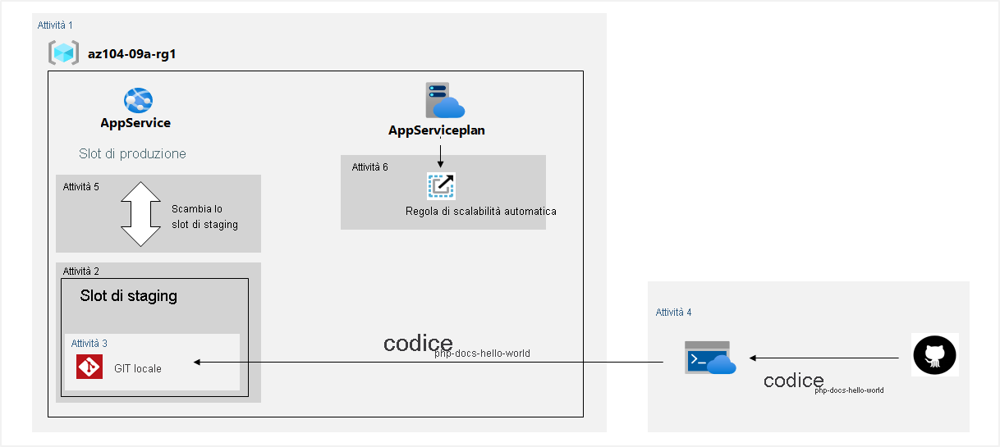

---
lab:
  title: 'Lab 09a: Implementare App Web'
  module: Administer PaaS Compute Options
---

# Lab 09a - Implementare app Web
# Manuale del lab per studenti

## Scenario del lab

È necessario valutare l'uso di app Web di Azure per l'hosting dei siti Web di Contoso ospitati attualmente nei data center locali della società. I siti Web sono in esecuzione su server Windows che usano lo stack di runtime PHP. È inoltre necessario determinare in che modo è possibile implementare le procedure DevOps sfruttando gli slot di distribuzione di app Web di Azure.

                **Nota:** è disponibile una **[simulazione di lab interattiva](https://mslabs.cloudguides.com/guides/AZ-104%20Exam%20Guide%20-%20Microsoft%20Azure%20Administrator%20Exercise%2013)** che consente di eseguire questo lab in base ai propri tempi. Si potrebbero notare piccole differenza tra la simulazione interattiva e il lab ospitato, ma i concetti e le idee principali dimostrati sono gli stessi. 

## Obiettivi

In questo lab si eseguiranno le attività seguenti:

+ Attività 1: Creare un'app Web di Azure
+ Attività 2: Creare uno slot di distribuzione di staging
+ Attività 3: Configurare le impostazioni di distribuzione delle app Web
+ Attività 4: Distribuire codice nello slot di distribuzione di staging
+ Attività 5: Scambiare gli slot di staging
+ Attività 6: Configurare e testare la scalabilità automatica dell'app Web di Azure

## Tempo stimato: 30 minuti

## Diagramma dell'architettura



### Istruzioni

## Esercizio 1

## Attività 1: Creare un'app Web di Azure

In questa attività verrà creata un'app Web di Azure.

1. Accedere al [**portale di Azure**](http://portal.azure.com).

1. Nel portale di Azure cercare e selezionare **Servizi app** e nel pannello **Servizi app** fare clic su **+ Crea**.

1. Nella scheda **Informazioni di base** del pannello **Crea app Web** specificare le impostazioni seguenti e non modificare i valori predefiniti per le altre impostazioni:

    | Impostazione | Valore |
    | --- | ---|
    | Subscription | Nome della sottoscrizione di Azure usata in questo lab |
    | Resource group | Nome di un nuovo gruppo di risorse **az104-09a-rg1** |
    | Nome dell'app Web | Qualsiasi nome univoco a livello globale |
    | Pubblica | **Codice** |
    | Stack di runtime | **PHP 8.2** |
    | Sistema operativo | **Linux** |
    | Region | Nome di un'area di Azure in cui è possibile effettuare il provisioning di app Web di Azure |
    | Piani tariffari | Accettare la configurazione predefinita |

1. Fare clic su **Rivedi e crea**. Nella scheda **Rivedi e crea** del pannello **Crea app Web** assicurarsi che la convalida abbia avuto esito positivo e fare clic su **Crea**.

    >**Nota**: attendere che venga creata l'app Web prima di procedere all'attività successiva. L'operazione dovrebbe richiedere circa un minuto.

1. Nel pannello della distribuzione fare clic su **Vai alla risorsa**.

## Attività 2: Creare uno slot di distribuzione di staging

In questa attività verrà creato uno slot di distribuzione di staging.

1. Nel pannello dell'app Web appena distribuita fare clic sul collegamento **Dominio predefinito** per visualizzare la pagina Web predefinita in una nuova scheda del browser.

1. Chiudere la nuova scheda del browser e, di nuovo nel portale di Azure, nella sezione **Distribuzione** del pannello dell'app Web fare clic su **Add a Slot di distribuzione**.

    >**Nota**: a questo punto l'app Web include un singolo slot di distribuzione con etichetta **PRODUCTION**.

1. Fare clic su **+ Add slot** (Aggiungi slot) e aggiungere un nuovo slot con le impostazioni seguenti:

    | Impostazione | Valore |
    | --- | ---|
    | Nome | **staging** |
    | Clona le impostazioni da | **Non clonare le impostazioni**|

1. Tornare al pannello **Slot di distribuzione** dell'app Web e fare clic sulla voce che rappresenta lo slot di staging appena creato.

    >**Nota**: verrà visualizzato il pannello che mostra le proprietà dello slot di staging.

1. Esaminare il pannello dello slot di staging e notare che l'URL è diverso da quello assegnato allo slot di produzione.

## Attività 3: Configurare le impostazioni di distribuzione delle app Web

In questa attività verranno configurate le impostazioni della distribuzione Web.

1. Nel pannello dello slot di distribuzione di staging, nella sezione **Distribuzione** fare clic su **Centro distribuzione** e quindi selezionare la scheda **Impostazioni**.

    >**Nota:** assicurarsi di trovarsi nel pannello dello slot di staging invece che dello slot di produzione.
    
1. Nella scheda **Impostazioni** nell'elenco a discesa **Origine** selezionare **Archivio Git locale** e fare clic sul pulsante **Salva**

1. Nel pannello **Centro distribuzione** copiare la voce **Git Clone Uri** nel Blocco note.

    >**Nota:** È necessario il valore URI clone Git nell'attività successiva di questo lab.

1. Nel pannello **Centro distribuzione** selezionare la scheda **Credenziali GIT locale/FTPS**, nella sezione **Ambito utente** specificare le impostazioni seguenti e fare clic su **Salva**.

    | Impostazione | Valore |
    | --- | ---|
    | Nome utente | qualsiasi nome univoco globale (vedere nota)  |
    | Password | qualsiasi password che soddisfi i requisiti di complessità (vedere nota) |

    >**Nota:** Copiare queste credenziali nel Blocco note. saranno necessarie più avanti.
    
    >**Nota:** Queste credenziali verranno passate tramite l'URI. Non includere caratteri speciali che influiscono sull'interpretazione dell'URI. Ad esempio, @, $o #. Un segno asterick o plus (nella parte centrale della stringa) funzionerebbe.
    
## Attività 4: Distribuire codice nello slot di distribuzione di staging

In questa attività verrà distribuito codice nello slot di distribuzione.

1. Nel portale di Azure aprire **Azure Cloud Shell** facendo clic sull'icona nell'angolo in alto a destra.

1. Se viene richiesto di selezionare **Bash** o **PowerShell**, selezionare **PowerShell**.

    >**Nota**: se è la prima volta che si avvia **Cloud Shell** e viene visualizzato il messaggio **Non sono state montate risorse di archiviazione**, selezionare la sottoscrizione in uso nel lab e quindi fare clic su **Crea archivio**.

1. Dal riquadro Cloud Shell eseguire il codice seguente per clonare il repository remoto contenente il codice per l'app Web.

   ```powershell
   git clone https://github.com/Azure-Samples/php-docs-hello-world
   ```

1. Dal riquadro Cloud Shell eseguire il codice seguente per impostare la posizione corrente sul clone appena creato del repository locale contenente il codice dell'app Web di esempio.

   ```powershell
   Set-Location -Path $HOME/php-docs-hello-world/
   ```

1. Nel riquadro Cloud Shell eseguire il comando seguente per aggiungere git remoto (assicurarsi di sostituire i `[deployment_user_name]` segnaposto e con il valore del nome utente delle **credenziali di distribuzione** e `[git_clone_uri]` **dell'URI di clonazione Git**, rispettivamente identificato nell'attività precedente):

   ```powershell
   git remote add [deployment_user_name] [git_clone_uri]
   ```

    >**Nota**: non è necessario che il valore successivo a `git remote add` corrisponda al nome utente di **Credenziali distribuzione**, ma deve essere univoco

1. Dal riquadro Cloud Shell eseguire quanto segue per eseguire il push del codice dell'app Web di esempio dal repository locale allo slot di distribuzione di staging dell'app Web di Azure (assicurarsi di sostituire i valori segnaposto con il valore del nome utente e della password delle **credenziali di distribuzione** e il nome dell'app, identificato nell'attività precedente):

   ```powershell
    git push https://<deployment-username>:<deployment-password>@<app-name>-staging.scm.azurewebsites.net/<app-name>.git master
   ```

1. Chiudere il riquadro Cloud Shell.

1. Nel pannello slot di gestione temporanea fare clic su **Panoramica** e quindi fare clic sul collegamento **Dominio predefinito** per visualizzare la pagina Web predefinita in una nuova scheda del browser.

1. Verificare che nella pagina del browser sia visualizzato il messaggio **Hello World!** e chiudere la nuova scheda.

## Attività 5: Scambiare gli slot di staging

In questa attività lo slot di staging verrà scambiato con lo slot di produzione

1. Tornare al pannello che mostra lo slot di produzione dell'app Web.

1. Nella sezione**Distribuzione** fare clic su **Slot di distribuzione** e quindi sull'icona **Scambia** della barra degli strumenti.

1. Nel pannello **Scambia** esaminare le impostazioni predefinite e fare clic su **Scambia**.

1. Fare clic su **Panoramica** nel pannello slot di produzione dell'app Web e quindi sul collegamento **Dominio predefinito** per visualizzare la home page del sito Web in una nuova scheda del browser.

1. Verificare che la pagina Web predefinita sia stata sostituita con la pagina **Hello World!** .

## Attività 6: Configurare e testare la scalabilità automatica dell'app Web di Azure

In questa attività verrà configurata l'app di Azure e ne verrà testata la scalabilità automatica.

1. Nel pannello che mostra lo slot di produzione dell'app Web, nella sezione **Impostazioni**, fare clic su **Aumenta istanze (piano di servizio app)** .

1. Nella **sezione Ridimensionamento** selezionare l'opzione **Basata su regole** , quindi fare clic sul collegamento **Gestisci regole basate sul ridimensionamento** .

1. Fare clic su **Scalabilità automatica personalizzata**.

    >**Nota**: è anche possibile dimensionare manualmente l'app Web.

1. Selezionare **Ridimensiona in base a una metrica** e fare clic su **+ Aggiungi una regola**.

1. Nel pannello **Regola scalabilità** specificare le impostazioni seguenti e non modificare i valori predefiniti per le altre impostazioni:

    | Impostazione | Valore |
    | --- |--- |
    | Origine della metrica | **Risorsa corrente** |
    | Spazio dei nomi delle metriche | **metriche standard** |
    | Nome metrica | **Percentuale CPU** |
    | Operatore | **Maggiore di** |
    | Soglia della metrica per l'attivazione dell'azione di dimensionamento | **10** |
    | Durata (in minuti) | **1** |
    | Statistica intervallo di tempo | **Massimo** |
    | Aggregazione temporale | **Massimo** |
    | Operazione | **Aumenta numero di** |
    | Numero di istanze | **1** |
    | Disattiva regole dopo (minuti) | **5** |

    >**Nota**: questi valori non rappresentano una configurazione realistica, perché lo scopo è quello di attivare la scalabilità automatica il prima possibile, senza un periodo di attesa prolungato.

1. Fare clic su **Aggiungi** e di nuovo nel pannello di dimensionamento del piano di servizio app specificare le impostazioni seguenti e non modificare i valori predefiniti per le altre impostazioni:

    | Impostazione | Valore |
    | --- |--- |
    | Limiti per le istanze Minimo | **1** |
    | Limiti per le istanze Massimo | **2** |
    | Limiti per le istanze Valore predefinito | **1** |

1. Fare clic su **Save** (Salva).

    >**Nota**: se si verifica un errore che indica che il provider di risorse "microsoft.insights" non è registrato, eseguire `az provider register --namespace 'Microsoft.Insights'` in Cloud Shell e riprovare a salvare le regole di scalabilità automatica.

1. Nel portale di Azure aprire **Azure Cloud Shell** facendo clic sull'icona nell'angolo in alto a destra.

1. Se viene richiesto di selezionare **Bash** o **PowerShell**, selezionare **PowerShell**.

1. Dal riquadro Cloud Shell eseguire il codice seguente per identificare l'URL dell'app Web di Azure.

   ```powershell
   $rgName = 'az104-09a-rg1'

   $webapp = Get-AzWebApp -ResourceGroupName $rgName
   ```

1. Dal riquadro Cloud Shell eseguire il codice seguente per avviare un ciclo infinito che invia le richieste HTTP all'app Web:

   ```powershell
   while ($true) { Invoke-WebRequest -Uri $webapp.DefaultHostName }
   ```

1. Ridurre a icona il riquadro Cloud Shell senza chiuderlo e nel pannello dell'app Web, nella sezione Impostazioni, fare clic su **Aumenta istanze (piano di servizio app)** .

1. Selezionare **Impostazioni di scalabilità automatica**, selezionare la scheda **Cronologia esecuzioni** . In **Mostra i dati per l'ultima** ora selezionare **1 ora** e controllare il **conteggio delle istanze delle risorse osservate**.

1. Monitorare l'utilizzo e il numero di istanze per qualche minuto. 

    >**Nota**: potrebbe essere necessario selezionare **Aggiorna** per la pagina.

1. Dopo aver notato che il numero di istanze è aumentato a 2, riaprire il riquadro Cloud Shell e terminare lo script premendo **CTRL+C**.

1. Chiudere il riquadro Cloud Shell.

## Pulire le risorse

>**Nota**: ricordarsi di rimuovere tutte le risorse di Azure appena create che non vengono più usate. La rimozione delle risorse inutilizzate garantisce che non verranno addebitati costi imprevisti.

>**Nota**: non è necessario preoccuparsi se le risorse del lab non possono essere rimosse immediatamente. A volte le risorse hanno dipendenze e l'eliminazione può richiedere molto tempo. Si tratta di un'attività comune dell'amministratore per monitorare l'utilizzo delle risorse, quindi è sufficiente esaminare periodicamente le risorse nel portale per verificare il funzionamento della pulizia. 

1. Nel portale di Azure aprire la sessione di **PowerShell** all'interno del riquadro **Cloud Shell**.

1. Elencare tutti i gruppi di risorse creati nei lab di questo modulo eseguendo il comando seguente:

   ```powershell
   Get-AzResourceGroup -Name 'az104-09a*'
   ```

1. Eliminare tutti i gruppi di risorse creati nei lab di questo modulo eseguendo il comando seguente:

   ```powershell
   Get-AzResourceGroup -Name 'az104-09a*' | Remove-AzResourceGroup -Force -AsJob
   ```

    >**Nota**: il comando viene eseguito in modo asincrono, in base a quanto determinato dal parametro -AsJob, quindi, sebbene sia possibile eseguire un altro comando di PowerShell immediatamente dopo nella stessa sessione di PowerShell, i gruppi di risorse verranno rimossi dopo alcuni minuti.

## Verifica

In questo lab sono state eseguite le attività seguenti:

+ Creazione di un'app Web di Azure
+ Creazione di uno slot di distribuzione di staging
+ Configurazione delle impostazioni di distribuzione delle app Web
+ Distribuzione di codice nello slot di distribuzione di staging
+ Scambio degli slot di staging
+ Configurazione e test della scalabilità automatica dell'app Web di Azure
