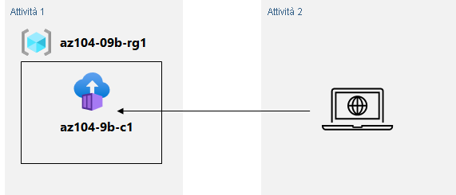

---
lab:
  title: 'Lab 09b: Implementare Istanze di Azure Container'
  module: Administer PaaS Compute Options
---

# Lab 09b - Implementare Istanze di Azure Container
# Manuale del lab per gli studenti

## Scenario laboratorio

Contoso vuole trovare una nuova piattaforma per i carichi di lavoro virtualizzati. Sono state identificate diverse immagini del contenitore che possono essere sfruttate per raggiungere questo obiettivo. Poiché si vuole ridurre al minimo la gestione dei contenitori, si prevede di valutare l'uso di Istanze di Azure Container per la distribuzione di immagini Docker.

**Nota:** è disponibile una **[simulazione di lab interattiva](https://mslabs.cloudguides.com/guides/AZ-104%20Exam%20Guide%20-%20Microsoft%20Azure%20Administrator%20Exercise%2014)** che consente di eseguire questo lab in base ai propri tempi. Si potrebbero notare piccole differenza tra la simulazione interattiva e il lab ospitato, ma i concetti e le idee principali dimostrati sono gli stessi. 

## Obiettivi

Contenuto del lab:

- Attività 1: Distribuire un'istanza di Azure Container usando un'immagine Docker
- Attività 2: Esaminare la funzionalità di Istanza di Azure Container

## Tempo stimato: 20 minuti

## Diagramma dell'architettura



### Istruzioni

## Esercizio 1

## Attività 1: Distribuire un'istanza di Azure Container usando un'immagine Docker

In questa attività verrà creata una nuova istanza di contenitore per l'applicazione Web.

1. Accedi al [portale di Azure](https://portal.azure.com).

1. Nel portale di Azure trovare **Istanze di Container** e nel pannello **Istanze di Container** fare clic su **+ Crea**.

1. Nella scheda **Dati principali** del pannello **Crea istanza di Container** specificare le impostazioni seguenti e non modificare i valori predefiniti per le altre impostazioni:

    | Impostazione | Valore |
    | ---- | ---- |
    | Subscription | Nome della sottoscrizione di Azure usata in questo lab |
    | Gruppo di risorse | Nome di un nuovo gruppo di risorse **az104-09b-rg1** |
    | Nome contenitore | **az104-9b-c1** |
    | Area | Nome di un'area in cui è possibile effettuare il provisioning delle istanze di Azure Container |
    | Origine immagine | **Immagini di avvio rapido** |
    | Immagine | **mcr.microsoft.com/azuredocs/aci-helloworld:latest (Linux)** |

1. Fare clic su **Avanti: Rete >** e nella scheda **Rete** del pannello **Crea istanza di Container** specificare le impostazioni seguenti, lasciando i valori predefiniti per le altre:

    | Impostazione | Valore |
    | --- | --- |
    | Etichetta del nome DNS | Qualsiasi nome host DNS valido e univoco a livello globale |

    >**Nota**: il contenitore sarà raggiungibile pubblicamente all'indirizzo dns-name-label.region.azurecontainer.io. Se viene visualizzato un messaggio di errore **L'etichetta del nome DNS non è disponibile**, specificare un valore diverso.

1. Fare clic su **Avanti: Avanzate >**, esaminare le impostazioni nella scheda **Avanzate** del pannello **Crea istanza di Container** senza apportare modifiche, fare clic su **Verifica e crea**, verificare che la convalida sia stata superata e fare clic su **Crea**.

    >**Nota**: attendere il completamento della distribuzione. L'operazione richiede circa 3 minuti.

    >**Nota**: durante l'attesa può essere interessante visualizzare il [codice alla base di questa applicazione di esempio](https://github.com/Azure-Samples/aci-helloworld). Per visualizzarlo, passare alla cartella \\app.

## Attività 2: Esaminare la funzionalità di Istanza di Azure Container

In questa attività verrà esaminata la distribuzione dell'istanza di contenitore.

1. Nel pannello della distribuzione fare clic sul collegamento **Vai alla risorsa**.

1. Nel pannello **Panoramica** dell'istanza di contenitore verificare che **Stato** indichi **In esecuzione**.

1. Copiare il valore **FQDN**dell'istanza di contenitore, aprire una nuova scheda del browser e passare all'URL corrispondente.

1. Verificare che venga visualizzata la pagina **Benvenuti in Istanze di Azure Container**.

1. Chiudere la nuova scheda del browser e nel portale di Azure, nella sezione **Impostazioni** del pannello dell'istanza del contenitore, fare clic su **Contenitori** e quindi su **Log**.

1. Verificare che siano visualizzate le voci di log che rappresentano la richiesta HTTP GET generata visualizzando l'applicazione nel browser.

## Pulire le risorse

>**Nota**: ricordarsi di rimuovere tutte le risorse di Azure appena create che non vengono più usate. La rimozione delle risorse inutilizzate garantisce che non verranno addebitati costi imprevisti.

>**Nota**: non è necessario preoccuparsi se le risorse del lab non possono essere rimosse immediatamente. A volte le risorse hanno dipendenze e l'eliminazione può richiedere molto tempo. Si tratta di un'attività comune dell'amministratore per monitorare l'utilizzo delle risorse, quindi è sufficiente esaminare periodicamente le risorse nel portale per verificare il funzionamento della pulizia. 

1. Nel portale di Azure aprire la sessione di **PowerShell** all'interno del riquadro **Cloud Shell**.

    >**Nota**: per il corretto funzionamento di questi comandi, è necessario creare l'archiviazione di Cloud Shell. 

1. Elencare tutti i gruppi di risorse creati nei lab di questo modulo eseguendo il comando seguente:

   ```powershell
   Get-AzResourceGroup -Name 'az104-09b*'
   ```

1. Eliminare tutti i gruppi di risorse creati nei lab di questo modulo eseguendo il comando seguente:

   ```powershell
   Get-AzResourceGroup -Name 'az104-09b*' | Remove-AzResourceGroup -Force -AsJob
   ```

    >**Nota**: il comando viene eseguito in modo asincrono, in base a quanto determinato dal parametro -AsJob, quindi, sebbene sia possibile eseguire un altro comando di PowerShell immediatamente dopo nella stessa sessione di PowerShell, i gruppi di risorse verranno rimossi dopo alcuni minuti.

## Rivedi

In questo lab sono state eseguite le attività seguenti:

- Distribuzione di un'immagine Docker usando Istanza di Azure Container
- Esame della funzionalità di Istanza di Azure Container
