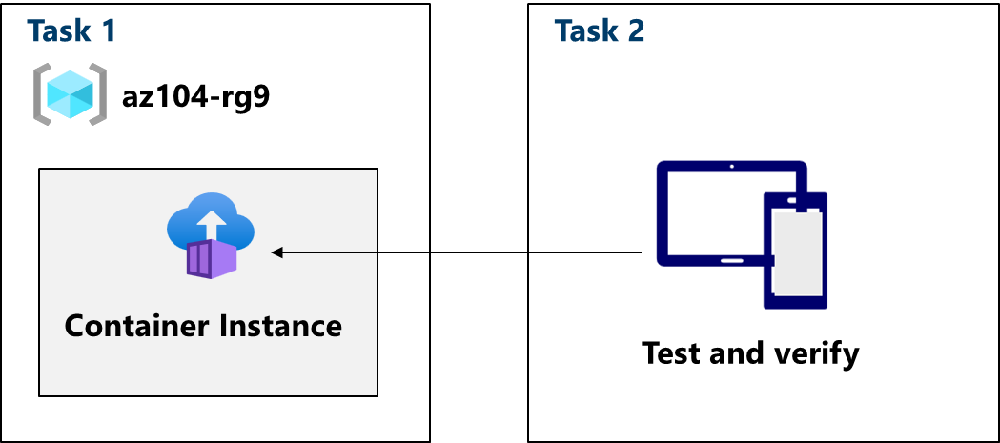

---
lab:
  title: 'Lab 09b: Implementare Istanze di Azure Container'
  module: Administer PaaS Compute Options
---

# Lab 09b - Implementare Istanze di Azure Container

## Introduzione al lab

In questo lab si apprenderà come implementare e distribuire Istanze di Azure Container.

Questo lab richiede una sottoscrizione di Azure. Il tipo di sottoscrizione può influire sulla disponibilità delle funzionalità in questo lab. È possibile modificare l'area, ma i passaggi vengono scritti usando **Stati Uniti orientali**.

## Tempo stimato: 15 minuti

## Scenario laboratorio

L'organizzazione ha un'applicazione Web che viene eseguita in una macchina virtuale nel data center locale. L'organizzazione vuole spostare tutte le applicazioni nel cloud, ma non vuole gestire un numero elevato di server. Si decide di valutare Istanze di Azure Container e Docker. 
## Simulazioni interattive del lab

Esistono simulazioni di lab interattive che potrebbero risultare utili per questo argomento. La simulazione consente di eseguire uno scenario simile al proprio ritmo. Esistono differenze tra la simulazione interattiva e questo lab, ma molti concetti fondamentali sono identici. Non è necessaria una sottoscrizione di Azure.

+ [Distribuire istanze di Azure Container](https://mslearn.cloudguides.com/en-us/guides/AZ-900%20Exam%20Guide%20-%20Azure%20Fundamentals%20Exercise%203). Creare, configurare e distribuire un contenitore Docker con Istanze di Azure Container.
  
+ [Implementare Istanze di Azure Container](https://mslabs.cloudguides.com/guides/AZ-104%20Exam%20Guide%20-%20Microsoft%20Azure%20Administrator%20Exercise%2014).  Distribuire un'immagine Docker usando Istanze di Azure Container. 

## Diagramma dell'architettura

## Competenze mansione

- Attività 1: Distribuire un'istanza di Azure Container usando un'immagine Docker.
- Attività 2: Testare e verificare la distribuzione di un'istanza di Azure Container.

## Attività 1: Distribuire Istanze di Azure Container usando un'immagine Docker

In questa attività si creerà una semplice applicazione Web usando un'immagine Docker. Docker è una piattaforma che consente di creare pacchetti ed eseguire applicazioni in ambienti isolati denominati contenitori. Istanze di Azure Container fornisce l'ambiente di calcolo per l'immagine del contenitore.

1. Accedere al **portale di Azure** - `https://portal.azure.com`.

1. Nel portale di Azure cercare e selezionare `Container instances` e quindi, nel pannello **Istanze di Contenitore** fare clic su **+ Crea**.

1. Nella scheda **Dati principali** del pannello **Crea istanza di Container** specificare le impostazioni seguenti e non modificare i valori predefiniti per le altre impostazioni:

    | Impostazione | Valore |
    | ---- | ---- |
    | Subscription | Selezionare la sottoscrizione di Azure |
    | Gruppo di risorse | `az104-rg9` (Se necessario, selezionare **Crea nuovo**) |
    | Nome contenitore | `az104-c1` |
    | Paese | **Stati Uniti orientali** (o un'area disponibile nelle vicinanze)|
    | Origine immagine | **Immagini di avvio rapido** |
    | Immagine | **mcr.microsoft.com/azuredocs/aci-helloworld:latest (Linux)** |

1. Fare clic su **Avanti: Rete >** e specificare le impostazioni seguenti (lasciare gli altri con i valori predefiniti):

    | Impostazione | Valore |
    | --- | --- |
    | Etichetta del nome DNS | Qualsiasi nome host DNS valido e univoco a livello globale |

    >**Nota**: il contenitore sarà raggiungibile pubblicamente all'indirizzo dns-name-label.region.azurecontainer.io. Se viene visualizzato un messaggio di errore **L'etichetta del nome DNS non è disponibile**, specificare un valore diverso.

1. Fare clic su **Avanti: **> avanzate, esaminare le impostazioni senza apportare modifiche.

 1. Fare clic su **Rivedi e crea**, assicurarsi che la convalida abbia avuto esito positivo e quindi selezionare **Crea**.

    >**Nota**: attendere il completamento della distribuzione. L'operazione dovrebbe richiedere 2-3 minuti.

    >**Nota**: durante l'attesa può essere interessante visualizzare il [codice alla base di questa applicazione di esempio](https://github.com/Azure-Samples/aci-helloworld). Per visualizzare il codice, esplorare la cartella dell'app \\.

## Attività 2: Testare e verificare la distribuzione di un'istanza di Azure Container 

In questa attività viene esaminata la distribuzione dell'istanza di contenitore. Per impostazione predefinita, l'istanza di Azure Container è accessibile sulla porta 80. Dopo aver distribuito l'istanza, è possibile passare al contenitore usando il nome DNS fornito nell'attività precedente.

1. Nel pannello della distribuzione fare clic sul collegamento **Vai alla risorsa**.

1. Nel pannello **Panoramica** dell'istanza di contenitore verificare che **Stato** indichi **In esecuzione**.

1. Copiare il valore **FQDN**dell'istanza di contenitore, aprire una nuova scheda del browser e passare all'URL corrispondente.

     

1. Verificare che venga visualizzata la pagina **Benvenuti in Istanze di Azure Container**. Aggiornare la pagina più volte per creare alcune voci di log e quindi chiudere la scheda del browser.  

1. Nella sezione **Impostazioni** del pannello dell'istanza del contenitore, fare clic su **Contenitori** e quindi su **Log**.

1. Verificare che siano visualizzate le voci di log che rappresentano la richiesta HTTP GET generata visualizzando l'applicazione nel browser.
   
## Pulire le risorse

Se si usa la **sottoscrizione personale** dedicare qualche minuto all’eliminazione delle risorse del lab. In tal modo, vengono liberate risorse e i costi vengono ridotti al minimo. Il modo più semplice per eliminare queste risorse del lab consiste nell'eliminazione del gruppo di risorse del lab. 

+ Nel portale di Azure selezionare il gruppo di risorse, selezionare **Elimina il gruppo di risorse**, **Immettere il nome del gruppo di risorse** e quindi fare clic su **Elimina**.
+ Usando Azure PowerShell, `Remove-AzResourceGroup -Name resourceGroupName`.
+ Usando l’interfaccia della riga di comando, `az group delete --name resourceGroupName`.

## Estendere l'apprendimento con Copilot
Copilot può essere utile per imparare a usare gli strumenti di scripting di Azure. Copilot può essere utile anche in aree non coperte nel lab o dove occorrono altre informazioni. Aprire un browser Edge e scegliere Copilot (in alto a destra) o passare a *copilot.microsoft.com*. Dedicare qualche minuto alla prova di queste richieste.

+ Riepilogare i passaggi per creare e configurare un'istanza di Azure Container.
+ Quali sono i modi in cui è possibile eseguire un contenitore serverless in Azure?

## Altre informazioni con la formazione autogestita

+ [Eseguire immagini del contenitore in Istanze di Azure Container](https://learn.microsoft.com/training/modules/create-run-container-images-azure-container-instances/). Informazioni su come Istanze di Azure Container consente di distribuire rapidamente i contenitori, su come impostare le variabili di ambiente e specificare i criteri di riavvio del contenitore.

## Punti chiave

Congratulazioni per aver completato il lab. Ecco i concetti chiave per questo lab. 

+ Istanze di Azure Container è un servizio che consente di distribuire contenitori nel cloud pubblico di Microsoft Azure.
+ ACI non richiede il provisioning o la gestione di un'infrastruttura sottostante.
+ ACI supporta sia contenitori Linux che contenitori Windows.
+ I carichi di lavoro in Istanze di Azure Container vengono in genere avviati e arrestati da un certo tipo di processo o trigger e sono in genere di breve durata. 

    
