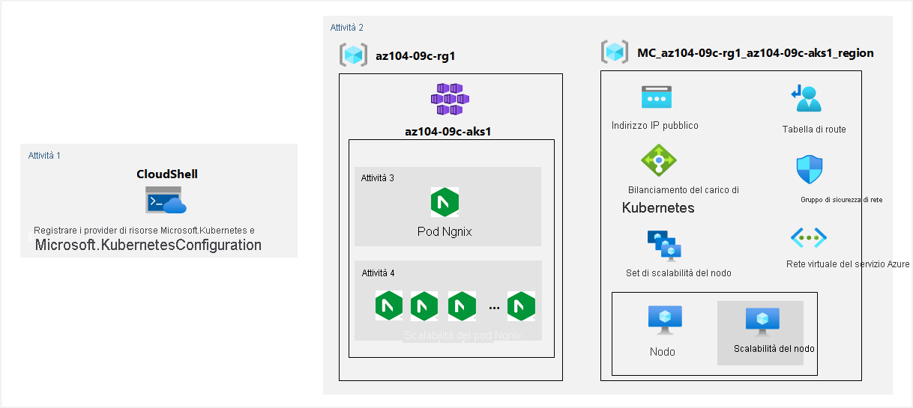

---
lab:
  title: 09c - Implementare il servizio Azure Kubernetes
  module: Administer Serverless Computing
---

# <a name="lab-09c---implement-azure-kubernetes-service"></a>Lab 09c - Implementare il servizio Azure Kubernetes
# <a name="student-lab-manual"></a>Manuale del lab per studenti

## <a name="lab-scenario"></a>Scenario del lab

Contoso has a number of multi-tier applications that are not suitable to run by using Azure Container Instances. In order to determine whether they can be run as containerized workloads, you want to evaluate using Kubernetes as the container orchestrator. To further minimize management overhead, you want to test Azure Kubernetes Service, including its simplified deployment experience and scaling capabilities.

<bpt id="p1">**</bpt>Note:<ept id="p1">**</ept> An <bpt id="p2">**</bpt><bpt id="p3">[</bpt>interactive lab simulation<ept id="p3">](https://mslabs.cloudguides.com/guides/AZ-104%20Exam%20Guide%20-%20Microsoft%20Azure%20Administrator%20Exercise%2015)</ept><ept id="p2">**</ept> is available that allows you to click through this lab at your own pace. You may find slight differences between the interactive simulation and the hosted lab, but the core concepts and ideas being demonstrated are the same. 

## <a name="objectives"></a>Obiettivi

In questo lab si eseguiranno le attività seguenti:

+ Attività 1: Registrare i provider di risorse Microsoft.Kubernetes e Microsoft.KubernetesConfiguration.
+ Attività 2: Distribuire un cluster del servizio Azure Kubernetes
+ Attività 3: Distribuire pod nel cluster del servizio Azure Kubernetes
+ Attività 4: Ridimensionare i carichi di lavoro in contenitori nel cluster del servizio Azure Kubernetes

## <a name="estimated-timing-40-minutes"></a>Tempo stimato: 40 minuti

## <a name="architecture-diagram"></a>Diagramma dell'architettura



## <a name="instructions"></a>Istruzioni

### <a name="exercise-1"></a>Esercizio 1

#### <a name="task-1-register-the-microsoftkubernetes-and-microsoftkubernetesconfiguration-resource-providers"></a>Attività 1: Registrare i provider di risorse Microsoft.Kubernetes e Microsoft.KubernetesConfiguration.

In questa attività verranno registrati i provider di risorse necessari per distribuire un cluster del servizio Azure Kubernetes.

1. Accedere al [portale di Azure](https://portal.azure.com).

1. Nel portale di Azure aprire **Azure Cloud Shell** facendo clic sull'icona nell'angolo in alto a destra.

1. Se viene richiesto di selezionare **Bash** o **PowerShell**, selezionare **PowerShell**.

    >**Nota**: se è la prima volta che si avvia **Cloud Shell** e viene visualizzato il messaggio **Non sono state montate risorse di archiviazione**, selezionare la sottoscrizione in uso nel lab e quindi fare clic su **Crea archivio**.

1. Nel riquadro Cloud Shell eseguire il comando seguente per registrare i provider di risorse Microsoft.Kubernetes e Microsoft.KubernetesConfiguration.

   ```powershell
   Register-AzResourceProvider -ProviderNamespace Microsoft.Kubernetes

   Register-AzResourceProvider -ProviderNamespace Microsoft.KubernetesConfiguration
   ```

1. Chiudere il riquadro Cloud Shell.

#### <a name="task-2-deploy-an-azure-kubernetes-service-cluster"></a>Attività 2: Distribuire un cluster del servizio Azure Kubernetes

In questa attività si distribuirà un cluster del servizio Azure Kubernetes usando il portale di Azure.

1. Nel portale di Azure trovare **Servizi Kubernetes** e quindi, nel pannello **Servizi Kubernetes**, fare clic su **+ Crea** e quindi su **+ Crea un cluster Kubernetes**.

1. Nella scheda **Dati principali** del pannello **Crea cluster Kubernetes** specificare le impostazioni seguenti e non modificare i valori predefiniti per le altre impostazioni:

    | Impostazione | Valore |
    | ---- | ---- |
    | Subscription | Nome della sottoscrizione di Azure usata in questo lab |
    | Resource group | Nome di un nuovo gruppo di risorse **az104-09c-rg1** |
    | Configurazione predefinita del cluster | **Sviluppo/test ($)** |
    | Nome del cluster Kubernetes | **az104-9c-aks1** |
    | Region | Nome di un'area in cui è possibile effettuare il provisioning di un cluster Kubernetes |
    | Zone di disponibilità | **Nessuna** (deselezionare tutte le caselle) |
    | Versione di Kubernetes | Accettare l'impostazione predefinita |
    | Disponibilità server API | Accettare l'impostazione predefinita |
    | Dimensioni nodo | Accettare l'impostazione predefinita |
    | Metodo di scalabilità | **Manuale** |
    | Numero di nodi | **1** |

1. Fare clic su **Avanti: Pool di nodi >** e, nella scheda **Pool di nodi** del pannello **Crea cluster Kubernetes**, specificare le impostazioni seguenti e non modificare i valori predefiniti per le altre impostazioni:

    | Impostazione | Valore |
    | ---- | ---- |
    | Abilitare i nodi virtuali | **Disabilitato** (impostazione predefinita) |

1. Fare clic su **Avanti: Accesso >** e nella scheda **Accesso** del pannello **Crea cluster Kubernetes** specificare le impostazioni seguenti, mantenendo i valori predefiniti per le altre:

    | Impostazione | Valore |
    | ---- | ---- |
    | Metodo di autenticazione | **Identità gestita assegnata dal sistema** (impostazione predefinita, nessuna modifica) | 
    | Controllo degli accessi in base al ruolo | **Enabled** |

1. Fare clic su **Avanti: Rete >** e nella scheda **Rete** del pannello **Crea cluster Kubernetes** specificare le impostazioni seguenti, lasciando i valori predefiniti per le altre:

    | Impostazione | Valore |
    | ---- | ---- |
    | Configurazione di rete | **kubenet** |
    | Prefisso nome DNS | Qualsiasi prefisso DNS valido e univoco a livello globale|

1. Fare clic su **Avanti: Integrazioni >** , nella scheda **Integrazioni** del pannello **Crea cluster Kubernetes** impostare **Monitoraggio contenitori** su **Disabilitato**, fare clic su **Verifica e crea**, verificare che la convalida sia stata superata e fare clic su **Crea**.

    ><bpt id="p1">**</bpt>Note<ept id="p1">**</ept>: In production scenarios, you would want to enable monitoring. Monitoring is disabled in this case since it is not covered in the lab.

    ><bpt id="p1">**</bpt>Note<ept id="p1">**</ept>: Wait for the deployment to complete. This should take about 10 minutes.

#### <a name="task-3-deploy-pods-into-the-azure-kubernetes-service-cluster"></a>Attività 3: Distribuire pod nel cluster del servizio Azure Kubernetes

In questa attività si distribuirà un pod nel cluster del servizio Azure Kubernetes.

1. Nel pannello della distribuzione fare clic sul collegamento **Vai alla risorsa**.

1. Nel pannello del servizio Kubernetes **az104-9c-aks1**, nella sezione **Impostazioni** fare clic su **Pool di nodi**.

1. Nel pannello **az104-9c-aks1 - Pool di nodi** verificare che il cluster sia costituito da un singolo pool con un nodo.

1. Nel portale di Azure aprire **Azure Cloud Shell** facendo clic sull'icona nell'angolo in alto a destra.

1. Impostare **Azure Cloud Shell** su **Bash** (sfondo nero).

1. Dal riquadro di Cloud Shell, eseguire il comando seguente per recuperare le credenziali per accedere al cluster del servizio Azure Kubernetes:

    ```sh
    RESOURCE_GROUP='az104-09c-rg1'

    AKS_CLUSTER='az104-9c-aks1'

    az aks get-credentials --resource-group $RESOURCE_GROUP --name $AKS_CLUSTER
    ```

1. Dal riquadro **Cloud Shell** eseguire il comando seguente per verificare la connettività al cluster del servizio Azure Kubernetes:

    ```sh
    kubectl get nodes
    ```

1. Nel riquadro **Cloud Shell** esaminare l'output e verificare che l'unico nodo di cui è costituito il cluster a questo punto segnali lo stato **Pronto**.

1. Nel riquadro **Cloud Shell** eseguire il comando seguente per distribuire l'immagine **nginx** da Docker Hub:

    ```sh
    kubectl create deployment nginx-deployment --image=nginx
    ```

    > **Nota:** assicurarsi di usare lettere minuscole quando si digita il nome della distribuzione (nginx-deployment)

1. Nel riquadro **Cloud Shell** eseguire il comando seguente per verificare che sia stato creato un pod Kubernetes:

    ```sh
    kubectl get pods
    ```

1. Nel riquadro **Cloud Shell** eseguire il comando seguente per identificare lo stato della distribuzione:

    ```sh
    kubectl get deployment
    ```

1. Nel riquadro **Cloud Shell** eseguire il comando seguente per rendere il pod disponibile da Internet:

    ```sh
    kubectl expose deployment nginx-deployment --port=80 --type=LoadBalancer
    ```

1. Nel riquadro **Cloud Shell** eseguire il comando seguente per stabilire se è stato eseguito il provisioning di un indirizzo IP pubblico:

    ```sh
    kubectl get service
    ```

1. Re-run the command until the value in the <bpt id="p1">**</bpt>EXTERNAL-IP<ept id="p1">**</ept> column for the <bpt id="p2">**</bpt>nginx-deployment<ept id="p2">**</ept> entry changes from <bpt id="p3">**</bpt><ph id="ph1">\&lt;pending\&gt;</ph><ept id="p3">**</ept> to a public IP address. Note the public IP address in the <bpt id="p1">**</bpt>EXTERNAL-IP<ept id="p1">**</ept> column for <bpt id="p2">**</bpt>nginx-deployment<ept id="p2">**</ept>.

1. Contoso ha una serie di applicazioni multilivello che non sono idonee per l'esecuzione tramite Istanze di Azure Container.

#### <a name="task-4-scale-containerized-workloads-in-the-azure-kubernetes-service-cluster"></a>Attività 4: Ridimensionare i carichi di lavoro in contenitori nel cluster del servizio Azure Kubernetes

In questa attività si aumenterà il numero di pod e quindi il numero di nodi del cluster.

1. Nel riquadro **Cloud Shell** eseguire il comando seguente per ridimensionare la distribuzione aumentando il numero di pod a 2:

    ```sh
    kubectl scale --replicas=2 deployment/nginx-deployment
    ```

1. Nel riquadro **Cloud Shell** eseguire quanto segue per verificare il risultato del ridimensionamento della distribuzione:

    ```sh
    kubectl get pods
    ```

    > **Nota:** esaminare l'output del comando e verificare che il numero di pod sia aumentato a 2.

1. Nel riquadro **Cloud Shell** eseguire il comando seguente per ridimensionare il cluster aumentando il numero di nodi a 2:

    ```sh
    RESOURCE_GROUP='az104-09c-rg1'

    AKS_CLUSTER='az104-9c-aks1'

    az aks scale --resource-group $RESOURCE_GROUP --name $AKS_CLUSTER --node-count 2
    ```

    > Per determinare se possono essere eseguite come carichi di lavoro in contenitori, è necessario valutare l'uso di Kubernetes come agente di orchestrazione dei contenitori.

1. Nel riquadro **Cloud Shell** eseguire quanto segue per verificare il risultato del ridimensionamento del cluster:

    ```sh
    kubectl get nodes
    ```

    > **Nota:** esaminare l'output del comando e verificare che il numero di nodi sia aumentato a 2.

1. Nel riquadro **Cloud Shell** eseguire quanto segue per ridimensionare la distribuzione:

    ```sh
    kubectl scale --replicas=10 deployment/nginx-deployment
    ```

1. Nel riquadro **Cloud Shell** eseguire quanto segue per verificare il risultato del ridimensionamento della distribuzione:

    ```sh
    kubectl get pods
    ```

    > **Nota:** esaminare l'output del comando e verificare che il numero di pod sia aumentato a 10.

1. Nel riquadro **Cloud Shell** eseguire il comando seguente per esaminare la distribuzione dei pod tra i nodi del cluster:

    ```sh
    kubectl get pod -o=custom-columns=NODE:.spec.nodeName,POD:.metadata.name
    ```

    > **Nota:** esaminare l'output del comando e verificare che i pod siano distribuiti in entrambi i nodi.

1. Nel riquadro **Cloud Shell** eseguire quanto segue per eliminare la distribuzione:

    ```sh
    kubectl delete deployment nginx-deployment
    ```

1. Chiudere il riquadro **Cloud Shell**.

#### <a name="clean-up-resources"></a>Pulire le risorse

>Per ridurre ulteriormente il sovraccarico di gestione, è necessario testare il servizio Azure Kubernetes, incluse le funzionalità di scalabilità e l'esperienza di distribuzione semplificata.

><bpt id="p1">**</bpt>Note<ept id="p1">**</ept>:  Don't worry if the lab resources cannot be immediately removed. Sometimes resources have dependencies and take a long time to delete. It is a common Administrator task to monitor resource usage, so just periodically review your resources in the Portal to see how the cleanup is going. 

1. Nel portale di Azure aprire la sessione shell **Bash** all'interno del riquadro **Cloud Shell**.

1. Elencare tutti i gruppi di risorse creati nei lab di questo modulo eseguendo il comando seguente:

   ```sh
   az group list --query "[?starts_with(name,'az104-09c')].name" --output tsv
   ```

1. Eliminare tutti i gruppi di risorse creati nei lab di questo modulo eseguendo il comando seguente:

   ```sh
   az group list --query "[?starts_with(name,'az104-09c')].[name]" --output tsv | xargs -L1 bash -c 'az group delete --name $0 --no-wait --yes'
   ```

    >**Nota**: il comando viene eseguito in modo asincrono, in base a quanto determinato dal parametro --nowait, quindi, sebbene sia possibile eseguire un altro comando dell'interfaccia della riga di comando di Azure immediatamente dopo nella stessa sessione Bash, il gruppo di risorse verrà rimosso dopo alcuni minuti.

#### <a name="review"></a>Verifica

In questo lab sono state eseguite le attività seguenti:

+ Creazione di un cluster del servizio Azure Kubernetes
+ Distribuzione di pod nel cluster del servizio Azure Kubernetes
+ Ridimensionamento dei carichi di lavoro in contenitori nel cluster del servizio Azure Kubernetes
