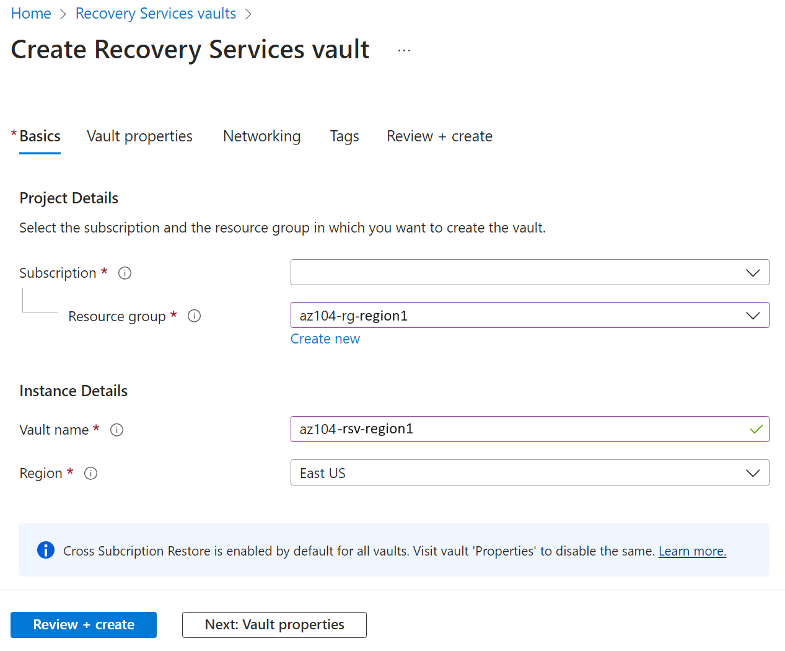

---
lab:
  title: 'Lab 10: Implementare la protezione dati'
  module: Administer Data Protection
---

# Lab 10 - Implementare la protezione dati

## Introduzione al lab    

In questo lab vengono fornite informazioni sul backup e il ripristino delle macchine virtuali di Azure. Si apprenderà come creare un insieme di credenziali di Servizi di ripristino e un criterio di backup per le macchine virtuali di Azure. Si apprenderanno informazioni sul ripristino di emergenza con Azure Site Recovery. 

Questo lab richiede una sottoscrizione di Azure. Il tipo di sottoscrizione può influire sulla disponibilità delle funzionalità in questo lab. È possibile modificare l'area, ma i passaggi sono scritti usando **Stati Uniti orientali** e **Stati Uniti occidentali**.

## Tempo stimato: 50 minuti

## Scenario laboratorio

L'organizzazione sta valutando come eseguire il backup e il ripristino di macchine virtuali di Azure per evitare perdite di dati accidentali o causate da attacchi. Inoltre, l'organizzazione vuole esplorare l'uso di Azure Site Recovery per scenari di ripristino di emergenza. 

## Simulazione interattiva del lab

È disponibile una simulazione di lab interattiva che può risultare utile per questo argomento. La simulazione consente di eseguire uno scenario simile al proprio ritmo. Esistono differenze tra la simulazione interattiva e questo lab, ma molti concetti fondamentali sono identici. Non è necessaria una sottoscrizione di Azure.

+ **[Eseguire il backup di macchine virtuali e file locali.](https://mslabs.cloudguides.com/guides/AZ-104%20Exam%20Guide%20-%20Microsoft%20Azure%20Administrator%20Exercise%2016)**. Creare un insieme di credenziali dei servizi di ripristino e implementare un backup di macchine virtuali di Azure. Implementare il backup di file e cartelle locali usando l'agente di Servizi di ripristino di Microsoft Azure. I backup locali non rientrano nell'ambito di questo lab, ma potrebbe essere utile visualizzare questi passaggi. 

## Competenze mansione

+ Attività 1: Usare un modello per effettuare il provisioning di un'infrastruttura.
+ Attività 2. Creare e configurare un insieme di credenziali di Servizi di ripristino.
+ Attività 3. Configurare il backup a livello di macchina virtuale di Azure.
+ Attività 4. Monitorare Backup di Azure.
+ Attività 5: Abilitare la replica delle macchine virtuali. 

## Tempo stimato: 40 minuti

## Diagramma dell'architettura

## Attività 1: Usare un modello per effettuare il provisioning di un'infrastruttura

In questa attività si userà un modello per distribuire una macchina virtuale. La macchina virtuale verrà usata per testare scenari di backup diversi.

1. Scaricare i file del lab **\\Allfiles\\Lab10\\**.

1. Accedere al **portale di Azure** - `https://portal.azure.com`.

1. Cercare e selezionare `Deploy a custom template`.

1. Nella pagina di distribuzione personalizzata, selezionare **Creare un modello personalizzato nell’editor**.

1. Nella pagina di modifica del modello, selezionare **Carica file**.

1. Individuare e selezionare il file **\\Allfiles\\Lab10\\az104-10-vms-edge-template.json** e quindi selezionare **Apri**.

   >**Nota:** prendersi qualche minuto per esaminare il modello. Vengono distribuite una rete virtuale e una macchina virtuale in modo da poter offrire una dimostrazione del backup e del ripristino. 

1. Selezionare **Salva** per salvare le modifiche.

1. Selezionare **Modifica parametri** e quindi **Carica file**.

1. Caricare e selezionare il file **\\Allfiles\\Lab10\\az104-10-vms-edge-parameters.json**.

1. Selezionare **Salva** per salvare le modifiche.

1. Usare le informazioni seguenti per completare i campi di distribuzione personalizzati, lasciando i valori predefiniti per tutti gli altri campi:

    | Impostazione       | Valore         | 
    | ---           | ---           |
    | Subscription  | la propria sottoscrizione di Azure |
    | Gruppo di risorse| `az104-rg-region1` (se necessario, selezionare **Crea nuovo**)
    | Area geografica        | **Stati Uniti orientali**   |
    | Username      | **localadmin**   |
    | Password      | Fornire una password complessa |

1. Selezionare **Rivedi e crea** e quindi **Crea**.

    >**Nota:** attendere che il modello venga distribuito e quindi selezionare **Vai alla risorsa**. Dovrebbe essere disponibile una sola macchina virtuale in una sola rete virtuale. 

## Attività 2: Creare e configurare un insieme di credenziali di Servizi di ripristino

In questa attività verrà creato un insieme di credenziali di Servizi di ripristino. Un insieme di credenziali di Servizi di ripristino fornisce l'archiviazione per i dati della macchina virtuale. 

1. Nel portale di Azure cercare e selezionare `Recovery Services vaults` e nel pannello **Insiemi di credenziali di Servizi di ripristino** fare clic su **+ Crea**.

1. Nel pannello **Crea Insieme di credenziali di Servizi di ripristino** specificare le impostazioni seguenti:

    | Impostazioni | Valore |
    | --- | --- |
    | Subscription | Il nome della propria sottoscrizione di Azure |
    | Gruppo di risorse | `az104-rg-region1`  |
    | Nome dell'insieme di credenziali | `az104-rsv-region1` |
    | Area geografica | **Stati Uniti orientali** |

    >**Nota**: assicurarsi di specificare la stessa area in cui sono state distribuite le macchine virtuali nell'attività precedente.

    

1. Fare clic su **Rivedi e crea**, assicurarsi che la convalida abbia esito positivo e quindi fare clic su **Crea**.

    >**Nota**: attendere il completamento della distribuzione. La distribuzione dovrebbe richiedere un paio di minuti. 

1. Al termine della distribuzione, fare clic su **Vai alla risorsa**.

1. Nella **sezione Impostazioni** fare clic su **Proprietà**.

1. Selezionare il collegamento **Aggiorna** in **Configurazione di backup**.

1. Nel pannello **Configurazione di backup** esaminare le opzioni disponibili per **Tipo di replica di archiviazione**. Lasciare selezionata l'impostazione predefinita **Con ridondanza geografica** e chiudere il pannello.

    >**Nota**: questa impostazione può essere configurata solo se non sono presenti elementi di backup esistenti.
    
    >**Suggerimenti utili** L'opzione [Ripristino tra aree](https://learn.microsoft.com/azure/backup/backup-create-recovery-services-vault#set-cross-region-restore) consente di ripristinare i dati in un'area secondaria abbinata di Azure. 

1. Selezionare il **collegamento Aggiorna** in **Impostazioni di sicurezza > etichetta delle impostazioni** di sicurezza e eliminazione temporanea.

1. Nel pannello **Impostazioni di sicurezza** si noti che l'opzione **Eliminazione temporanea (per carichi di lavoro in esecuzione in Azure)** è **abilitata**. Si noti che **periodo di conservazione per l'eliminazione temporanea** è di **14** giorni. 

>**Suggerimenti utili** In Azure esistono due tipi di insiemi di credenziali: Insiemi di credenziali di Servizi di ripristino e insiemi di credenziali di Backup. La differenza principale è costituita dalle origini dati di cui è possibile eseguire il backup. Vedere altre informazioni sulle [differenze](https://learn.microsoft.com/answers/questions/405915/what-is-difference-between-recovery-services-vault).

## Attività 3: Configurare il backup a livello di macchina virtuale di Azure

In questa attività verrà implementato il backup a livello di macchina virtuale di Azure. Come parte del backup di una macchina virtuale, sarà necessario definire i criteri di backup e conservazione applicabili al backup. A diverse macchine virtuali possono essere assegnati criteri di backup e conservazione diversi.

   >**Nota**: prima di avviare questa attività, assicurarsi che la distribuzione avviata nella prima attività di questo lab sia stata completata correttamente.

1. Nel pannello dell'insieme di credenziali di Servizi di ripristino fare clic su **Panoramica** e quindi su **+ Backup**.

1. Nel pannello **Obiettivo del backup** specificare le impostazioni seguenti:

    | Impostazioni | Valore |
    | --- | --- |
    | Dove viene eseguito il carico di lavoro? | **Azure** (si notino le altre opzioni) |
    | Di quali elementi si vuole eseguire il backup? | **Macchina virtuale** (si notino le altre opzioni) |

1. Selezionare **Backup**.

1. Si noti che sono disponibili due **sottotipi di criteri**: **Avanzato** e **Standard**. Esaminare le scelte e selezionare **Standard**. 

1. In **Criteri di backup**selezionare **Crea un nuovo criterio**.

1. Definire un nuovo criterio di backup con le impostazioni seguenti e non modificare i valori predefiniti per gli altri criteri:

    | Impostazione | Valore |
    | ---- | ---- |
    | Nome del criterio | `az104-backup` |
    | Frequenza | **Giornaliero** |
    | Time | **12:00** |
    | FusoOrario | Nome del fuso orario locale |
    | Conservare gli snapshot del ripristino istantaneo per | **2** giorni |

    

1. Fare clic su **OK** per creare il criterio e quindi nella **sezione Macchine virtuali** selezionare **Aggiungi** (scorrere verso il basso).

1. Nel pannello **Seleziona macchine virtuali** selezionare **az-104-10-vm0**, fare clic su **OK** e quindi di nuovo nel pannello **Backup** fare clic su **Abilita backup**.

    >**Nota**: attendere il completamento dell'abilitazione del backup. Per il completamento sono richiesti 2 minuti circa.

1. Al termine della distribuzione, selezionare **Vai alla risorsa**.
   
1. Nella sezione **Elementi protetti** fare clic su **Elementi di backup** e quindi fare clic sulla voce **Macchina virtuale di Azure**.

1. Selezionare il collegamento **Visualizza dettagli** per **az104-10-vm0** ed esaminare i valori delle voci **Controllo preliminare di backup** e **Stato ultimo backup**.

    >**Nota:** si noti che il backup è in sospeso.
    
1. Selezionare **Esegui backup ora**, accettare il valore predefinito nell'elenco a discesa **Conserva backup fino a** e fare clic su **OK**.

    >**Nota**: non attendere il completamento del backup, ma procedere con l'attività successiva.

## Attività 4: Monitorare Backup di Azure

In questa attività verrà distribuito un account di archiviazione di Azure. Si configurerà quindi l'insieme di credenziali per inviare i log e le metriche all'account di archiviazione. Questo repository può quindi essere usato con Log Analytics o altre soluzioni di monitoraggio di terze parti.

1. Nel portale di Azure, cercare e selezionare `Storage accounts`.

1. Nella pagina Account di archiviazione selezionare **Crea**.

1. Usare le informazioni seguenti per definire l'account di archiviazione e quindi selezionare **Rivedi e crea**.

    | Impostazioni | Valore |
    | --- | --- | 
    | Subscription          | *Sottoscrizione in uso*    |
    | Gruppo di risorse        | **az104-rg-region1**        |
    | Nome account di archiviazione  | Specificare un nome globalmente univoco   |
    | Area geografica                | **Stati Uniti orientali**   |

1. Selezionare **Crea**.

    >**Nota**: attendere il completamento della distribuzione. L'operazione dovrebbe richiedere circa un minuto.

1. Cercare e selezionare l'insieme di credenziali di Servizi di ripristino.

1. Nel pannello **Monitoraggio** selezionare **Impostazioni** di diagnostica e quindi selezionare **Aggiungi impostazione** di diagnostica.

1. Assegnare il nome `Logs and Metrics to storage` all'impostazione.

1. Posizionare un segno di spunta accanto alle categorie di log e metriche seguenti:

    - **Dati dei report di Backup di Azure**
    - **Dati del processo del componente aggiuntivo Backup di Azure**
    - **Dati degli avvisi del componente aggiuntivo Backup di Azure**
    - **Processi di Azure Site Recovery**
    - **Eventi di Azure Site Recovery**
    - **Integrità**

1. In Dettagli destinazione posizionare un segno di spunta accanto a **Archivia in un account di archiviazione**.

1. Nel campo a discesa Account di archiviazione selezionare l'account di archiviazione distribuito in precedenza in questa attività.

1. Seleziona **Salva**.

1. Tornare all'insieme di credenziali di Servizi di ripristino e nel pannello **Monitoraggio** selezionare **Processi di backup**.

1. Individuare l'operazione di backup per la macchina virtuale **az104-10-vm0**. 

1. **Visualizzare i dettagli** (scorrere verso destra per il collegamento) del processo di backup.

## Attività 5: Abilitare la replica delle macchine virtuali

1. Nel portale di Azure cercare e selezionare `Recovery Services vaults` e nel pannello **Insiemi di credenziali di Servizi di ripristino** fare clic su **+ Crea**.

1. Nel pannello **Crea Insieme di credenziali di Servizi di ripristino** specificare le impostazioni seguenti:

    | Impostazioni | Valore |
    | --- | --- |
    | Subscription | Il nome della propria sottoscrizione di Azure |
    | Gruppo di risorse | `az104-rg-region2` (se necessario, selezionare **Crea nuovo**) |
    | Nome dell'insieme di credenziali | `az104-rsv-region2` |
    | Paese | **Stati Uniti occidentali** |

    >**Nota**: assicurarsi di specificare un'area **diversa** da quella della macchina virtuale.

1. Fare clic su **Rivedi e crea**, assicurarsi che la convalida abbia esito positivo e quindi fare clic su **Crea**.

    >**Nota**: attendere il completamento della distribuzione. La distribuzione dovrebbe richiedere un paio di minuti. 

1. Cercare e selezionare la macchina virtuale `az104-10-vm0`.

1. Nel pannello **Backup e ripristino di emergenza** selezionare **Ripristino di emergenza**. 

1. Selezionare **Abilita replica**.

1. Nella scheda **Informazioni di base** notare l'**area di destinazione**.

1. Selezionare **Successivo: impostazioni avanzate**. Le selezioni delle risorse sono state effettuate per l'utente. 

1. Scorrere verso il basso e **Creare** l'account di automazione. 

   >**Nota:** è importante che le impostazioni vengano popolate o che la convalida non riesca. 

1. Selezionare **Verifica e avvio della replica** e quindi **Abilita replica**.

    >**Nota**: l'abilitazione della replica richiederà 10-15 minuti. Controllare i messaggi di notifica in alto a destra nel portale. Durante l'attesa, valutare la possibilità di visitare i collegamenti per il training autogestito alla fine di questa pagina.
    
1. Al termine della replica, cercare e individuare l'insieme di credenziali di Servizi di ripristino **az104-rsv-region2**. Può essere necessario **aggiornare** la pagina. 

1. Nella sezione **Elementi protetti** selezionare **Elementi replicati**.

1. Verificare che la macchina virtuale sia visualizzata come integra per l'integrità della replica. Si noti che lo stato mostrerà lo stato di sincronizzazione (a partire dallo 0%) e alla fine indicherà **Protetta** dopo il completamento della sincronizzazione iniziale.

   

1. Selezionare la macchina virtuale per visualizzare altri dettagli.
   
>**Suggerimenti utili** È consigliabile [testare il failover di una macchina virtuale protetta](https://learn.microsoft.com/azure/site-recovery/tutorial-dr-drill-azure#run-a-test-failover-for-a-single-vm).

## Pulire le risorse

Se si usa la **sottoscrizione personale**, dedicare qualche minuto all’eliminazione delle risorse del lab. In questo modo le risorse vengono liberate e i costi vengono ridotti al minimo. Il modo più semplice per eliminare le risorse del lab consiste nell'eliminare il gruppo di risorse lab. 

+ Nel portale di Azure selezionare il gruppo di risorse, selezionare **Elimina il gruppo di risorse**, **Immettere il nome del gruppo di risorse**, quindi fare clic su **Elimina**.
+ Tramite Azure PowerShell, `Remove-AzResourceGroup -Name resourceGroupName`.
+ Usando l’interfaccia della riga di comando, `az group delete --name resourceGroupName`.

## Estendere l'apprendimento con Copilot
Copilot può essere utile per imparare a usare gli strumenti di scripting di Azure. Copilot può essere utile anche in aree non coperte nel lab o dove occorrono altre informazioni. Aprire un browser Edge e scegliere Copilot (in alto a destra) o passare a *copilot.microsoft.com*. Dedicare qualche minuto alla prova di queste richieste.

+ Quali prodotti supporta Backup di Azure?
+ Riepilogare i passaggi per eseguire il backup e il ripristino di una macchina virtuale di Azure con Backup di Azure.
+ Come è possibile usare Azure PowerShell o l'interfaccia della riga di comando per controllare lo stato di un processo di Backup di Azure.
+ Fornire almeno cinque procedure consigliate per la configurazione dei backup delle macchine virtuali di Azure.  

## Altre informazioni con la formazione autogestita

+ [Proteggere le macchine virtuali usando Backup di Azure](https://learn.microsoft.com/training/modules/protect-virtual-machines-with-azure-backup/). Usare Backup di Azure per proteggere server locali, macchine virtuali, istanze di SQL Server, File di Azure e altri carichi di lavoro.
+ [Proteggi l'infrastruttura di Azure con Azure Site Recovery](https://learn.microsoft.com/en-us/training/modules/protect-infrastructure-with-site-recovery/). È possibile ottenere funzionalità di ripristino di emergenza per l'infrastruttura di Azure personalizzando la replica, il failover e il failback di macchine virtuali di Azure con Azure Site Recovery.

## Punti chiave

Congratulazioni per aver completato il lab. Ecco i concetti chiave per questo lab. 

+ Il servizio Backup di Azure offre soluzioni semplici, sicure ed economicamente accessibili per eseguire il backup e il ripristino dei dati.
+ Backup di Azure può proteggere le risorse locali e cloud, incluse le macchine virtuali e le condivisioni file.
+ I criteri di Backup di Azure configurano la frequenza dei backup e il periodo di conservazione per i punti di ripristino. 
+ Azure Site Recovery è una soluzione di ripristino di emergenza che fornisce protezione per le macchine virtuali e le applicazioni.
+ Azure Site Recovery replica i carichi di lavoro in un sito secondario e, in caso di interruzione o emergenza, è possibile eseguire il failover nel sito secondario e riprendere le operazioni con tempi di inattività minimi.
+ Un insieme di credenziali di Servizi di ripristino archivia i dati di backup e riduce al minimo il sovraccarico di gestione.
