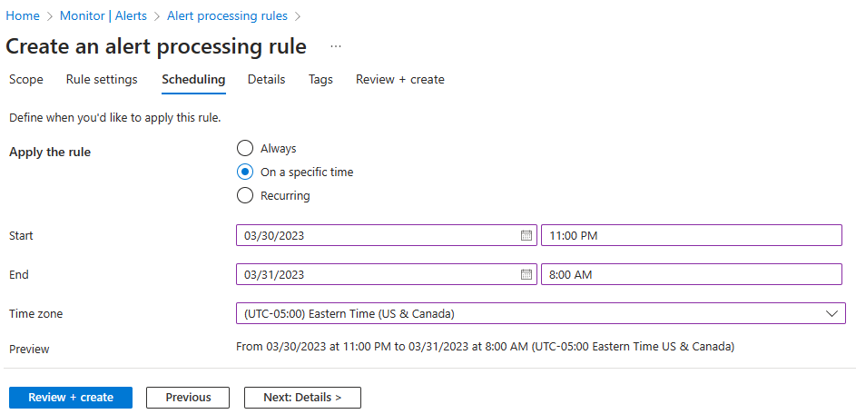

---
lab:
  title: 'Lab 11: Implementare il monitoraggio'
  module: Administer Monitoring
---

# Lab 11 - Implementare il monitoraggio

## Introduzione al lab

In questo lab vengono fornite informazioni su Monitoraggio di Azure. Si apprenderà come creare un avviso e inviarlo a un gruppo di azioni. Attivare e testare l'avviso e controllare il log attività.  

Questo lab richiede una sottoscrizione di Azure. Il tipo di sottoscrizione può influire sulla disponibilità delle funzionalità in questo lab. È possibile modificare l'area, ma i passaggi vengono scritti usando **Stati Uniti** orientali.

## Tempo stimato: 40 minuti

## Scenario laboratorio

L'organizzazione ha eseguito la migrazione dell'infrastruttura ad Azure. È importante che i Amministrazione istrator vengano informati di eventuali modifiche significative dell'infrastruttura. Si prevede di esaminare le funzionalità di Monitoraggio di Azure, incluso Log Analytics.

## Simulazione interattiva del lab

È disponibile una simulazione di lab interattiva che può risultare utile per questo argomento. La simulazione consente di fare clic su uno scenario simile al proprio ritmo. Esistono differenze tra la simulazione interattiva e questo lab, ma molti dei concetti di base sono gli stessi. Non è necessaria una sottoscrizione di Azure.

+ [Implementare il monitoraggio.](https://mslabs.cloudguides.com/guides/AZ-104%20Exam%20Guide%20-%20Microsoft%20Azure%20Administrator%20Exercise%2017) Creare un'area di lavoro Log Analytics e soluzioni di automazione di Azure. Esaminare le impostazioni di monitoraggio e diagnostica per le macchine virtuali. Esaminare le funzionalità di Monitoraggio di Azure e Log Analytics. 

## Diagramma dell'architettura


## Competenze mansione

+ Attività 1: usare un modello per effettuare il provisioning di un'infrastruttura.
+ Attività 2: Creare un avviso.
+ Attività 3: Configurare le notifiche del gruppo di azioni.
+ Attività 4: attivare un avviso e verificare che funzioni.
+ Attività 5: Configurare una regola di elaborazione degli avvisi.
+ Attività 6: Usare query di log di Monitoraggio di Azure.

## Attività 1: Usare un modello per effettuare il provisioning di un'infrastruttura

In questa attività si distribuirà una macchina virtuale che verrà usata per testare gli scenari di monitoraggio.

1. Scaricare i **\\file di lab Allfiles\\Lab11\\az104-11-vm-template.json** nel computer.

1. Accedere al **portale di Azure** - `https://portal.azure.com`.

1. Nella portale di Azure cercare e selezionare `Deploy a custom template`.

1. Nella pagina di distribuzione personalizzata selezionare **Compila un modello personalizzato nell'editor**.

1. Nella pagina modifica modello selezionare **Carica file**.

1. Individuare e selezionare il **\\file Allfiles\\Labs11\\az104-11-vm-template.json** e selezionare **Apri**.

1. Seleziona **Salva**.

1. Usare le informazioni seguenti per completare i campi di distribuzione personalizzati, lasciando tutti gli altri campi con i valori predefiniti:

    | Impostazione       | Valore         | 
    | ---           | ---           |
    | Subscription  | la propria sottoscrizione di Azure |
    | Gruppo di risorse| `az104-rg11` (Se necessario, selezionare **Crea nuovo**)
    | Area geografica        | **Stati Uniti orientali**   |
    | Username      | `localadmin`   |
    | Password      | Specificare una password complessa |
    
1. Selezionare **Rivedi e crea** e quindi **Crea**.

1. Attendere il completamento della distribuzione, quindi fare clic su **Vai al gruppo** di risorse.

1. Esaminare le risorse distribuite. Deve essere presente una rete virtuale con una macchina virtuale.

**Configurare Monitoraggio di Azure per le macchine virtuali (verrà usato nell'ultima attività)**

1. Nel portale cercare e selezionare **Monitoraggio**.

1. Esaminare tutti gli strumenti analitici, di rilevamento, valutazione e diagnosi disponibili.

1. Selezionare **Visualizza** nella **casella Informazioni dettagliate** macchina virtuale e quindi selezionare **Configura informazioni dettagliate**.

1. Selezionare la macchina virtuale e quindi **Abilitare** (due volte).

1. Prendere le impostazioni predefinite per le regole di sottoscrizione e raccolta dati, quindi selezionare **Configura**. 

1. L'installazione e la configurazione dell'agente di macchine virtuali richiederanno alcuni minuti, procedere con il passaggio successivo. 
   
## Attività 2: Creare un avviso

In questa attività viene creato un avviso per quando viene eliminata una macchina virtuale. 

1. Continuare nella **pagina Monitoraggio** , selezionare **Avvisi**. 

1. Selezionare Crea e** selezionare ****Regola** di avviso. 

1. Selezionare la casella per il gruppo di risorse e quindi selezionare **Applica**. Questo avviso verrà applicato a tutte le macchine virtuali nel gruppo di risorse. In alternativa, è possibile specificare solo un computer specifico. 

1. Selezionare la **scheda Condizione** e quindi selezionare il **collegamento Visualizza tutti i segnali** .

1. Cercare e selezionare **Elimina macchina virtuale (Macchine virtuali).** Si notino gli altri segnali predefiniti. Selezionare **Applica**.

1. Nell'area **Logica** avvisi (scorrere verso il basso) esaminare le selezioni a **livello** di evento. Lasciare selezionata** l'impostazione predefinita **Tutti.

1. Esaminare le **selezioni di Stato** . Lasciare selezionata** l'impostazione predefinita **Tutti.

1. Lasciare aperto il **riquadro Crea una regola** di avviso per l'attività successiva.

## Attività 3: Configurare le notifiche del gruppo di azioni

In questa attività, se l'avviso viene attivato, inviare una notifica tramite posta elettronica al team operativo. 

1. Continuare a lavorare sull'avviso. Selezionare **Avanti: Azioni** e quindi selezionare **Crea gruppo** di azioni.

    >**Lo sapevi?** Puoi aggiungere fino a cinque gruppi di azioni a una regola di avviso. I gruppi di azioni vengono eseguiti simultaneamente, senza un ordine specifico. Più regole di avviso possono usare lo stesso gruppo di azioni. 

1. Nella scheda **Informazioni di base** immettere i valori indicati di seguito per ogni impostazione.

    | Impostazione | Valore |
    |---------|---------|
    | **Dettagli di progetto** |
    | Subscription | sottoscrizione in uso |
    | Gruppo di risorse | **az104-rg11** |
    | Area | **Globale** (impostazione predefinita) |
    | **Dettagli istanza** |
    | Nome gruppo di azioni | `Alert the operations team` (deve essere univoco nel gruppo di risorse) |
    | Nome visualizzato | `AlertOpsTeam` |

1. Selezionare **Avanti: Notifiche** e immettere i valori seguenti per ogni impostazione.

    | Impostazione | Valore |
    |---------|---------|
    | Tipo di notifica | Selezionare **Posta elettronica/SMS/Push/Chiamata vocale** |
    | Nome | `VM was deleted` |

1. Selezionare **Posta elettronica**, quindi nella casella **Posta elettronica** immettere l'indirizzo di posta elettronica e selezionare **OK**. 

    >**Nota:** dovresti ricevere una notifica tramite posta elettronica che informa che sei stato aggiunto a un gruppo di azioni. Potrebbe verificarsi un ritardo di alcuni minuti, ma si tratta di un segno sicuro della distribuzione della regola.

1. Dopo aver creato il gruppo di azioni passare alla **scheda Avanti: Dettagli** e immettere i valori seguenti per ogni impostazione.

    | Impostazione | Valore |
    |---------|---------|
    | Nome regola di avviso | `VM was deleted` |
    | Descrizione della regola di avviso | `A VM in your resource group was deleted` |

1. Selezionare **Rivedi e crea** per convalidare l'input e quindi selezionare **Crea**.

## Attività 4: Attivare un avviso e verificare che funzioni

In questa attività si attiva l'avviso e si conferma che viene inviata una notifica. 

>**Nota:** se si elimina la macchina virtuale prima della distribuzione della regola di avviso, la regola di avviso potrebbe non essere attivata. 

1. Nel portale cercare e selezionare **Macchine** virtuali.

1. Selezionare la casella per la **macchina virtuale az104-vm0** .

1. Dalla barra dei menu selezionare **Elimina**.

1. Selezionare la casella **Applica l'eliminazione** forzata. Immettere `delete` per confermare e quindi selezionare **Elimina**. 

1. Nella barra del titolo selezionare l'icona **Notifiche** e attendere l'eliminazione **di vm0** .

1. Si dovrebbe ricevere un messaggio di posta elettronica di notifica che legge, **Avviso importante: la macchina virtuale di avviso di Monitoraggio di Azure è stata eliminata è stata attivata...** In caso contrario, aprire il programma di posta elettronica e cercare un messaggio di posta elettronica da azure-noreply@microsoft.com.

    
   
1. Nel menu delle risorse del portale di Azure selezionare **Monitoraggio** e quindi selezionare **Avvisi** nel menu a sinistra.

1. Dovrebbero essere presenti tre avvisi dettagliato generati eliminando **vm0**.

   >**Nota:** l'invio del messaggio di posta elettronica di avviso e l'aggiornamento degli avvisi nel portale può richiedere alcuni minuti. Se non si vuole attendere, continuare con l'attività successiva e quindi tornare. 

1. Selezionare il nome di uno degli avvisi, ad esempio **Macchina virtuale eliminata**. Viene visualizzato un riquadro **Dettagli avviso** che mostra altri dettagli sull'evento.

## Attività 5: Configurare una regola di elaborazione degli avvisi

In questa attività si crea una regola di avviso per eliminare le notifiche durante un periodo di manutenzione. 

1. Continuare nel pannello **Avvisi** , selezionare **Regole** di elaborazione avvisi e quindi **+ Crea**. 
   
1. Selezionare il **gruppo** di risorse, quindi selezionare **Applica**.
   
1. Selezionare **Avanti: Impostazioni regola**, quindi selezionare **Elimina notifiche**.
   
1. Al termine, selezionare **Avanti: Pianificazione**.
   
1. Per impostazione predefinita, la regola funziona sempre, a meno che non venga disabilitata o configurata una pianificazione. Si definirà una regola per eliminare le notifiche durante la manutenzione notturna.
Immettere queste impostazioni per la pianificazione della regola di elaborazione degli avvisi:

    | Impostazione | Valore |
    |---------|---------|
    | Applicare la regola | A un'ora specifica |
    | Inizio | Immettere la data odierna alle 10.00. |
    | Fine | Immettere la data di domani alle 7.00. |
    | Time zone | Selezionare il fuso orario locale. |

    

1. Selezionare **Avanti: Dettagli** e immettere le impostazioni seguenti:

    | Impostazione | Valore |
    |---------|---------|
    | Gruppo di risorse | **az104-rg11** |
    | Nome regola | `Planned Maintenance` |
    | Descrizione | `Suppress notifications during planned maintenance.` |

1. Selezionare **Rivedi e crea** per convalidare l'input e quindi selezionare **Crea**.

## Attività 6: Usare query di log di Monitoraggio di Azure

In questa attività si userà Monitoraggio di Azure per eseguire query sui dati acquisiti dalla macchina virtuale.

1. Nella portale di Azure cercare e selezionare `Monitor` il pannello Fare clic su **Log**.

1. Se necessario, chiudere la schermata iniziale. 

1. Selezionare un ambito, il **gruppo** di risorse. Selezionare **Applica**. 

1. **Nella scheda Query** selezionare **Macchine** virtuali (riquadro sinistro). 

1. Esaminare le query disponibili. **Eseguire** (passare il puntatore del mouse sulla query) la **query Conteggio heartbeat.**

1. Quando la macchina virtuale è in esecuzione, dovrebbe essere visualizzato un numero di heartbeat.

1. Esaminare la query. Questa query usa la *tabella heartbeat* . 

1. Sostituire la query con questa e quindi fare clic su **Esegui**. Esaminare il grafico risultante. 

   ```
    InsightsMetrics
    | where TimeGenerated > ago(1h)
    | where Name == "UtilizationPercentage"
    | summarize avg(Val) by bin(TimeGenerated, 5m), Computer //split up by computer
    | render timechart
   ```

1. Quando si ha tempo, esaminare ed eseguire altre query. 

    >**Lo sapevi?**: se vuoi esercitarti con altre query, è disponibile un [ambiente](https://learn.microsoft.com/azure/azure-monitor/logs/log-analytics-tutorial#open-log-analytics) demo di Log Analytics.
    
    >**Lo sapevi?**: dopo aver trovato una query desiderata, è possibile creare un avviso da esso. 

## Pulire le risorse

Se si usa **la propria sottoscrizione** , è necessario un minuto per eliminare le risorse del lab. In questo modo le risorse vengono liberate e i costi vengono ridotti al minimo. Il modo più semplice per eliminare le risorse del lab consiste nell'eliminare il gruppo di risorse del lab. 

+ Nella portale di Azure selezionare il gruppo di risorse, selezionare **Elimina il gruppo di risorse, **Immettere il nome** del gruppo** di risorse e quindi fare clic su **Elimina**.
+ Uso di Azure PowerShell, `Remove-AzResourceGroup -Name resourceGroupName`.
+ Uso dell'interfaccia della riga di comando di `az group delete --name resourceGroupName`.

## Estendere l'apprendimento con Copilot
Copilot può essere utile per imparare a usare gli strumenti di scripting di Azure. Copilot può anche assistere in aree non coperte nel lab o dove sono necessarie altre informazioni. Aprire un browser Edge e scegliere Copilot (in alto a destra) o passare a *copilot.microsoft.com*. Per provare queste richieste, richiedere alcuni minuti.

+ Quali sono i passaggi di configurazione di base da avvisare in Azure quando una macchina virtuale è inattiva?
+ Come è possibile ricevere una notifica quando viene attivato un avviso di Azure?
+ Creare una query di Monitoraggio di Azure per fornire informazioni sulle prestazioni della CPU della macchina virtuale.

## Altre informazioni con la formazione autogestita

+ [Migliorare la risposta agli eventi imprevisti con gli avvisi in Azure](https://learn.microsoft.com/en-us/training/modules/incident-response-with-alerting-on-azure/). Rispondere agli eventi imprevisti e alle attività nell'infrastruttura tramite le funzionalità di avviso di Monitoraggio di Azure.
+ [Monitorare le macchine virtuali di Azure con Monitoraggio](https://learn.microsoft.com/en-us/training/modules/monitor-azure-vm-using-diagnostic-data/) di Azure. Monitorare le macchine virtuali di Azure usando Monitoraggio di Azure per raccogliere e analizzare le metriche e i log degli host e dei client delle macchine virtuali.

## Punti chiave

Congratulazioni per il completamento del lab. Ecco le principali considerazioni per questo lab. 

+ Gli avvisi consentono di rilevare e risolvere i problemi prima che gli utenti notino che si è verificato un problema con l'infrastruttura o l'applicazione.
+ È possibile creare avvisi su qualsiasi metrica o fonte di dati di log nella piattaforma di dati di Monitoraggio di Azure.
+ Una regola di avviso monitora i dati e acquisisce un segnale che indica che sta accadendo qualcosa nella risorsa specificata.
+ Se vengono soddisfatte le condizioni della regola di avviso, viene attivato un avviso. È possibile attivare diverse azioni (posta elettronica, SMS, push, voce).
+ I gruppi di azioni includono utenti che devono ricevere una notifica di un avviso.
