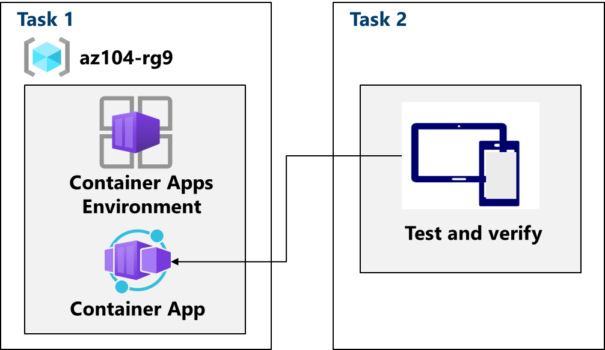

---
lab:
  title: 'Lab 09c: Implementare App contenitore di Azure'
  module: Administer PaaS Compute Options
---

# Lab 09c - Implementare App contenitore di Azure

## Introduzione al lab

In questo lab si apprenderà come implementare e distribuire App contenitore di Azure.

Questo lab richiede una sottoscrizione di Azure. Il tipo di sottoscrizione può influire sulla disponibilità delle funzionalità in questo lab. È possibile modificare l'area, ma i passaggi vengono scritti usando **Stati Uniti orientali**.

## Tempo stimato: 15 minuti

## Scenario laboratorio

L'organizzazione ha un'applicazione Web che viene eseguita in una macchina virtuale nel data center locale. L'organizzazione vuole spostare tutte le applicazioni nel cloud, ma non vuole gestire un numero elevato di server. Si decide di valutare App contenitore di Azure.

## Diagramma dell'architettura

## Competenze mansione

- Attività 1: Creare e configurare un'app contenitore di Azure e l'ambiente.
- Attività 2: Testare e verificare la distribuzione dell'app contenitore di Azure.

## Attività 1: Creare e configurare un'app contenitore di Azure e l'ambiente

App contenitore di Azure amplia ulteriormente il concetto di cluster Kubernetes gestito e gestisce l'ambiente del cluster, oltre a fornire altri servizi gestiti all'interno del cluster. A differenza di un cluster Azure Kubernetes, in cui è comunque necessario gestire il cluster, un'istanza di App contenitore di Azure evita alcune delle complessità per la configurazione di un cluster Kubernetes.

1. Nel portale di Azure, cercare e selezionare `Container Apps`.

1. Selezionare **+ Crea** dal menu a discesa App **** contenitore. Si notino le altre opzioni. 

1. Usare le informazioni seguenti per compilare i dettagli nella scheda **Informazioni di base**.*.

    | Impostazione | Azione |
    |---|---|
    | Abbonamento | Selezionare la sottoscrizione di Azure |
    | Gruppo di risorse | `az104-rg9` |
    | Nome app contenitore |  `my-app` |
    | Paese    | **Stati Uniti** orientali (|
    | Ambiente delle app contenitore | Selezionare Crea nuovo** > Imposta nome ambiente su**`my-environment` >  Crea **** |

1. Fare clic sulla **scheda Avanti: Contenitore** e verificare che **l'opzione Usa immagine** di avvio rapido sia selezionata. Potrebbe essere necessario scorrere verso l'alto per visualizzare questa impostazione. 

1. Assicurarsi che **l'immagine** di avvio rapido sia impostata su **Simple hello world container** (Contenitore Hello World semplice). Si notino le altre opzioni. 

1. Selezionare **Rivedi e crea** e quindi **Crea**.

    >**Nota:** attendere che l'app contenitore venga distribuita. L'operazione richiede alcuni minuti. 
 
## Attività 2: Testare e verificare la distribuzione dell'app contenitore di Azure

Per impostazione predefinita, l'app contenitore di Azure creata accetterà il traffico sulla porta 80 usando l'applicazione Hello World di esempio. App contenitore di Azure fornirà un nome DNS per l'applicazione. Copiare e passare a questo URL per assicurarsi che l'applicazione sia attiva e in esecuzione.

1. Selezionare **Vai alla risorsa** per visualizzare la nuova app contenitore.

1. Selezionare il collegamento accanto a *URL applicazione* per visualizzare l'applicazione.

    

1. Verificare di ricevere il messaggio **L'app di App contenitore di Azure è attiva**.
   
## Pulire le risorse

Se si usa la **sottoscrizione personale**, dedicare qualche minuto all’eliminazione delle risorse del lab. In questo modo le risorse vengono liberate e i costi vengono ridotti al minimo. Il modo più semplice per eliminare le risorse del lab consiste nell'eliminare il gruppo di risorse lab. 

+ Nel portale di Azure selezionare il gruppo di risorse, selezionare **Elimina il gruppo di risorse**, **Immettere il nome del gruppo di risorse**, quindi fare clic su **Elimina**.
+ Tramite Azure PowerShell, `Remove-AzResourceGroup -Name resourceGroupName`.
+ Usando l’interfaccia della riga di comando, `az group delete --name resourceGroupName`.

## Estendere l'apprendimento con Copilot
Copilot può essere utile per imparare a usare gli strumenti di scripting di Azure. Copilot può essere utile anche in aree non coperte nel lab o dove occorrono altre informazioni. Aprire un browser Edge e scegliere Copilot (in alto a destra) o passare a *copilot.microsoft.com*. Dedicare qualche minuto alla prova di queste richieste.

+ Riepilogare i passaggi per creare e configurare un'app contenitore di Azure.
+ Confrontare le App contenitore di Azure con il servizio Azure Kubernetes e indicare le differenze.

## Altre informazioni con la formazione autogestita

+ [Configurare un’app contenitore in App contenitore di Azure](https://learn.microsoft.com/training/modules/configure-container-app-azure-container-apps/). Esamina le funzionalità di App contenitore di Azure e quindi illustra come creare, configurare, ridimensionare e gestire app contenitore usando App contenitore di Azure.

## Punti chiave

Congratulazioni per aver completato il lab. Ecco i concetti chiave per questo lab. 

+ App contenitore di Azure è una piattaforma serverless che consente di ridurre l'infrastruttura da gestire e risparmiare sui costi per l'esecuzione di applicazioni in contenitori.
+ App contenitore gestisce la configurazione del server, l'orchestrazione dei contenitori e i dettagli di distribuzione. 
+ I carichi di lavoro in App contenitore di Azure sono in genere processi a esecuzione prolungata, come un'app Web.

     
